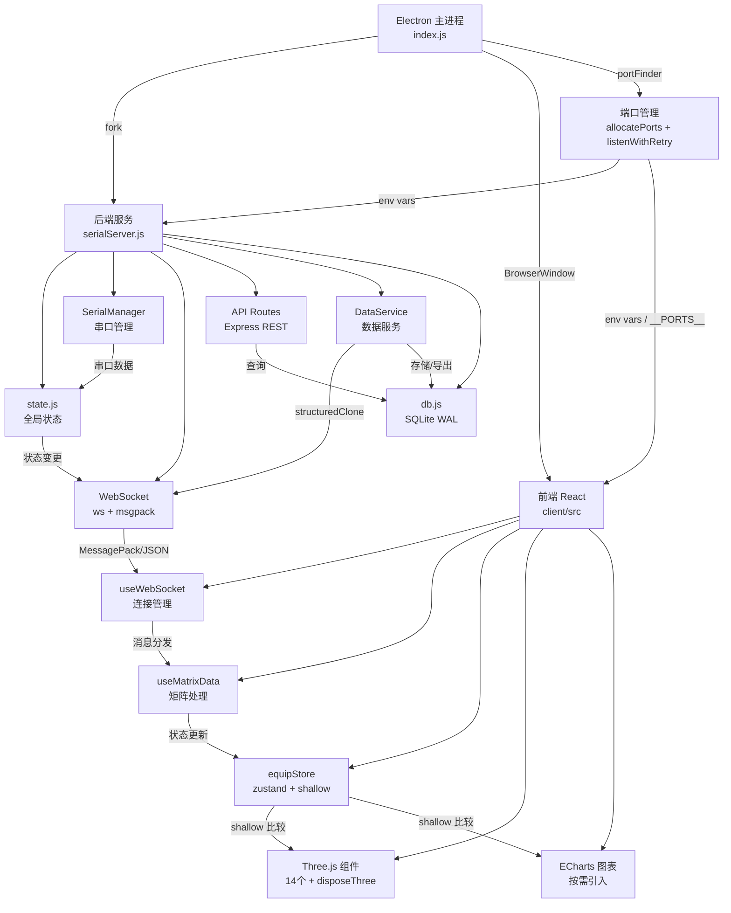

# 架构文档

> 本文档由 Manus 自动生成和维护。最后更新于：2026-04-22 16:46

## 1. 项目概述

本项目（`jqtools2` / Shroom）是一个基于 Electron 的桌面应用程序，核心功能是连接硬件传感器（通过串口），实时采集、处理、可视化和分析压力数据。应用包含一个 React 构建的前端界面用于数据展示和交互，以及一个 Node.js 后端服务处理硬件通信、数据存储和 API 请求。支持多种传感器类型（座椅、床垫、手部），提供 3D 可视化、数据采集回放、CSV 导出等功能。

## 2. 技术栈

| 分类 | 技术 | 版本/说明 |
| :--- | :--- | :--- |
| **应用框架** | Electron | 桌面应用容器，管理主进程和渲染进程 |
| **前端框架** | React | 单页应用，Vite 构建（从 CRA/Webpack 迁移） |
| **后端框架** | Express.js | REST API 服务 |
| **实时通信** | ws + @msgpack/msgpack | WebSocket，支持 JSON/MessagePack 双模式 |
| **数据库** | SQLite3 | WAL 模式，本地嵌入式数据库 |
| **状态管理** | zustand | 轻量级状态管理，配合 shallow 比较 |
| **3D 可视化** | Three.js | 压力矩阵 3D 渲染 |
| **图表** | ECharts | 按需引入，折线图等 |
| **UI 组件库** | Ant Design (antd) | 通用 UI 组件 |
| **硬件交互** | serialport | 串口通信 |
| **编程语言** | JavaScript (ES6+) | 前后端统一 |
| **前端构建** | Vite 5 + @vitejs/plugin-react | 秒级启动 + HMR 热更新 |
| **包管理器** | npm | |
| **部署环境** | Windows 桌面 | electron-builder 打包 |
| **其他关键库** | crypto-js, axios, i18next, sass | 加密、HTTP 请求、国际化、样式预处理 |

## 3. 目录结构

```
shroom/
├── index.js                    # Electron 主进程入口
├── indexsingle.js              # 单机模式入口
├── preload.js                  # Electron preload 脚本
├── kartingcar.js               # 卡丁车模式 WebSocket 服务
├── pyWorker.js                 # Python 子进程管理
├── python.js                   # Python 集成
├── genJqtoolsConfig.js         # 配置生成工具
├── package.json
├── server/                     # 后端服务（模块化）
│   ├── serialServer.js         # 服务入口（~118 行）
│   ├── state.js                # 全局状态管理（含 lastDataTime/rescanLock）
│   ├── api/
│   │   └── routes.js           # Express REST API 路由（~373 行）
│   ├── websocket/
│   │   └── index.js            # WebSocket 服务（~80 行）
│   ├── serial/
│   │   └── SerialManager.js    # 串口管理（含 rescanPort/僵尸检测/帧验证）
│   ├── services/
│   │   └── DataService.js      # 数据采集/回放/导出（~201 行）
│   ├── equipMap.js             # 设备映射配置
│   └── HttpResult.js           # HTTP 响应封装
├── util/                       # 通用工具模块
│   ├── portFinder.js           # 端口检测与动态分配
│   ├── db.js                   # SQLite 数据库操作
│   ├── logger.js               # 统一日志模块
│   ├── config.js               # 加密配置读写
│   ├── serialCache.js          # MAC→设备类型本地缓存（serial_cache.json）
│   ├── line.js                 # 数据转换工具
│   ├── aes_ecb.js              # AES-ECB 加密
│   ├── parseData.js            # 数据解析
│   ├── serialport.js           # 串口工具
│   ├── time.js                 # 时间工具
│   ├── getServer.js            # 服务器地址获取
│   └── getWinConfig.js         # 窗口配置
├── client/                     # 前端 React 应用
│   ├── src/
│   │   ├── App.js              # 应用根组件
│   │   ├── page/
│   │   │   ├── test/Test.js    # 主测试页面（272 行）
│   │   │   ├── data/Data.js    # 数据页面
│   │   │   ├── equip/Equip.js  # 设备管理页面
│   │   │   └── equip/macConfig/MacConfig.js # MAC 地址配置页面
│   │   ├── hooks/
│   │   │   ├── useWebSocket.js # WebSocket 连接管理 Hook
│   │   │   ├── useMatrixData.js# 矩阵数据处理 Hook
│   │   │   ├── useWindowsize.js# 窗口尺寸 Hook
│   │   │   └── useDebounce.js  # 防抖 Hook
│   │   ├── store/
│   │   │   └── equipStore.js   # zustand 状态仓库（含 macInfo/rescanning 状态）
│   │   ├── components/
│   │   │   ├── three/          # Three.js 3D 可视化组件（14 个）
│   │   │   ├── chartsAside/    # ECharts 图表侧边栏
│   │   │   ├── ColAndHistory/  # 采集历史组件
│   │   │   ├── viewSetting/    # 视图设置
│   │   │   ├── title/          # 标题栏组件
│   │   │   ├── aside/          # 侧边栏
│   │   │   ├── Drawer/         # 抽屉组件
│   │   │   ├── num/            # 数值显示组件
│   │   │   └── EquipStatus/    # 设备状态组件
│   │   ├── util/
│   │   │   ├── echarts.js      # ECharts 按需引入入口
│   │   │   ├── portConfig.js   # 端口配置
│   │   │   ├── constant.js     # 常量定义
│   │   │   ├── util.js         # 工具函数
│   │   │   └── disposeThree.js # Three.js 资源清理工具
│   │   ├── scheduler/
│   │   │   └── scheduler.js    # 渲染调度器
│   │   ├── api/
│   │   │   └── request.js      # axios 请求封装
│   │   ├── library/
│   │   │   └── playback/       # 回放功能库
│   │   └── locale/             # i18n 国际化资源
│   ├── index.html              # Vite 入口 HTML（从 public/ 移出）
│   ├── vite.config.js          # Vite 构建配置
│   ├── config/                 # 旧 CRA 配置（保留备用）
│   └── package.json
├── backend/                    # 独立后端服务（备用）
│   └── index.js
├── test/
│   └── portFinder.test.js      # 端口分配单元测试
├── scripts/
│   └── migrate_remarks.py      # 数据迁移脚本
└── swagger.yaml                # API 文档
```

### 关键目录说明

| 目录 | 主要功能 |
| :--- | :--- |
| `/server` | 后端核心服务，模块化拆分为 api、websocket、serial、services |
| `/client/src/components` | 可复用的 UI 组件，包含 14 个 Three.js 3D 可视化组件 |
| `/client/src/page` | 页面级组件：test（主页）、data（数据）、equip（设备管理） |
| `/client/src/hooks` | 自定义 React Hook，封装 WebSocket、矩阵数据等核心逻辑 |
| `/client/src/store` | zustand 状态管理 |
| `/util` | 后端通用工具：端口管理、数据库、日志、加密等 |
| `/client/src/util` | 前端通用工具：echarts 按需引入、端口配置、Three.js 清理 |

## 4. 核心模块与数据流

### 4.1. 模块关系图 (Mermaid)



### 4.2. 主要数据流

1. **实时数据采集流程**
    - 硬件传感器 → 串口 → `SerialManager`（解析数据包）→ `state.js`（更新全局状态）→ `DataService`（`structuredClone` 深拷贝）→ `WebSocket`（MessagePack 二进制 / JSON 广播）→ `useWebSocket` Hook（自动解码）→ `useMatrixData` Hook（处理矩阵数据）→ `zustand store`（`shallow` 比较更新）→ React 组件（`memo` 优化，按需重渲染）→ Three.js 3D 可视化 / ECharts 图表

2. **历史数据回放流程**
    - 前端发起回放请求 → `API Routes` → `DataService`（从 SQLite 读取）→ 定时器逐帧推送 → `WebSocket` 广播 → 前端渲染

3. **端口分配流程**
    - 主进程 `allocatePorts()` 检测可用端口 → 环境变量传递给子进程 → `listenWithRetry()` 二次保障 → `process.send` 回传实际端口 → 前端通过 `window.__PORTS__` 或 `REACT_APP_*_PORT` 获取

4. **历史数据页签交互状态流**
    - `ColAndHistory` 在“本地数据 / 导入数据”页签之间共享删除、下载等操作态；切换页签前统一重置 `operateStatus`、`selectArr` 和 `contrastArr`，避免编辑/选择状态跨页签残留

5. **底部控制栏与抽屉层级**
    - `ColAndHistory` 的底部固定控制层需要低于右侧历史抽屉；`colAndHContent` 保持在画布之上但低于 `Drawer`，避免抽屉底部“存储路径”等交互区被遮挡

6. **3D 单视图控制器对焦**
    - `ThreeAndCarPointV2` 的单独靠背/坐垫模式保留原有 `reset + move` 动画流程；在 tween 完成后会把期望旋转中心投影到当前相机视线方向上，再用该投影点更新 `TrackballControls.target` 与缩放基准，从而尽量贴近当前对象旋转，同时保持画面尺寸与位置不突变
    - 整体模式的默认 reset 基准只在初始化整体视图时写入一次；切换到单独靠背/坐垫或切回 `all` 后，后续的无视觉位移对焦不会覆盖这个默认基准，从而保证下一次切换模式时仍然能从整体视图起播动画
    - 在整体模式下，初始加载和切回 `all` 视图后会将座椅模型、坐垫点阵、靠背点阵的联合包围盒中心投影到当前视线，再无视觉位移地同步到 `TrackballControls.target`，使左键旋转围绕整体对象而不是场景原点

7. **非正方形矩阵框选有效区**
    - `BrushManager` 不再把整个 `.canvasThree` 都视为可框选区域；会根据当前系统与 `displayType` 读取 `systemPointConfig`，计算真实矩阵在画布中的有效矩形
    - 对 `endi-back` 这类非正方形矩阵，框选起点和最终框选区域都必须完整落在真实矩阵区域内；例如靠背按 `50 x 64` 有效区判定，而不是整个正方形 canvas
    - 当用户在有效区外起框或框选越界时，统一提示“请在有效区域框选”
    - 框选视觉样式统一由 `newSelecttBox.js` 输出：边框使用提亮后的显示色，填充层单独使用半透明色值，避免整块元素 `opacity` 把边框一起压暗

8. **更新日志双轨维护**
    - 根目录 `CHANGELOG.md` 维护面向仓库的 Markdown 版本记录，用于汇总每个版本的文字说明
    - `client/src/page/equip/changeLog/ChangeLog.js` 维护应用内时间线展示，版本号与日期需要和根目录 changelog 保持同步

9. **打包版本元数据**
    - Electron 安装包依赖根目录 `package.json` 的 `version` 字段，必须是合法 SemVer；诸如 `endi1.0.1` 这类业务前缀版本不能直接用于 `electron-builder`
    - 前端界面显示版本由 `client/src/util/version.js` 的 `APP_VERSION` 单独维护，因此可以保留业务展示版本，同时将打包元数据保持为合法的 `1.0.1`
    - 打包配置中的 `npmRebuild` 已显式关闭，避免 `electron-builder` 在本机已有 N-API 预编译二进制时仍强制重编 `sqlite3` / `serialport`，从而被缺失的 VS C++ 工具链阻塞

10. **本地串口缓存写入路径**
    - `serial_cache.json` 在开发模式下仍写入项目根目录，保持现有调试习惯不变
    - 打包后主进程会将 `SERIAL_CACHE_PATH` 传给后端子进程，统一落到 Electron `userData` 目录下的 `serial_cache.json`，不再尝试写入只读的 `app.asar`
    - `serialCache.writeCache()` 在落盘前会自动创建父目录，确保首次启动时缓存目录不存在也能正常写入

## 5. API 端点 (Endpoints)

| 方法 | 路径 | 描述 |
| :--- | :--- | :--- |
| `GET` | `/` | 健康检查 |
| `GET` | `/getSystem` | 获取系统配置 |
| `POST` | `/selectSystem` | 选择系统类型 |
| `POST` | `/changeSystemType` | 切换系统类型 |
| `GET` | `/getPort` | 获取可用串口列表 |
| `GET` | `/connPort` | 一键连接（波特率探测+连接+MAC识别一体化） |
| `GET` | `/rescanPort` | 重新连接（清理死端口/僵尸设备后重连） |
| `GET` | `/stopPort` | 断开所有串口连接 |
| `GET` | `/sendMac` | 发送 MAC 地址绑定（保留兼容） |
| `POST` | `/startCol` | 开始数据采集 |
| `GET` | `/endCol` | 结束数据采集 |
| `GET` | `/getColHistory` | 获取采集历史列表 |
| `POST` | `/getDbHistory` | 获取数据库历史记录 |
| `POST` | `/getDbHistorySelect` | 获取历史记录（带筛选） |
| `POST` | `/getContrastData` | 获取对比数据 |
| `POST` | `/getDbHistoryPlay` | 开始历史数据回放 |
| `POST` | `/getDbHistoryStop` | 停止历史数据回放 |
| `POST` | `/cancalDbPlay` | 取消回放 |
| `POST` | `/changeDbplaySpeed` | 修改回放速度 |
| `POST` | `/getDbHistoryIndex` | 获取历史数据指定帧 |
| `POST` | `/downlaod` | 导出 CSV 数据 |
| `POST` | `/delete` | 删除历史记录 |
| `POST` | `/changeDbName` | 修改数据库记录名称 |
| `POST` | `/changeDbDataName` | 修改数据记录名称 |
| `POST` | `/upsertRemark` | 新增/更新备注 |
| `POST` | `/getRemark` | 获取备注 |
| `POST` | `/bindKey` | 绑定授权密钥 |
| `POST` | `/getCsvData` | 获取 CSV 格式数据 |
| `POST` | `/getSysconfig` | 获取系统配置 |

## 6. 外部依赖与集成

| 服务/库 | 用途 | 集成方式 |
| :--- | :--- | :--- |
| serialport | 硬件串口通信 | Node.js 原生模块 |
| electron | 桌面应用容器 | 主进程框架 |
| electron-builder | 应用打包分发 | 构建工具 |
| three.js | 3D 压力矩阵可视化 | 前端组件 |
| echarts | 折线图表 | 前端按需引入 |
| crypto-js | 配置文件 AES 加密 | 后端工具 |
| i18next | 国际化 | 前端多语言 |

## 7. 环境变量

| 变量名 | 描述 | 示例值 |
| :--- | :--- | :--- |
| `NODE_ENV` | 运行环境 | `development` / `production` |
| `API_PORT` | 后端 API 服务端口 | `19245` |
| `WS_PORT` | WebSocket 服务端口 | `19999` |
| `REACT_APP_API_PORT` | 前端 API 端口（开发模式） | `19245` |
| `REACT_APP_WS_PORT` | 前端 WebSocket 端口（开发模式） | `19999` |
| `REACT_APP_SERVER_ADDRESS` | 服务器地址 | `localhost` |
| `LOG_LEVEL` | 日志级别 | `debug` / `info` / `warn` / `error` |
| `isPackaged` | 是否为打包环境 | `true` / `false` |

## 8. 项目进度

> 记录项目从开始到现在已经完成的所有工作，每次新增追加到末尾。

| 完成日期 | 完成的功能/工作 | 说明 |
| :--- | :--- | :--- |
| 2026-03-01 | 核心功能开发 | 串口通信、数据采集、3D 可视化、历史回放、CSV 导出等核心功能 |
| 2026-03-01 | 端口冲突修复 | portFinder 动态分配、listenWithRetry 二次保障、环境变量传递 |
| 2026-03-01 | Windows spawn 修复 | 修复 React dev server 启动时 spawn EINVAL 错误 |
| 2026-03-01 | 工程化基础 | 添加 .gitignore、清理 copy 文件、重命名为有意义的文件名 |
| 2026-03-01 | 后端模块化重构 | serialServer.js 拆分为 state/websocket/serial/services/api 五个模块 |
| 2026-03-01 | db.js 优化 | 修复 JSON.parse 冗余、清理死代码、提取通用函数 |
| 2026-03-01 | 前端 Hook 封装 | 创建 useWebSocket、useMatrixData Hook，Test.js 从 1499 行精简到 272 行 |
| 2026-03-02 | Three.js 内存泄漏修复 | 14 个组件全部添加 disposeThree 资源清理 |
| 2026-03-02 | 后端性能优化 | structuredClone 替换深拷贝、SQLite WAL 模式 |
| 2026-03-02 | WebSocket 二进制传输 | 支持 MessagePack 双模式，体积减少 70-80% |
| 2026-03-02 | React 渲染优化 | 10 个组件添加 React.memo，zustand shallow 比较 |
| 2026-03-02 | 打包优化 | Webpack splitChunks、echarts 按需引入、统一日志模块 |
| 2026-03-06 | 前端迁移到 Vite | CRA/Webpack → Vite 5，启动 ~200ms，HMR <100ms |
| 2026-03-09 | WebSocket 调试工具 | 在 useWebSocket Hook 中添加 WS 数据打印调试功能，支持开关、过滤、计数、查看最近消息 |
| 2026-03-09 | 框选工具优化 | 框选边框颜色加深（红色 3px），支持同时框选多个区域 |
| 2026-03-09 | 靠背线序旋转 | endiBack / endiBack1024 输出数据旋转 180 度 |
| 2026-03-09 | 框选交互优化 | 统一框选颜色，支持单击选中/取消，选中时显示框选区域面板（可缩小/关闭） |
| 2026-03-09 | 功能面板优化 | 压力曲线/面积曲线/重心曲线/正态分布面板可拖拽、缩放、置顶，不可关闭 |
| 2026-03-09 | DraggablePanel 缩放范围 | 缩放范围从 50%-200% 扩展到 10%-1000%，动态步长 |
| 2026-03-09 | 3D 视角切换统一 | 整体/坐垫/靠背模式视角切换逻辑统一，整体模式下视角切换不再禁用 |
| 2026-03-09 | 3D 边缘外框 | 坐垫/靠背单独模式下显示有效识别范围边缘外框（青色 LineLoop） |
| 2026-03-09 | 删除编辑图标 | 历史数据面板中删除重命名图标 |
| 2026-03-09 | 版本号 V0.0.3 | 新增临时软件版本号，显示在底部工具栏右侧 |
| 2026-04-17 | MAC 地址本地配置 | 新增 MacConfig 页面（黑色主题单输入框），MAC→类型映射持久化到 serial_cache.json，启动自动检测，右上角设置按钮跳转 |
| 2026-04-17 | 3D 缩放等比例优化 | 缩放改为等比例（×1.1/÷1.1），范围 10%~300%，消除阶梯跳跃卡顿 |
| 2026-04-17 | 连接逻辑全面优化 | 一键连接合并 connPort+sendMac；新增 rescanPort（清理死端口+僵尸设备+重连）；新增 stopPort（断开所有串口）；波特率帧长度双重验证；连接重试 3 次；前端重连/断开按钮；5 秒防抖 offline 检测 |

| 2026-04-17 | 3D 透视视角缩放修复 | 新增 `threeZoom` 公用缩放工具；按钮/滚轮缩放改为基于相机到 `controls.target` 的真实距离，保留当前透视角和当前模式，不再因 `+/-` 重置整体视图 |

| 2026-04-17 | 3D 缩放交互提速 | 按钮缩放取消补间动画，改为即时到位，减少点击放大/缩小时的拖滞感 |

| 2026-04-17 | CSV 导出文件名区分修复 | 导出文件名改为保留系统类型与 back/sit 区分，并在存在别名时仍附带原始记录时间，避免多文件导出时不易区分或发生同名覆盖 |

| 2026-04-17 | 3D 缩放状态同步修复 | 按钮缩放前先同步 `TrackballControls` 的缩放/平移/旋转残留状态，避免 `+/-` 后首次滚轮缩放出现反向跳动 |

| 2026-04-17 | 3D 缩放百分比实时同步 | 缩放百分比改为监听 `TrackballControls` 的 `change` 事件实时计算，阻尼尾段继续运动时显示值也跟随真实相机距离更新 |

| 2026-04-17 | 3D 点位调参后动画修复 | `ThreeAndCarPointV2` 将 group/chair/tween 状态改为 ref 持有，并让座椅/靠背动画恢复读取当前调参值，避免改 pointSize/scale 后切换动画失效 |
| 2026-04-20 | 历史数据页签状态重置 | `ColAndHistory` 在“本地数据 / 导入数据”切换时统一清空删除/下载选择态，避免编辑状态跨页签残留 |
| 2026-04-20 | 历史抽屉层级修复 | 下调 `colAndHContent` 层级到 `Drawer` 之下，避免右侧抽屉底部“存储路径”区域被底部控制层遮挡 |
| 2026-04-20 | 下载路径打开修复 | `ColAndHistory` 底部“打开”改为显式调用目录打开逻辑，并校验 Electron `openPath` 返回值，避免点击事件对象被误当作路径导致无法打开文件夹 |
| 2026-04-20 | 靠背2D放大镜修复 | 修复 `NumThreeColorV4` 放大镜仍引用已移除的 `jetWhite3` 导致靠背 `back2D` 放大镜失效的问题，统一回当前组件的 `jet` 颜色映射 |
| 2026-04-21 | 3D靠背视角中心修复 | `ThreeAndCarPointV2` 在单独靠背/坐垫动画完成后同步控制器目标点和 reset 基准到当前点阵中心，避免左键旋转仍围绕整体原点 |
| 2026-04-21 | 3D靠背动画后对焦修正 | `ThreeAndCarPointV2` 改为保留原 `reset + move` 动画流程，仅在 tween 完成后切换控制器目标点到靠背/坐垫中心，避免动画过程中提前改视角导致进场效果丢失 |
| 2026-04-21 | 3D整体视图旋转中心修复 | `ThreeAndCarPointV2` 在初始整体视图和切回 `all` 模式后，将控制器目标点切到座椅模型、坐垫点阵、靠背点阵的联合中心，保证左键围绕整体旋转 |
| 2026-04-21 | 3D单视图收尾跳动修复 | `ThreeAndCarPointV2` 单独靠背/坐垫模式在 tween 完成后改用点阵对象自身世界坐标作为控制器锚点，避免结束瞬间因包围盒中心偏移导致画面再跳一下 |
| 2026-04-21 | 取消单视图收尾自动对焦 | `ThreeAndCarPointV2` 撤销单独靠背/坐垫模式在 tween 完成后的自动对焦，恢复动画结束即停，避免任何额外视角跳动 |
| 2026-04-21 | 3D无跳动切换旋转中心 | `ThreeAndCarPointV2` 在单视图和整体视图的 tween 完成后，通过同步平移相机与控制器目标点的方式切换旋转中心，保证动画保留且画面不额外跳动 |
| 2026-04-21 | 3D模式切换起播基准修复 | `ThreeAndCarPointV2` 将默认 reset 视图基准固定在整体模式初始视图，避免单视图对焦覆盖默认起播相机，导致再次切换到靠背/坐垫时动画看起来不动 |
| 2026-04-21 | 3D无缩放切换旋转中心 | `ThreeAndCarPointV2` 改为把目标旋转中心投影到当前视线后再更新控制器 target，避免无跳动切换时因平移相机导致画面突然变小 |
| 2026-04-22 | 靠背框选有效区域修复 | `BrushManager` 按当前矩阵真实区域计算框选有效区，靠背 `endi-back` 改为仅允许在 `50 x 64` 真实矩阵区域内框选，越界时提示“请在有效区域框选” |
| 2026-04-22 | 框选框亮度提升 | 框选改为提亮边框色并单独使用半透明填充，避免整块透明度导致边框发灰，鼠标框选和输入生成的框选视觉保持一致 |
| 2026-04-22 | changelog 补充同步 | 将“框选框亮度提升”同步补入根目录 `CHANGELOG.md` 与应用内 `ChangeLog.js`，保持版本说明与界面展示一致 |
| 2026-04-22 | 打包版本元数据修复 | 根目录 `package.json` 改为合法 SemVer `1.0.1` 以兼容 `electron-builder`，同时保留前端展示版本 `endi1.0.1` 不变 |
| 2026-04-22 | serial cache 打包写入修复 | 打包后 `serial_cache.json` 改为写入 Electron `userData` 目录，避免误写 `app.asar` 导致 ENOENT；同时默认关闭打包阶段原生模块重编 |

## 9. 更新日志

| 日期 | 变更类型 | 描述 |
| :--- | :--- | :--- |
| 2026-03-02 | 初始化 | 按照 update-tech-doc 技能规范创建 ARCHITECTURE.md |
| 2026-03-02 | 优化重构 | P0: 修复 14 个 Three.js 组件内存泄漏，创建 disposeThree 工具 |
| 2026-03-02 | 优化重构 | P1: structuredClone 替换深拷贝、SQLite WAL 模式、WebSocket MessagePack |
| 2026-03-02 | 优化重构 | P1: 10 个组件添加 React.memo，zustand shallow 比较 |
| 2026-03-02 | 优化重构 | P2: Webpack splitChunks 代码分割、echarts 按需引入、统一日志模块 |
| 2026-03-06 | 依赖升级 | 前端从 CRA (react-scripts/Webpack) 迁移到 Vite 5，启动速度提升 100x |
| 2026-03-09 | 新增功能 | useWebSocket Hook 添加 WS 数据打印调试工具，支持 wsDebugOn/Off/Filter/Last/Count 控制台命令 |
| 2026-03-09 | 优化重构 | 框选工具边框加深为红色 3px，支持多区域同时框选，去除单框选限制 |
| 2026-03-09 | 优化重构 | 靠背数据线序旋转 180 度（endiBack 和 endiBack1024 函数输出 reverse） |
| 2026-03-09 | 新增功能 | 框选工具支持单击选中/取消，选中时显示框选区域面板（可缩小/关闭） |
| 2026-03-09 | 新增组件 | DraggablePanel 可拖拽缩放置顶面板组件，应用于压力/面积/重心/正态分布四个功能面板 |
| 2026-03-09 | 优化重构 | DraggablePanel 缩放范围扩展到 10%-1000%，动态步长调整 |
| 2026-03-09 | 优化重构 | 3D 视角切换逻辑统一，整体模式下同时旋转 sit/back/椅子模型，单独模式与整体一致 |
| 2026-03-09 | 新增功能 | 3D 坐垫/靠背单独模式下显示有效识别范围边缘外框（青色 LineLoop） |
| 2026-03-09 | 优化重构 | 历史数据面板删除重命名图标 |
| 2026-03-09 | 新增功能 | 临时软件版本号 V0.0.3，显示在底部工具栏右侧 |
| 2026-03-09 | 优化重构 | 框选区域面板统一为带输入框样式（X/Y/长/宽可手动输入），鼠标框选后自动填入坐标，选中框可编辑修改位置 |
| 2026-03-09 | 新增功能 | 历史数据面板底部添加固定下载路径显示，支持点击跳转、修改路径（Electron 文件夹对话框 + 手动输入） |
| 2026-03-09 | 新增功能 | 下载成功后右上角弹窗提示，点击可直接打开文件，3秒自动消失 |
| 2026-03-09 | 新增接口 | 服务端新增 getDownloadPath/setDownloadPath/openFile/openFolder API |
| 2026-03-09 | 新增接口 | Electron preload 新增 selectFolder/openPath/showItemInFolder IPC 接口 |
| 2026-03-09 | 优化重构 | 隐藏右上角固定的框选区域输入面板，仅在选中框时显示编辑面板 |
| 2026-03-09 | 优化重构 | 框选限制在有效区域内（canvas 矩阵范围），有效范围外不可框选 |
| 2026-03-09 | 优化重构 | 框选支持多选模式：点击选中不互斥，可同时选中多个框并显示各自编辑面板 |
| 2026-03-12 10:30 | serial | 串口循环断开重连修复 | 修复 MAX_PORT_DATA_KEEP=2 导致3个设备同时连接时无限循环断开重连的问题 |
| 2026-03-10 23:27 | all | 新建 all 分支并恢复靠背配置 | 基于 ld 分支新建 all 分支，将3D模型整体下靠背的方位和大小恢复为 main 分支的值 |
| 2026-03-10 23:32 | all | 框选传感点数范围校验 | 框选功能添加超出传感点数范围的校验和 message 提示（鼠标框选自动计算和手动输入确认两个场景） |
| 2026-03-10 23:54 | all | 3D缩放优化 | 优化 TrackballControls 缩放参数、滚轮实时更新百分比显示、+/- 按钮智能步长对齐、缩放平滑 easeOutCubic 动画过渡 |
| 2026-03-10 23:27 | all | 配置变更 | 新建 all 分支（基于 ld），将3D模型整体下靠背的 pointConfig 方位和大小恢复为 main 分支配置（position/scale） |
| 2026-03-10 23:32 | all | 新增功能 | 框选功能添加传感点数范围校验：初始 X+长度不超过横向点数，初始 Y+宽度不超过纵向点数，超出时 message.warning 提示 |
| 2026-03-10 23:54 | all | 优化重构 | 3D场景放大缩小功能优化：TrackballControls 配置缩放参数、滚轮实时更新百分比、+/- 按钮智能步长、缩放平滑动画 |
| 2026-03-12 10:30 | serial | 修复缺陷 | 修复串口循环断开重连问题：移除 MAX_PORT_DATA_KEEP=2 限制，允许所有设备同时连接；重连监控增加 portHistory 检查防止重复检测；stopPort 完整清理状态；同端口重连后重新绑定数据处理器 |
| 2026-04-17 14:00 | ld | 新增功能 | MAC 地址配置改为本地存储：新增 MacConfig.js 黑色主题单输入框配置页面，数据持久化到 serial_cache.json（不依赖 localStorage），启动时自动检测配置，右上角设置按钮 |
| 2026-04-17 14:20 | ld | 优化重构 | 3D 模型缩放优化：等比例缩放（乘/除 1.1），范围限制 10%~300%，移除阶梯步长，TrackballControls 配置同步 |
| 2026-04-17 14:40 | ld | 优化重构 | 连接逻辑全面优化：波特率帧长度双重验证、连接重试 3 次（500ms 间隔）、僵尸检测（5s 无数据）、rescanPort 手动重连、移除自动重连监控、前端断开/重连按钮、5 秒防抖 offline 检测、WS 固定 3 秒重连 |

| 2026-04-17 19:06 | ld | 修复缺陷 | 修复 3D 透视视角下按钮/滚轮缩放异常：新增 `client/src/util/threeZoom.js`，统一按相机到 `controls.target` 的真实距离计算缩放百分比，`+/-` 缩放保留当前透视角与当前模式，不再触发整体视图重置 |
| 2026-04-17 19:13 | ld | 优化重构 | 3D 按钮缩放交互提速：`client/src/util/threeZoom.js` 默认取消 200ms 缩放补间，按钮点击改为即时缩放到目标距离，降低放大缩小拖滞感 |

| 2026-04-17 19:36 | ld | 修复缺陷 | 修复 CSV 下载文件名区分问题：`util/db.js` 导出文件名改为显式保留系统类型与 back/sit 标识，并在有别名时附带原始记录时间，避免多文件下载时难以区分或被同名覆盖 |

| 2026-04-17 19:39 | ld | 修复缺陷 | 修复 3D 按钮缩放后首次滚轮方向异常：`client/src/util/threeZoom.js` 在程序化缩放前先清空 `TrackballControls` 的 `_zoomStart/_zoomEnd` 等阻尼残留，避免放大时先缩小的反向跳动 |

| 2026-04-17 19:53 | ld | 修复缺陷 | 修复 3D 缩放百分比被阻尼拖慢的问题：新增 `client/src/util/threeZoom.js` 的 `bindZoomValueSync`，5 个 Three 视图改为监听 `TrackballControls.change` 实时同步显示百分比，不再只在滚轮事件结束后估算一次 |

| 2026-04-17 21:42 | ld | 修复缺陷 | 修复 `ThreeAndCarPointV2` 在点位配置面板调节 pointSize/scale 后座椅与靠背动画失效的问题：将 `group/chair/tween` 改为 ref 持有，避免 React 重渲染后 `actionSit` 与动画循环引用不同实例；同时切换动画与旋转基准改为读取当前配置值 |
| 2026-04-20 16:20 | 修复缺陷 | 修复 `client/src/components/ColAndHistory/ColAndHistory.js` 在“本地数据”进入删除/下载选择态后切换到“导入数据”仍保留编辑状态的问题；抽出统一状态重置逻辑并在页签切换时执行 |
| 2026-04-20 16:32 | 修复缺陷 | 修复 `client/src/components/ColAndHistory/index.scss` 中 `colAndHContent` 层级过高导致右侧历史抽屉底部“存储路径”区域被遮挡的问题；将底部控制层降到 `Drawer` 之下 |
| 2026-04-20 16:45 | 修复缺陷 | 修复 `client/src/components/ColAndHistory/ColAndHistory.js` 底部“打开”按钮无法打开文件夹的问题：避免将 React 点击事件对象误传给 `handleOpenFolder`，并对 Electron `openPath` 的失败返回值增加提示 |
| 2026-04-20 16:57 | 修复缺陷 | 修复 `client/src/components/three/NumThreeColorV4.js` 中靠背 `back2D` 放大镜配色仍调用已移除的 `jetWhite3` 导致运行时报错的问题；改回使用当前组件一致的 `jet` 映射，恢复放大镜功能 |
| 2026-04-21 11:28 | 修复缺陷 | 修复 `client/src/components/three/ThreeAndCarPointV2.js` 中单独靠背/坐垫动画切换后 `TrackballControls` 仍围绕整体原点旋转的问题：新增默认视图快照、模式切换后的 target/reset 基准同步，以及缩放基准重绑，使左键旋转中心跟随当前点阵世界坐标 |
| 2026-04-21 11:35 | 修复缺陷 | 调整 `client/src/components/three/ThreeAndCarPointV2.js` 单视图对焦时机：保留原有靠背/坐垫 `reset + move` 动画，仅在 tween 完成后把 `TrackballControls.target` 切到当前点阵中心并重绑缩放基准，恢复进场动画同时让左键旋转围绕当前对象 |
| 2026-04-21 11:50 | 修复缺陷 | 调整 `client/src/components/three/ThreeAndCarPointV2.js` 整体视图对焦逻辑：新增联合包围盒中心计算，在模型初始加载与切回 `all` 模式动画完成后，把 `TrackballControls.target` 对齐到座椅模型、坐垫点阵、靠背点阵的整体中心，并同步整体视图的 reset 基准 |
| 2026-04-21 11:58 | 修复缺陷 | 调整 `client/src/components/three/ThreeAndCarPointV2.js` 单视图收尾对焦锚点：单独靠背/坐垫模式在 tween 完成后不再取当前点阵包围盒中心，而是改用对象自身世界坐标作为 `TrackballControls.target`，减少动画结束瞬间的额外跳动 |
| 2026-04-21 12:01 | 修复缺陷 | 撤销 `client/src/components/three/ThreeAndCarPointV2.js` 单独靠背/坐垫模式的 tween 完成后自动对焦逻辑：移除单视图 `onComplete` 中对 `TrackballControls.target` 的额外切换，避免动画结束后画面仍然再动一下 |
| 2026-04-21 14:21 | 修复缺陷 | 调整 `client/src/components/three/ThreeAndCarPointV2.js` 的控制器对焦实现：新增“无视觉位移”切换逻辑，在单独靠背/坐垫与整体模式的 tween 完成后，同步平移相机与 `TrackballControls.target` 到新旋转中心，并更新 reset / 缩放基准，使动画保留、后续旋转中心正确且切换点图时画面不再额外移动 |
| 2026-04-21 14:44 | 修复缺陷 | 调整 `client/src/components/three/ThreeAndCarPointV2.js` 的模式切换起播基准：单独靠背/坐垫与 `all` 模式 tween 完成后的无视觉位移对焦不再覆盖默认 `controls.reset()` 基准，仅更新当前旋转中心与缩放基准，从而恢复再次切换到靠背/坐垫时的进场动画 |
| 2026-04-21 14:55 | 修复缺陷 | 调整 `client/src/components/three/ThreeAndCarPointV2.js` 的无视觉位移对焦算法：取消通过平移相机补偿的方式切换旋转中心，改为将目标对象中心或整体包围盒中心投影到当前相机视线后更新 `TrackballControls.target`，避免动画结束后画面突然变小，同时保留模式切换动画与后续旋转中心修正 |
| 2026-04-22 15:27 | 修复缺陷 | 修复 `client/src/components/selectBox/newSelecttBox.js` 的框选有效区判定：不再按整个 `.canvasThree` 判断是否可框选，而是基于当前系统和 `displayType` 的 `systemPointConfig` 计算真实矩阵区域；`endi-back` 靠背改为仅允许在 `50 x 64` 有效区内起框和完成框选，越界时统一提示“请在有效区域框选” |
| 2026-04-22 15:50 | 修复缺陷 | 调整 `client/src/components/selectBox/newSelecttBox.js` 与 `client/src/components/title/SelectSet.js` 的框选视觉：边框改用提亮后的显示色，填充改为单独半透明色值，不再通过整块元素 `opacity` 降亮度，提升框选框可见度 |
| 2026-04-22 15:58 | 文档更新 | 更新根目录 `CHANGELOG.md` 与 `client/src/page/equip/changeLog/ChangeLog.js`，补充 `endi1.0.1` 的“框选框亮度提升”版本说明，并保持仓库 changelog 与应用内时间线同步 |
| 2026-04-22 16:07 | 配置变更 | 调整根目录 `package.json` 与 `package-lock.json` 的包版本元数据为合法 SemVer `1.0.1`，修复 `electron-builder` 因 `endi1.0.1` 非法版本号而无法打包的问题；前端展示版本仍由 `client/src/util/version.js` 保持为 `endi1.0.1` |
| 2026-04-22 16:46 | 修复缺陷 | 修复 `util/serialCache.js` 在打包后仍按模块相对路径写入 `app.asar/serial_cache.json` 导致 `ENOENT` 的问题：主进程在 `index.js` / `indexsingle.js` 中将 Electron `userData/serial_cache.json` 通过 `SERIAL_CACHE_PATH` 传给 `server/serialServer.js`，后端统一调用 `setCachePath()` 切到外置可写文件，并在写缓存前自动创建父目录；同时在 `package.json` 的 `build` 配置中设置 `npmRebuild: false`，避免后续打包再次卡在原生模块重编 |

*变更类型：`新增功能` / `优化重构` / `修复缺陷` / `配置变更` / `文档更新` / `依赖升级` / `初始化`*

---

*此文档旨在提供项目架构的快照，具体实现细节请参考源代码。*
