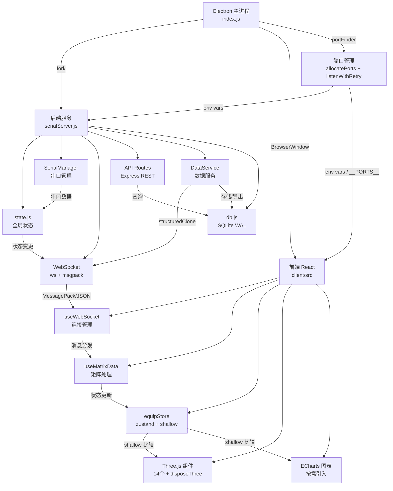

# 架构文档

> 本文档由 Manus 自动生成和维护。最后更新于：2026-03-09

## 1. 项目概述

本项目（`jqtools2` / Shroom）是一个基于 Electron 的桌面应用程序，核心功能是连接硬件传感器（通过串口），实时采集、处理、可视化和分析压力数据。应用包含一个 React 构建的前端界面用于数据展示和交互，以及一个 Node.js 后端服务处理硬件通信、数据存储和 API 请求。支持多种传感器类型（座椅、床垫、手部），提供 3D 可视化、数据采集回放、CSV 导出等功能。

## 2. 技术栈

| 分类 | 技术 | 版本/说明 |
| :--- | :--- | :--- |
| **应用框架** | Electron | 桌面应用容器，管理主进程和渲染进程 |
| **前端框架** | React | 单页应用，Vite 构建（从 CRA/Webpack 迁移） |
| **后端框架** | Express.js | REST API 服务 |
| **实时通信** | ws + @msgpack/msgpack | WebSocket，支持 JSON/MessagePack 双模式 |
| **数据库** | SQLite3 | WAL 模式，本地嵌入式数据库 |
| **状态管理** | zustand | 轻量级状态管理，配合 shallow 比较 |
| **3D 可视化** | Three.js | 压力矩阵 3D 渲染 |
| **图表** | ECharts | 按需引入，折线图等 |
| **UI 组件库** | Ant Design (antd) | 通用 UI 组件 |
| **硬件交互** | serialport | 串口通信 |
| **编程语言** | JavaScript (ES6+) | 前后端统一 |
| **前端构建** | Vite 5 + @vitejs/plugin-react | 秒级启动 + HMR 热更新 |
| **包管理器** | npm | |
| **部署环境** | Windows 桌面 | electron-builder 打包 |
| **其他关键库** | crypto-js, axios, i18next, sass | 加密、HTTP 请求、国际化、样式预处理 |

## 3. 目录结构

```
shroom/
├── index.js                    # Electron 主进程入口
├── indexsingle.js              # 单机模式入口
├── preload.js                  # Electron preload 脚本
├── kartingcar.js               # 卡丁车模式 WebSocket 服务
├── pyWorker.js                 # Python 子进程管理
├── python.js                   # Python 集成
├── genJqtoolsConfig.js         # 配置生成工具
├── package.json
├── server/                     # 后端服务（模块化）
│   ├── serialServer.js         # 服务入口（~90 行）
│   ├── state.js                # 全局状态管理（~74 行）
│   ├── api/
│   │   └── routes.js           # Express REST API 路由（~373 行）
│   ├── websocket/
│   │   └── index.js            # WebSocket 服务（~80 行）
│   ├── serial/
│   │   └── SerialManager.js    # 串口管理（~384 行）
│   ├── services/
│   │   └── DataService.js      # 数据采集/回放/导出（~201 行）
│   ├── equipMap.js             # 设备映射配置
│   └── HttpResult.js           # HTTP 响应封装
├── util/                       # 通用工具模块
│   ├── portFinder.js           # 端口检测与动态分配
│   ├── db.js                   # SQLite 数据库操作
│   ├── logger.js               # 统一日志模块
│   ├── config.js               # 加密配置读写
│   ├── line.js                 # 数据转换工具
│   ├── aes_ecb.js              # AES-ECB 加密
│   ├── parseData.js            # 数据解析
│   ├── serialport.js           # 串口工具
│   ├── time.js                 # 时间工具
│   ├── getServer.js            # 服务器地址获取
│   └── getWinConfig.js         # 窗口配置
├── client/                     # 前端 React 应用
│   ├── src/
│   │   ├── App.js              # 应用根组件
│   │   ├── page/
│   │   │   ├── test/Test.js    # 主测试页面（272 行）
│   │   │   ├── data/Data.js    # 数据页面
│   │   │   └── equip/Equip.js  # 设备管理页面
│   │   ├── hooks/
│   │   │   ├── useWebSocket.js # WebSocket 连接管理 Hook
│   │   │   ├── useMatrixData.js# 矩阵数据处理 Hook
│   │   │   ├── useWindowsize.js# 窗口尺寸 Hook
│   │   │   └── useDebounce.js  # 防抖 Hook
│   │   ├── store/
│   │   │   └── equipStore.js   # zustand 状态仓库
│   │   ├── components/
│   │   │   ├── three/          # Three.js 3D 可视化组件（14 个）
│   │   │   ├── chartsAside/    # ECharts 图表侧边栏
│   │   │   ├── ColAndHistory/  # 采集历史组件
│   │   │   ├── viewSetting/    # 视图设置
│   │   │   ├── title/          # 标题栏组件
│   │   │   ├── aside/          # 侧边栏
│   │   │   ├── Drawer/         # 抽屉组件
│   │   │   ├── num/            # 数值显示组件
│   │   │   └── EquipStatus/    # 设备状态组件
│   │   ├── util/
│   │   │   ├── echarts.js      # ECharts 按需引入入口
│   │   │   ├── portConfig.js   # 端口配置
│   │   │   ├── constant.js     # 常量定义
│   │   │   ├── util.js         # 工具函数
│   │   │   └── disposeThree.js # Three.js 资源清理工具
│   │   ├── scheduler/
│   │   │   └── scheduler.js    # 渲染调度器
│   │   ├── api/
│   │   │   └── request.js      # axios 请求封装
│   │   ├── library/
│   │   │   └── playback/       # 回放功能库
│   │   └── locale/             # i18n 国际化资源
│   ├── index.html              # Vite 入口 HTML（从 public/ 移出）
│   ├── vite.config.js          # Vite 构建配置
│   ├── config/                 # 旧 CRA 配置（保留备用）
│   └── package.json
├── backend/                    # 独立后端服务（备用）
│   └── index.js
├── test/
│   └── portFinder.test.js      # 端口分配单元测试
├── scripts/
│   └── migrate_remarks.py      # 数据迁移脚本
└── swagger.yaml                # API 文档
```

### 关键目录说明

| 目录 | 主要功能 |
| :--- | :--- |
| `/server` | 后端核心服务，模块化拆分为 api、websocket、serial、services |
| `/client/src/components` | 可复用的 UI 组件，包含 14 个 Three.js 3D 可视化组件 |
| `/client/src/page` | 页面级组件：test（主页）、data（数据）、equip（设备管理） |
| `/client/src/hooks` | 自定义 React Hook，封装 WebSocket、矩阵数据等核心逻辑 |
| `/client/src/store` | zustand 状态管理 |
| `/util` | 后端通用工具：端口管理、数据库、日志、加密等 |
| `/client/src/util` | 前端通用工具：echarts 按需引入、端口配置、Three.js 清理 |

## 4. 核心模块与数据流

### 4.1. 模块关系图 (Mermaid)



### 4.2. 主要数据流

1. **实时数据采集流程**
    - 硬件传感器 → 串口 → `SerialManager`（解析数据包）→ `state.js`（更新全局状态）→ `DataService`（`structuredClone` 深拷贝）→ `WebSocket`（MessagePack 二进制 / JSON 广播）→ `useWebSocket` Hook（自动解码）→ `useMatrixData` Hook（处理矩阵数据）→ `zustand store`（`shallow` 比较更新）→ React 组件（`memo` 优化，按需重渲染）→ Three.js 3D 可视化 / ECharts 图表

2. **历史数据回放流程**
    - 前端发起回放请求 → `API Routes` → `DataService`（从 SQLite 读取）→ 定时器逐帧推送 → `WebSocket` 广播 → 前端渲染

3. **端口分配流程**
    - 主进程 `allocatePorts()` 检测可用端口 → 环境变量传递给子进程 → `listenWithRetry()` 二次保障 → `process.send` 回传实际端口 → 前端通过 `window.__PORTS__` 或 `REACT_APP_*_PORT` 获取

## 5. API 端点 (Endpoints)

| 方法 | 路径 | 描述 |
| :--- | :--- | :--- |
| `GET` | `/` | 健康检查 |
| `GET` | `/getSystem` | 获取系统配置 |
| `POST` | `/selectSystem` | 选择系统类型 |
| `POST` | `/changeSystemType` | 切换系统类型 |
| `GET` | `/getPort` | 获取可用串口列表 |
| `GET` | `/connPort` | 连接指定串口 |
| `GET` | `/sendMac` | 发送 MAC 地址绑定 |
| `POST` | `/startCol` | 开始数据采集 |
| `GET` | `/endCol` | 结束数据采集 |
| `GET` | `/getColHistory` | 获取采集历史列表 |
| `POST` | `/getDbHistory` | 获取数据库历史记录 |
| `POST` | `/getDbHistorySelect` | 获取历史记录（带筛选） |
| `POST` | `/getContrastData` | 获取对比数据 |
| `POST` | `/getDbHistoryPlay` | 开始历史数据回放 |
| `POST` | `/getDbHistoryStop` | 停止历史数据回放 |
| `POST` | `/cancalDbPlay` | 取消回放 |
| `POST` | `/changeDbplaySpeed` | 修改回放速度 |
| `POST` | `/getDbHistoryIndex` | 获取历史数据指定帧 |
| `POST` | `/downlaod` | 导出 CSV 数据 |
| `POST` | `/delete` | 删除历史记录 |
| `POST` | `/changeDbName` | 修改数据库记录名称 |
| `POST` | `/changeDbDataName` | 修改数据记录名称 |
| `POST` | `/upsertRemark` | 新增/更新备注 |
| `POST` | `/getRemark` | 获取备注 |
| `POST` | `/bindKey` | 绑定授权密钥 |
| `POST` | `/getCsvData` | 获取 CSV 格式数据 |
| `POST` | `/getSysconfig` | 获取系统配置 |

## 6. 外部依赖与集成

| 服务/库 | 用途 | 集成方式 |
| :--- | :--- | :--- |
| serialport | 硬件串口通信 | Node.js 原生模块 |
| electron | 桌面应用容器 | 主进程框架 |
| electron-builder | 应用打包分发 | 构建工具 |
| three.js | 3D 压力矩阵可视化 | 前端组件 |
| echarts | 折线图表 | 前端按需引入 |
| crypto-js | 配置文件 AES 加密 | 后端工具 |
| i18next | 国际化 | 前端多语言 |

## 7. 环境变量

| 变量名 | 描述 | 示例值 |
| :--- | :--- | :--- |
| `NODE_ENV` | 运行环境 | `development` / `production` |
| `API_PORT` | 后端 API 服务端口 | `19245` |
| `WS_PORT` | WebSocket 服务端口 | `19999` |
| `REACT_APP_API_PORT` | 前端 API 端口（开发模式） | `19245` |
| `REACT_APP_WS_PORT` | 前端 WebSocket 端口（开发模式） | `19999` |
| `REACT_APP_SERVER_ADDRESS` | 服务器地址 | `localhost` |
| `LOG_LEVEL` | 日志级别 | `debug` / `info` / `warn` / `error` |
| `isPackaged` | 是否为打包环境 | `true` / `false` |

## 8. 项目进度

> 记录项目从开始到现在已经完成的所有工作，每次新增追加到末尾。

| 完成日期 | 完成的功能/工作 | 说明 |
| :--- | :--- | :--- |
| 2026-03-01 | 核心功能开发 | 串口通信、数据采集、3D 可视化、历史回放、CSV 导出等核心功能 |
| 2026-03-01 | 端口冲突修复 | portFinder 动态分配、listenWithRetry 二次保障、环境变量传递 |
| 2026-03-01 | Windows spawn 修复 | 修复 React dev server 启动时 spawn EINVAL 错误 |
| 2026-03-01 | 工程化基础 | 添加 .gitignore、清理 copy 文件、重命名为有意义的文件名 |
| 2026-03-01 | 后端模块化重构 | serialServer.js 拆分为 state/websocket/serial/services/api 五个模块 |
| 2026-03-01 | db.js 优化 | 修复 JSON.parse 冗余、清理死代码、提取通用函数 |
| 2026-03-01 | 前端 Hook 封装 | 创建 useWebSocket、useMatrixData Hook，Test.js 从 1499 行精简到 272 行 |
| 2026-03-02 | Three.js 内存泄漏修复 | 14 个组件全部添加 disposeThree 资源清理 |
| 2026-03-02 | 后端性能优化 | structuredClone 替换深拷贝、SQLite WAL 模式 |
| 2026-03-02 | WebSocket 二进制传输 | 支持 MessagePack 双模式，体积减少 70-80% |
| 2026-03-02 | React 渲染优化 | 10 个组件添加 React.memo，zustand shallow 比较 |
| 2026-03-02 | 打包优化 | Webpack splitChunks、echarts 按需引入、统一日志模块 |
| 2026-03-06 | 前端迁移到 Vite | CRA/Webpack → Vite 5，启动 ~200ms，HMR <100ms |
| 2026-03-09 | WebSocket 调试工具 | 在 useWebSocket Hook 中添加 WS 数据打印调试功能，支持开关、过滤、计数、查看最近消息 |
| 2026-03-09 | 框选工具优化 | 框选边框颜色加深（红色 3px），支持同时框选多个区域 |
| 2026-03-09 | 靠背线序旋转 | endiBack / endiBack1024 输出数据旋转 180 度 |
| 2026-03-09 | 框选交互优化 | 统一框选颜色，支持单击选中/取消，选中时显示框选区域面板（可缩小/关闭） |
| 2026-03-09 | 功能面板优化 | 压力曲线/面积曲线/重心曲线/正态分布面板可拖拽、缩放、置顶，不可关闭 |
| 2026-03-09 | DraggablePanel 缩放范围 | 缩放范围从 50%-200% 扩展到 10%-1000%，动态步长 |
| 2026-03-09 | 3D 视角切换统一 | 整体/坐垫/靠背模式视角切换逻辑统一，整体模式下视角切换不再禁用 |
| 2026-03-09 | 3D 边缘外框 | 坐垫/靠背单独模式下显示有效识别范围边缘外框（青色 LineLoop） |
| 2026-03-09 | 删除编辑图标 | 历史数据面板中删除重命名图标 |
| 2026-03-09 | 版本号 V0.0.3 | 新增临时软件版本号，显示在底部工具栏右侧 |

## 9. 更新日志

| 日期 | 变更类型 | 描述 |
| :--- | :--- | :--- |
| 2026-03-02 | 初始化 | 按照 update-tech-doc 技能规范创建 ARCHITECTURE.md |
| 2026-03-02 | 优化重构 | P0: 修复 14 个 Three.js 组件内存泄漏，创建 disposeThree 工具 |
| 2026-03-02 | 优化重构 | P1: structuredClone 替换深拷贝、SQLite WAL 模式、WebSocket MessagePack |
| 2026-03-02 | 优化重构 | P1: 10 个组件添加 React.memo，zustand shallow 比较 |
| 2026-03-02 | 优化重构 | P2: Webpack splitChunks 代码分割、echarts 按需引入、统一日志模块 |
| 2026-03-06 | 依赖升级 | 前端从 CRA (react-scripts/Webpack) 迁移到 Vite 5，启动速度提升 100x |
| 2026-03-09 | 新增功能 | useWebSocket Hook 添加 WS 数据打印调试工具，支持 wsDebugOn/Off/Filter/Last/Count 控制台命令 |
| 2026-03-09 | 优化重构 | 框选工具边框加深为红色 3px，支持多区域同时框选，去除单框选限制 |
| 2026-03-09 | 优化重构 | 靠背数据线序旋转 180 度（endiBack 和 endiBack1024 函数输出 reverse） |
| 2026-03-09 | 新增功能 | 框选工具支持单击选中/取消，选中时显示框选区域面板（可缩小/关闭） |
| 2026-03-09 | 新增组件 | DraggablePanel 可拖拽缩放置顶面板组件，应用于压力/面积/重心/正态分布四个功能面板 |
| 2026-03-09 | 优化重构 | DraggablePanel 缩放范围扩展到 10%-1000%，动态步长调整 |
| 2026-03-09 | 优化重构 | 3D 视角切换逻辑统一，整体模式下同时旋转 sit/back/椅子模型，单独模式与整体一致 |
| 2026-03-09 | 新增功能 | 3D 坐垫/靠背单独模式下显示有效识别范围边缘外框（青色 LineLoop） |
| 2026-03-09 | 优化重构 | 历史数据面板删除重命名图标 |
| 2026-03-09 | 新增功能 | 临时软件版本号 V0.0.3，显示在底部工具栏右侧 |
| 2026-03-09 | 优化重构 | 框选区域面板统一为带输入框样式（X/Y/长/宽可手动输入），鼠标框选后自动填入坐标，选中框可编辑修改位置 |

*变更类型：`新增功能` / `优化重构` / `修复缺陷` / `配置变更` / `文档更新` / `依赖升级` / `初始化`*

---

*此文档旨在提供项目架构的快照，具体实现细节请参考源代码。*
