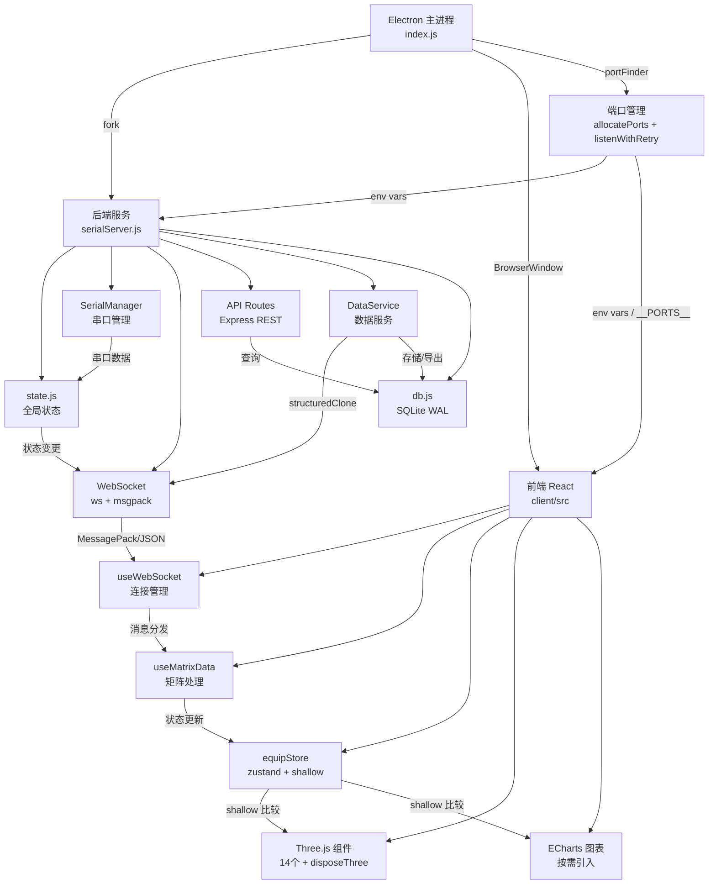

# 架构文档

> 本文档由 Manus 自动生成和维护。最后更新于：2026-05-18

## 1. 项目概述

本项目（`jqtools2` / Shroom）是一个基于 Electron 的桌面应用程序，核心功能是连接硬件传感器（通过串口），实时采集、处理、可视化和分析压力数据。应用包含一个 React 构建的前端界面用于数据展示和交互，以及一个 Node.js 后端服务处理硬件通信、数据存储和 API 请求。支持多种传感器类型（座椅、床垫、手部），提供 3D 可视化、数据采集回放、CSV 导出等功能。

## 2. 技术栈

| 分类 | 技术 | 版本/说明 |
| :--- | :--- | :--- |
| **应用框架** | Electron | 桌面应用容器，管理主进程和渲染进程 |
| **前端框架** | React | 单页应用，Vite 构建（从 CRA/Webpack 迁移） |
| **后端框架** | Express.js | REST API 服务 |
| **实时通信** | ws + @msgpack/msgpack | WebSocket，支持 JSON/MessagePack 双模式 |
| **数据库** | SQLite3 | WAL 模式，本地嵌入式数据库 |
| **状态管理** | zustand | 轻量级状态管理，配合 shallow 比较 |
| **3D 可视化** | Three.js | 压力矩阵 3D 渲染 |
| **图表** | ECharts | 按需引入，折线图等 |
| **UI 组件库** | Ant Design (antd) | 通用 UI 组件 |
| **硬件交互** | serialport | 串口通信 |
| **编程语言** | JavaScript (ES6+) | 前后端统一 |
| **前端构建** | Vite 5 + @vitejs/plugin-react | 秒级启动 + HMR 热更新 |
| **包管理器** | npm | |
| **部署环境** | Windows 桌面 | electron-builder 打包 |
| **其他关键库** | crypto-js, axios, i18next, sass | 加密、HTTP 请求、国际化、样式预处理 |

## 3. 目录结构

```
shroom/
├── index.js                    # Electron 主进程入口
├── indexsingle.js              # 单机模式入口
├── preload.js                  # Electron preload 脚本
├── kartingcar.js               # 卡丁车模式 WebSocket 服务
├── pyWorker.js                 # Python 子进程管理
├── python.js                   # Python 集成
├── genJqtoolsConfig.js         # 配置生成工具
├── package.json
├── server/                     # 后端服务（模块化）
│   ├── serialServer.js         # 服务入口（~118 行）
│   ├── state.js                # 全局状态管理（含 lastDataTime/rescanLock）
│   ├── api/
│   │   └── routes.js           # Express REST API 路由（~373 行）
│   ├── websocket/
│   │   └── index.js            # WebSocket 服务（~80 行）
│   ├── serial/
│   │   └── SerialManager.js    # 串口管理（含 rescanPort/僵尸检测/帧验证）
│   ├── services/
│   │   └── DataService.js      # 数据采集/回放/导出（~201 行）
│   ├── equipMap.js             # 设备映射配置
│   └── HttpResult.js           # HTTP 响应封装
├── util/                       # 通用工具模块
│   ├── portFinder.js           # 端口检测与动态分配
│   ├── db.js                   # SQLite 数据库操作
│   ├── logger.js               # 统一日志模块
│   ├── config.js               # 加密配置读写
│   ├── serialCache.js          # MAC→设备类型本地缓存（serial_cache.json）
│   ├── line.js                 # 数据转换工具
│   ├── aes_ecb.js              # AES-ECB 加密
│   ├── parseData.js            # 数据解析
│   ├── serialport.js           # 串口工具
│   ├── time.js                 # 时间工具
│   ├── getServer.js            # 服务器地址获取
│   └── getWinConfig.js         # 窗口配置
├── client/                     # 前端 React 应用
│   ├── src/
│   │   ├── App.js              # 应用根组件
│   │   ├── page/
│   │   │   ├── test/Test.js    # 主测试页面（272 行）
│   │   │   ├── data/Data.js    # 数据页面
│   │   │   ├── equip/Equip.js  # 设备管理页面
│   │   │   └── equip/macConfig/MacConfig.js # MAC 地址配置页面
│   │   ├── hooks/
│   │   │   ├── useWebSocket.js # WebSocket 连接管理 Hook
│   │   │   ├── useMatrixData.js# 矩阵数据处理 Hook
│   │   │   ├── useWindowsize.js# 窗口尺寸 Hook
│   │   │   └── useDebounce.js  # 防抖 Hook
│   │   ├── store/
│   │   │   └── equipStore.js   # zustand 状态仓库（含 macInfo/rescanning 状态）
│   │   ├── components/
│   │   │   ├── three/          # Three.js 3D 可视化组件（14 个）
│   │   │   ├── chartsAside/    # ECharts 图表侧边栏
│   │   │   ├── ColAndHistory/  # 采集历史组件
│   │   │   ├── viewSetting/    # 视图设置
│   │   │   ├── title/          # 标题栏组件
│   │   │   ├── aside/          # 侧边栏
│   │   │   ├── Drawer/         # 抽屉组件
│   │   │   ├── num/            # 数值显示组件
│   │   │   └── EquipStatus/    # 设备状态组件
│   │   ├── util/
│   │   │   ├── echarts.js      # ECharts 按需引入入口
│   │   │   ├── portConfig.js   # 端口配置
│   │   │   ├── constant.js     # 常量定义
│   │   │   ├── util.js         # 工具函数
│   │   │   └── disposeThree.js # Three.js 资源清理工具
│   │   ├── scheduler/
│   │   │   └── scheduler.js    # 渲染调度器
│   │   ├── api/
│   │   │   └── request.js      # axios 请求封装
│   │   ├── library/
│   │   │   └── playback/       # 回放功能库
│   │   └── locale/             # i18n 国际化资源
│   ├── index.html              # Vite 入口 HTML（从 public/ 移出）
│   ├── vite.config.js          # Vite 构建配置
│   ├── config/                 # 旧 CRA 配置（保留备用）
│   └── package.json
├── backend/                    # 独立后端服务（备用）
│   └── index.js
├── test/
│   └── portFinder.test.js      # 端口分配单元测试
├── scripts/
│   └── migrate_remarks.py      # 数据迁移脚本
└── swagger.yaml                # API 文档
```

### 关键目录说明

| 目录 | 主要功能 |
| :--- | :--- |
| `/server` | 后端核心服务，模块化拆分为 api、websocket、serial、services |
| `/client/src/components` | 可复用的 UI 组件，包含 14 个 Three.js 3D 可视化组件 |
| `/client/src/page` | 页面级组件：test（主页）、data（数据）、equip（设备管理） |
| `/client/src/hooks` | 自定义 React Hook，封装 WebSocket、矩阵数据等核心逻辑 |
| `/client/src/store` | zustand 状态管理 |
| `/util` | 后端通用工具：端口管理、数据库、日志、加密等 |
| `/client/src/util` | 前端通用工具：echarts 按需引入、端口配置、Three.js 清理 |

## 4. 核心模块与数据流

### 4.1. 模块关系图 (Mermaid)


```mermaid
graph TD
    A[Electron 主进程<br/>index.js] -->|fork| B[后端服务<br/>serialServer.js]
    A -->|BrowserWindow| C[前端 React<br/>client/src]

    B --> B1[state.js<br/>全局状态]
    B --> B2[SerialManager<br/>串口管理]
    B --> B3[WebSocket<br/>ws + msgpack]
    B --> B4[API Routes<br/>Express REST]
    B --> B5[DataService<br/>数据服务]
    B --> B6[db.js<br/>SQLite WAL]

    B2 -->|串口数据| B1
    B1 -->|状态变更| B3
    B5 -->|structuredClone| B3
    B4 -->|查询| B6
    B5 -->|存储/导出| B6

    C --> C1[useWebSocket<br/>连接管理]
    C --> C2[useMatrixData<br/>矩阵处理]
    C --> C3[equipStore<br/>zustand + shallow]
    C --> C4[Three.js 组件<br/>14个 + disposeThree]
    C --> C5[ECharts 图表<br/>按需引入]

    B3 -->|MessagePack/JSON| C1
    C1 -->|消息分发| C2
    C2 -->|状态更新| C3
    C3 -->|shallow 比较| C4
    C3 -->|shallow 比较| C5

    A -->|portFinder| D[端口管理<br/>allocatePorts + listenWithRetry]
    D -->|env vars| B
    D -->|env vars / __PORTS__| C
```

### 4.2. 主要数据流

1. **实时数据采集流程**
    - 硬件传感器 → 串口 → `SerialManager`（解析数据包）→ `state.js`（更新全局状态）→ `DataService`（`structuredClone` 深拷贝）→ `WebSocket`（MessagePack 二进制 / JSON 广播）→ `useWebSocket` Hook（自动解码）→ `useMatrixData` Hook（处理矩阵数据）→ `zustand store`（`shallow` 比较更新）→ React 组件（`memo` 优化，按需重渲染）→ Three.js 3D 可视化 / ECharts 图表

2. **历史数据回放流程**
    - 前端发起回放请求 → `API Routes` → `DataService`（从 SQLite 读取）→ 定时器逐帧推送 → `WebSocket` 广播 → 前端渲染

3. **端口分配流程**
    - 主进程 `allocatePorts()` 检测可用端口 → 环境变量传递给子进程 → `listenWithRetry()` 二次保障 → `process.send` 回传实际端口 → 前端通过 `window.__PORTS__` 或 `REACT_APP_*_PORT` 获取

4. **历史数据页签交互状态流**
    - `ColAndHistory` 在“本地数据 / 导入数据”页签之间共享删除、下载等操作态；切换页签前统一重置 `operateStatus`、`selectArr` 和 `contrastArr`，避免编辑/选择状态跨页签残留

5. **底部控制栏与抽屉层级**
    - `ColAndHistory` 的底部固定控制层需要低于右侧历史抽屉；`colAndHContent` 保持在画布之上但低于 `Drawer`，避免抽屉底部“存储路径”等交互区被遮挡

6. **3D 单视图控制器对焦**
    - `ThreeAndCarPointV2` 的单独靠背/坐垫模式保留原有 `reset + move` 动画流程；在 tween 完成后会把期望旋转中心投影到当前相机视线方向上，再用该投影点更新 `TrackballControls.target` 与缩放基准，从而尽量贴近当前对象旋转，同时保持画面尺寸与位置不突变
    - 整体模式的默认 reset 基准只在初始化整体视图时写入一次；切换到单独靠背/坐垫或切回 `all` 后，后续的无视觉位移对焦不会覆盖这个默认基准，从而保证下一次切换模式时仍然能从整体视图起播动画
    - 在整体模式下，初始加载和切回 `all` 视图后会将座椅模型、坐垫点阵、靠背点阵的联合包围盒中心投影到当前视线，再无视觉位移地同步到 `TrackballControls.target`，使左键旋转围绕整体对象而不是场景原点

7. **非正方形矩阵框选有效区**
    - `BrushManager` 不再把整个 `.canvasThree` 都视为可框选区域；会根据当前系统与 `displayType` 读取 `systemPointConfig`，计算真实矩阵在画布中的有效矩形
    - 对 `endi-back` 这类非正方形矩阵，框选起点和最终框选区域都必须完整落在真实矩阵区域内；例如靠背按 `50 x 64` 有效区判定，而不是整个正方形 canvas
    - 当用户在有效区外起框或框选越界时，统一提示“请在有效区域框选”
    - 框选视觉样式统一由 `newSelecttBox.js` 输出：边框使用提亮后的显示色，填充层单独使用半透明色值，避免整块元素 `opacity` 把边框一起压暗

8. **更新日志双轨维护**
    - 根目录 `CHANGELOG.md` 维护面向仓库的 Markdown 版本记录，用于汇总每个版本的文字说明
    - `client/src/page/equip/changeLog/ChangeLog.js` 维护应用内时间线展示，版本号与日期需要和根目录 changelog 保持同步

9. **打包版本元数据**
    - Electron 安装包依赖根目录 `package.json` 的 `version` 字段，必须是合法 SemVer；诸如 `endi1.0.1` 这类业务前缀版本不能直接用于 `electron-builder`
    - 前端界面显示版本由 `client/src/util/version.js` 的 `APP_VERSION` 单独维护，因此可以保留业务展示版本，同时将打包元数据保持为合法的 `1.0.1`
    - 打包配置中的 `npmRebuild` 已显式关闭，避免 `electron-builder` 在本机已有 N-API 预编译二进制时仍强制重编 `sqlite3` / `serialport`，从而被缺失的 VS C++ 工具链阻塞

10. **本地串口缓存写入路径**
    - `serial_cache.json` 在开发模式下仍写入项目根目录，保持现有调试习惯不变
    - 打包后主进程会将 `SERIAL_CACHE_PATH` 传给后端子进程，统一落到 Electron `userData` 目录下的 `serial_cache.json`，不再尝试写入只读的 `app.asar`
    - `serialCache.writeCache()` 在落盘前会自动创建父目录，确保首次启动时缓存目录不存在也能正常写入

11. **本地 CSV 导入校验与列表去重**
    - `/uploadCsv` 保存后通过 `validateImportedCsv` 校验导出结构，必须包含 `sec(s)`、`time`、原始数据矩阵列和同前缀统计列；矩阵数组长度需匹配 32x32、46x46、50x64 或 4096 等受支持点阵，并且所有元素为数字
    - 校验失败会删除临时上传文件并返回“数据有误”，避免无效 CSV 进入本地导入列表；`/getCsvData` 改为等待 CSV 读取完成并处理读取错误
    - `ColAndHistory` 的导入列表从 `localStorage` 读取、上传追加和删除时统一按路径去重，切换页签和上传/删除后清空操作态，避免重复渲染和复选状态残留

12. **回放框选与采集翻转方向一致性**
    - `/getDbHistoryIndex` 拖动进度条时复用 `getPlaybackSnapshot()` 构造帧数据，和正常播放一样注入 `historySelectCache`，避免拖动时回退展示完整原始数据
    - 前端画布翻转后会通过 `/setDataDirection` 同步当前方向；`/startCol` 也会携带采集开始时的方向，后端保存每帧前按该方向翻转矩阵并写入 `dataDirection`
    - `useMatrixData` 渲染历史帧时比较“帧保存方向”和“当前显示方向”，只做差异翻转，避免已按翻转方向保存的数据在回放时被二次翻转
    - 2026-05-15 起，`/setDataDirection` 会把方向写入后端 `data_direction.json`，服务启动时加载；实时 WebSocket 输出也由后端按该方向转换并写入 `dataDirection`，前端只同步方向状态，不再只依赖本地画布翻转。多矩阵系统使用 `byKey` 分别记录 `${system}-back` 与 `${system}-sit` 的方向，当前工具提供坐垫上下翻转、坐垫左右翻转、坐垫 90 度旋转和靠背左右翻转，未命中的矩阵不继承本次翻转状态。

13. **座椅模型亮度与采集控件字号**
    - `ThreeAndCarPointV2` 为座椅 GLB 模型增加环境光、半球光、主补光，并在加载后统一处理贴图色彩空间、材质颜色、粗糙度和轻量自发光，降低黑场下模型发暗的问题
    - `ColControlV2` 将“数据采集”/采集计时文字从 `fs16` 调整为 `fs14`，与右侧“历史数据”入口字号保持一致

14. **一键连接与重连异常处理**
    - `SerialManager` 为 `/connPort` 和 `/rescanPort` 增加连接生命周期锁，防止连续点击导致重复连接；锁超过最大生命周期后会释放陈旧任务，避免界面长期卡在连接中
    - `/connPort` 总体连接超时控制为 20 秒，前端标题栏请求超时为 15 秒；后端扫描、波特率探测、稳定打开、MAC 读取和类型授权识别均按阶段返回结构化错误
    - `/rescanPort` 不再只清理死端口或僵尸端口，而是先完整释放旧串口、parser、监听器、缓存和发送定时器，再重新扫描连接，避免仍打开的旧端口被跳过
    - MAC/type/auth 校验失败的设备会立即关闭对应串口并从运行态移除；只有通过识别和授权的设备才绑定数据处理器并进入采集链路
    - 前端 `Title` 根据 `HttpResult.code` 和 `data.success` 判断真实连接结果，失败时进入 `failed` 状态并显示后端中文错误；`useWebSocket` 同步 `connectResult/macInfo`，保证异步连接结果和按钮状态一致

15. **框选矩阵坐标与分析解耦**
    - `BrushManager` 在拖拽、缩放、键盘移动和手动输入创建区域时同步生成 `matrixKey` 与 `matrixRect`，框选保存和统计优先使用矩阵坐标，不再依赖 DOM 像素反推
    - 框选仅在可解析矩阵配置的 2D 数字视图启用；起点、终点、拖动、缩放和手动输入都会校验有效矩阵范围、正尺寸和最多 4 个区域
    - 坐垫/靠背或系统类型切换时清空当前框选，避免旧坐标套用到不同矩阵；回放查询和实时统计按区域绑定的 `matrixKey` 选择对应数据源
    - 采集开始时只把框选作为可选分析方案元数据保存，仍然保存全量矩阵；导出统计修复全零框选时最小值为 `Infinity` 的异常
    - `SelectSet` 支持框选区域命名，名称会进入实时统计、图表图例、采集备注和回放筛选元数据，便于区分“左侧坐垫”“腰托区域”等实验区域
    - 框选模板以 `localStorage.selectionTemplatesV1` 保存，只持久化区域名称、坐标、颜色、设备 key、显示对象和矩阵尺寸，不保存原始压力矩阵、帧数据或统计结果
    - 模板应用严格匹配 `deviceType/displayType/matrixWidth/matrixHeight`，已有框选时通过确认弹窗覆盖；删除模板只移除本地模板，不清空当前画布区域

16. **数据对比 A/B 分析**
    - `ColAndHistory` 在历史数据面板新增 A/B 对比选择入口，只允许从本地历史记录选择两条不同记录进入对比，CSV/实时对比仍不进入 V2.0 P0。
    - `/getContrastData` 负责读取两条历史全量矩阵、校验记录非空、A/B 不同，并按双方共同存在且尺寸一致的矩阵 key 建立可比范围；一条记录同时包含坐垫/靠背而另一条只包含其中之一时，只对共同矩阵进入对比。
    - 对比视图由 `NumThresContrast` 和 `ContrastHeatmap` 渲染 A 基准图、B 对比图、`B-A` 红蓝差值图；统一进度条按百分比映射到 A/B 各自帧号，支持帧数不同的数据同步查看。
    - 指标表在前端按当前帧计算 A、B、差值和变化率，支持全量矩阵和当前 `selectArr.matrixRect` 框选区域；对比模式下允许继续使用框选工具，同一矩阵坐标作用于 A/B/差值分析。
    - `NumThresContrast` 内嵌 `SelectSet`，让数据对比独占视图下仍可应用框选模板；模板恢复出的同一矩阵区域会作用到 A/B 和差值指标计算。
    - `Test` 在 `display='contrast'` 时隐藏 `Title`、`ViewSetting`、`ColAndHistory` 和 `ChartsAside`，让对比页独占视图；`contrast.scss` 使用固定 100vh flex 布局压缩三图、进度条、图例和指标表，避免其它分析数据与对比内容叠加。

17. **2D 数字显示基线恢复**
    - `NumThreeColorV2/V3/V4` 与 `NumThres` 恢复为当前分支修改前的 2D 数字显示实现；数字纹理字体回到固定 `40px/32px` 策略，不再使用动态字号、格内裁剪和黑色描边。
    - 2D 数字渲染前对压力值做 `Number -> Math.round -> 0..255` 归一化，保证用于 UV 偏移和放大镜展示的原始值为整数，避免小数导致贴图采样偏移。

18. **回放图表数据源修复**
    - `ChartsAside` 在回放模式下优先使用历史接口返回的 `historyChart.pressArr/areaArr` 生成曲线，不再依赖实时 `chartRef.current` 已存在。
    - 仅在实时数据路径使用当前帧 `boxStats` 生成框选多曲线，避免回放曲线被旧实时帧或空实时帧跳过。

19. **采集中方向口径锁定**
    - 根据主 PRD 的数据处理规则，采集开始后通过 `useEquipStore.collecting` 记录全局采集状态，采集结束或失败时释放。
    - 画布翻转入口在采集中会拦截并提示“采集中禁止翻转，请停止采集后再修改方向”，避免同一次采集内出现不同显示方向口径。

20. **CSV 导出 metadata 与接口兼容**
    - CSV 导出新增 `csv_format_version`、`record_id`、`system_type`、`matrix_key`、矩阵尺寸、采样率、数据方向和置零状态字段，满足 PRD 对导出数据可追溯的要求。
    - 后端新增标准 `/download` 接口并保留旧 `/downlaod` 兼容路径，前端导出调用切换到 `/download`。

21. **工具与方向状态完善**
    - 前端方向状态扩展为兼容 `left/up + byKey` 结构，支持坐垫/靠背等多矩阵对象独立保存上下/左右翻转方向，并写入 `localStorage` 持久化。
    - 采集入库按矩阵 key 读取方向并写入每个矩阵帧的 `dataDirection`，CSV metadata 可分别反映坐垫/靠背方向。
    - 新增 `noCompleted.md` 按分类维护功能完成度，未完成项置顶，后续 PRD 对齐时持续更新。

22. **MAC 配置强校验**
    - 新增 `util/deviceConfigValidation.js` 统一校验 MAC/Unique ID、设备类型、重复配置和设备大类推断，后端 `/cache/devices` 写入前必须通过校验。
    - 新增 `/cache/devices/bulk` 批量保存接口，先整体验证再清空并写入 `serial_cache.json`，避免前端逐条写入导致部分成功、部分失败。
    - `MacConfig` 页面在输入时实时解析并展示错误，保存前拦截格式错误、重复 MAC/Unique ID 和不支持的设备类型，支持冒号分隔 MAC 与硬件返回的连续十六进制 Unique ID。

23. **设备数据接收与处理质量状态**
    - `SerialManager` 增加数据质量统计，按端口/设备记录 `rawFrame`、`rawPointArray`、坏帧总数、连续坏帧、1 秒坏帧率、采样率异常和最后错误信息。
    - 未识别帧长度、空帧、矩阵尺寸不匹配会被记录为异常帧；连续 10 帧异常或矩阵尺寸错误会进入 `device_error`，并通过 WebSocket 推送 `dataQuality`。
    - `DataService.parseData` 在实时 payload 中附加 `sampleRateHz`、`frameIntervalMs`、`matrixMeta` 和 `dataQuality`，并在采集入库时跳过 `device_error/matrix_error/offline` 帧，避免异常帧污染历史数据。
    - 前端 `useWebSocket` 和 `useMatrixData` 消费 `dataQuality`，对数据不稳定或设备数据异常进行节流提示，并将连续异常同步为 `deviceError` 连接状态。

24. **连接后展示视图规则**
    - `client/src/util/displayMapping.js` 统一 3D 点图/模型颜色映射：颜色上限仅作为颜色饱和上限，超过上限的数据按最大颜色显示，不修改原始矩阵值。
    - `filter` 只作为无效点显示阈值，低于阈值的点在 `ThreeAndCarPointV2` 中隐藏；颜色上限不再承担隐藏阈值，避免调高颜色上限导致点位错误消失。
    - `CanvasMemo`、`ThreeAndCar`、`ThreeAndModel`、`ThreeAndCarPoint`、`ThreeAndCarPointV2` 渲染颜色时仅传入裁剪后的显示值，采集、统计、回放和 CSV 导出仍使用原始数据链路。
    - `ViewSetting` 在连接后切换坐垫/靠背 2D 或 3D 视图时检查 `displayStatus`，缺少对应矩阵数据时提示并阻止切换；3D 数字视图本次未纳入调整。

25. **连接后功能工具模块**
    - 方向状态从 `left/up` 扩展为 `left/up/rotateDegree/data_direction`，并继续支持 `byKey`，坐垫和靠背可分别保存上下翻转、左右翻转和 0/90/180/270 度累计旋转。
    - `SecondTitle` 的画布翻转下拉增加“顺时针旋转90°”，`IconAndTextAndSelect` 在采集中统一拦截翻转/旋转，避免同一次采集出现方向口径变化。
    - `DataService.storageData` 采集入库前按当前方向修正业务矩阵，写入 `dataDirection`、`matrixMeta` 和旋转后的矩阵尺寸；CSV 导出新增 `rotate_degree`、`data_direction`。
    - 预压力置零从纯前端展示状态升级为后端采集口径：前端点击置零时通过 `/setZeroBaseline` 同步当前基线，后端入库前扣减基线并写入 `zeroState`，CSV 导出 `zero_enabled/zero_time/zero_state`。
    - `newRuler` 将量尺数量限制为最多 8 条，按当前设备点距计算直线距离并默认以 cm 显示，超限时提示。

26. **采集、历史数据、回放与导出对比**
    - 回放通过 `validatePlaybackFrameData()` 校验历史帧，空帧、矩阵缺失、矩阵长度不匹配和非法数值会自动跳过；连续 10 个异常帧会停止回放并返回 `playError`，避免损坏历史导致软件崩溃。
    - 回放倍速限制为 PRD 指定的 `0.5x/1x/2x/4x`，后端 `changePlaySpeed()` 对非法倍速回退到 1x。
    - CSV 导出在保留旧中文业务列的同时新增标准字段：`software_version`、`device_mac`、`device_type`、`frame_index`、`timestamp`、`pressure_unit`、`pressure_conversion`、`noise_removed`、标准指标列和 `selection_1_*` 框选派生字段。
    - CSV 导出改为单条历史记录只生成一个文件；坐垫和靠背数据按行合并在同一 CSV 内，通过 `matrix_key/device_type` 区分，避免导入时需要处理同一批次的多文件关联。
    - carY 导出增加 `pressure_conversion=carY_100_div_3` 和说明字段，标明其展示、统计、采集和导出的换算口径。
    - 数据对比页从 A/B/差值调整为 A/差值/B 三栏，新增分析范围状态条、当前帧结论摘要、固定红蓝图例、差值范围提示、压力/面积趋势曲线和当前对比结果 CSV 导出。
    - 按《框选与数据对比界面体验优化方案》补齐对比页右侧区域管理栏：支持全量/框选区域显式切换，显示框选坐标、压力差、面积差和导出预览；状态条补充当前帧、采样率、置零与方向口径。
    - Designer 视角体验继续增强：实时/回放 2D 框选面板复用历史数据同款 `Drawer` 右侧抽屉，不遮挡主画布；框选画布拖拽/移动/缩放时显示行列范围与尺寸提示，框选编号在画布、区域列表和对比侧栏保持一致；差值图内部固定显示红/灰/蓝图例和当前差值范围。
    - 公共 `Drawer` 通过 `createPortal` 挂载到 `document.body`，避免被各自父级 stacking context 固定层级；打开和点击时自动提升层级，多个抽屉同时存在时最近点击的抽屉处于最上层；框选监听仅响应 2D canvas 点击，点击抽屉、工具栏、底部控制区、弹窗或普通页面区域不会误触发“请在有效区域框选”。
    - 实时框选控制点优化：移除框内编号避免遮挡矩阵，右上角删除按钮改为项目统一关闭 iconfont 并独立外置，避免和右上缩放手柄重叠。
    - 2026-05-15 起，框选工具从右侧抽屉恢复为标题栏下方小浮窗；退出框选时若存在区域，会先询问是否保存为模板，保存后写入本地模板再关闭。
    - 框选小浮窗会读取当前 2D 数字矩阵 `.canvasThree` 的实际边界并定位到矩阵右侧，同时避让右侧 `DraggablePanel` 图表面板；空间不足时优先收窄或下移，避免遮挡数字矩阵和右侧图表可视化。
    - 数据采集入口与当前框选解耦，不再把框选随 `/startCol` 或 `upsertRemark` 写入历史备注，采集只保存完整矩阵数据和采集参数。
    - 回放帧通过 `processSensorFrame(..., { source: 'playback' })` 进入前端矩阵处理链路，只更新显示和统计，不覆盖实时设备在线状态；退出回放/对比时 `/cancalDbPlay` 清理历史状态并主动推送一帧实时数据，避免传感器仍连接但 UI 显示未连接。

27. **3D 视角切换角度**
    - `ViewSetting` 的 3D 视角切换统一维护 `0/1/2` 三档序号，切换整体/靠背/座椅显示对象时重置到 0° 初始位置。
    - `ThreeAndCarPointV2.changePointRotation()` 将每档步进固定为 45°，因此靠背或座椅单独选中后点击视角切换时按 0°、向里 45°、向里 90°循环。

## 5. API 端点 (Endpoints)

| 方法 | 路径 | 描述 |
| :--- | :--- | :--- |
| `GET` | `/` | 健康检查 |
| `GET` | `/getSystem` | 获取系统配置 |
| `POST` | `/selectSystem` | 选择系统类型 |
| `POST` | `/changeSystemType` | 切换系统类型 |
| `GET` | `/getPort` | 获取可用串口列表 |
| `GET` | `/connPort` | 一键连接（波特率探测+连接+MAC识别一体化） |
| `GET` | `/rescanPort` | 重新连接（清理死端口/僵尸设备后重连） |
| `GET` | `/stopPort` | 断开所有串口连接 |
| `GET` | `/sendMac` | 发送 MAC 地址绑定（保留兼容） |
| `POST` | `/startCol` | 开始数据采集 |
| `POST` | `/setDataDirection` | 同步并持久化当前翻转方向，供实时输出和采集保存统一按显示方向转换 |
| `GET` | `/getDataDirection` | 获取后端持久化的当前翻转方向，供前端初始化同步 |
| `POST` | `/setZeroBaseline` | 同步预压力置零基线，供采集保存和 CSV 导出记录置零口径 |
| `GET` | `/endCol` | 结束数据采集 |
| `GET` | `/getColHistory` | 获取采集历史列表 |
| `POST` | `/getDbHistory` | 获取数据库历史记录 |
| `POST` | `/getDbHistorySelect` | 获取历史记录（带筛选） |
| `POST` | `/getContrastData` | 获取 A/B 对比数据并完成可比性校验 |
| `POST` | `/getContrastIndex` | 按进度百分比获取 A/B 同步对比帧 |
| `POST` | `/getDbHistoryPlay` | 开始历史数据回放 |
| `POST` | `/getDbHistoryStop` | 停止历史数据回放 |
| `POST` | `/cancalDbPlay` | 取消回放 |
| `POST` | `/changeDbplaySpeed` | 修改回放速度 |
| `POST` | `/getDbHistoryIndex` | 获取历史数据指定帧 |
| `POST` | `/downlaod` | 导出 CSV 数据 |
| `POST` | `/delete` | 删除历史记录 |
| `POST` | `/changeDbName` | 修改数据库记录名称 |
| `POST` | `/changeDbDataName` | 修改数据记录名称 |
| `POST` | `/upsertRemark` | 新增/更新备注 |
| `POST` | `/getRemark` | 获取备注 |
| `POST` | `/bindKey` | 绑定授权密钥 |
| `POST` | `/uploadCsv` | 上传并校验本地 CSV，结构不匹配时返回“数据有误” |
| `POST` | `/getCsvData` | 获取 CSV 格式数据 |
| `POST` | `/getSysconfig` | 获取系统配置 |
| `GET` | `/cache/device-types` | 获取 MAC 配置允许的设备类型 |
| `POST` | `/cache/devices/bulk` | 批量校验并保存 MAC/Unique ID 到设备类型映射 |

## 6. 外部依赖与集成

| 服务/库 | 用途 | 集成方式 |
| :--- | :--- | :--- |
| serialport | 硬件串口通信 | Node.js 原生模块 |
| electron | 桌面应用容器 | 主进程框架 |
| electron-builder | 应用打包分发 | 构建工具 |
| three.js | 3D 压力矩阵可视化 | 前端组件 |
| echarts | 折线图表 | 前端按需引入 |
| crypto-js | 配置文件 AES 加密 | 后端工具 |
| i18next | 国际化 | 前端多语言 |

## 7. 环境变量

| 变量名 | 描述 | 示例值 |
| :--- | :--- | :--- |
| `NODE_ENV` | 运行环境 | `development` / `production` |
| `API_PORT` | 后端 API 服务端口 | `19245` |
| `WS_PORT` | WebSocket 服务端口 | `19999` |
| `REACT_APP_API_PORT` | 前端 API 端口（开发模式） | `19245` |
| `REACT_APP_WS_PORT` | 前端 WebSocket 端口（开发模式） | `19999` |
| `REACT_APP_SERVER_ADDRESS` | 服务器地址 | `localhost` |
| `LOG_LEVEL` | 日志级别 | `debug` / `info` / `warn` / `error` |
| `isPackaged` | 是否为打包环境 | `true` / `false` |

## 8. 项目进度

> 记录项目从开始到现在已经完成的所有工作，每次新增追加到末尾。

| 完成日期 | 完成的功能/工作 | 说明 |
| :--- | :--- | :--- |
| 2026-03-01 | 核心功能开发 | 串口通信、数据采集、3D 可视化、历史回放、CSV 导出等核心功能 |
| 2026-03-01 | 端口冲突修复 | portFinder 动态分配、listenWithRetry 二次保障、环境变量传递 |
| 2026-03-01 | Windows spawn 修复 | 修复 React dev server 启动时 spawn EINVAL 错误 |
| 2026-03-01 | 工程化基础 | 添加 .gitignore、清理 copy 文件、重命名为有意义的文件名 |
| 2026-03-01 | 后端模块化重构 | serialServer.js 拆分为 state/websocket/serial/services/api 五个模块 |
| 2026-03-01 | db.js 优化 | 修复 JSON.parse 冗余、清理死代码、提取通用函数 |
| 2026-03-01 | 前端 Hook 封装 | 创建 useWebSocket、useMatrixData Hook，Test.js 从 1499 行精简到 272 行 |
| 2026-03-02 | Three.js 内存泄漏修复 | 14 个组件全部添加 disposeThree 资源清理 |
| 2026-03-02 | 后端性能优化 | structuredClone 替换深拷贝、SQLite WAL 模式 |
| 2026-03-02 | WebSocket 二进制传输 | 支持 MessagePack 双模式，体积减少 70-80% |
| 2026-03-02 | React 渲染优化 | 10 个组件添加 React.memo，zustand shallow 比较 |
| 2026-03-02 | 打包优化 | Webpack splitChunks、echarts 按需引入、统一日志模块 |
| 2026-03-06 | 前端迁移到 Vite | CRA/Webpack → Vite 5，启动 ~200ms，HMR <100ms |
| 2026-03-09 | WebSocket 调试工具 | 在 useWebSocket Hook 中添加 WS 数据打印调试功能，支持开关、过滤、计数、查看最近消息 |
| 2026-03-09 | 框选工具优化 | 框选边框颜色加深（红色 3px），支持同时框选多个区域 |
| 2026-03-09 | 靠背线序旋转 | endiBack / endiBack1024 输出数据旋转 180 度 |
| 2026-03-09 | 框选交互优化 | 统一框选颜色，支持单击选中/取消，选中时显示框选区域面板（可缩小/关闭） |
| 2026-03-09 | 功能面板优化 | 压力曲线/面积曲线/重心曲线/正态分布面板可拖拽、缩放、置顶，不可关闭 |
| 2026-03-09 | DraggablePanel 缩放范围 | 缩放范围从 50%-200% 扩展到 10%-1000%，动态步长 |
| 2026-03-09 | 3D 视角切换统一 | 整体/坐垫/靠背模式视角切换逻辑统一，整体模式下视角切换不再禁用 |
| 2026-03-09 | 3D 边缘外框 | 坐垫/靠背单独模式下显示有效识别范围边缘外框（青色 LineLoop） |
| 2026-03-09 | 删除编辑图标 | 历史数据面板中删除重命名图标 |
| 2026-03-09 | 版本号 V0.0.3 | 新增临时软件版本号，显示在底部工具栏右侧 |
| 2026-04-17 | MAC 地址本地配置 | 新增 MacConfig 页面（黑色主题单输入框），MAC→类型映射持久化到 serial_cache.json，启动自动检测，右上角设置按钮跳转 |
| 2026-04-17 | 3D 缩放等比例优化 | 缩放改为等比例（×1.1/÷1.1），范围 10%~300%，消除阶梯跳跃卡顿 |
| 2026-04-17 | 连接逻辑全面优化 | 一键连接合并 connPort+sendMac；新增 rescanPort（清理死端口+僵尸设备+重连）；新增 stopPort（断开所有串口）；波特率帧长度双重验证；连接重试 3 次；前端重连/断开按钮；5 秒防抖 offline 检测 |

| 2026-04-17 | 3D 透视视角缩放修复 | 新增 `threeZoom` 公用缩放工具；按钮/滚轮缩放改为基于相机到 `controls.target` 的真实距离，保留当前透视角和当前模式，不再因 `+/-` 重置整体视图 |

| 2026-04-17 | 3D 缩放交互提速 | 按钮缩放取消补间动画，改为即时到位，减少点击放大/缩小时的拖滞感 |

| 2026-04-17 | CSV 导出文件名区分修复 | 导出文件名改为保留系统类型与 back/sit 区分，并在存在别名时仍附带原始记录时间，避免多文件导出时不易区分或发生同名覆盖 |

| 2026-04-17 | 3D 缩放状态同步修复 | 按钮缩放前先同步 `TrackballControls` 的缩放/平移/旋转残留状态，避免 `+/-` 后首次滚轮缩放出现反向跳动 |

| 2026-04-17 | 3D 缩放百分比实时同步 | 缩放百分比改为监听 `TrackballControls` 的 `change` 事件实时计算，阻尼尾段继续运动时显示值也跟随真实相机距离更新 |

| 2026-04-17 | 3D 点位调参后动画修复 | `ThreeAndCarPointV2` 将 group/chair/tween 状态改为 ref 持有，并让座椅/靠背动画恢复读取当前调参值，避免改 pointSize/scale 后切换动画失效 |
| 2026-04-20 | 历史数据页签状态重置 | `ColAndHistory` 在“本地数据 / 导入数据”切换时统一清空删除/下载选择态，避免编辑状态跨页签残留 |
| 2026-04-20 | 历史抽屉层级修复 | 下调 `colAndHContent` 层级到 `Drawer` 之下，避免右侧抽屉底部“存储路径”区域被底部控制层遮挡 |
| 2026-04-20 | 下载路径打开修复 | `ColAndHistory` 底部“打开”改为显式调用目录打开逻辑，并校验 Electron `openPath` 返回值，避免点击事件对象被误当作路径导致无法打开文件夹 |
| 2026-04-20 | 靠背2D放大镜修复 | 修复 `NumThreeColorV4` 放大镜仍引用已移除的 `jetWhite3` 导致靠背 `back2D` 放大镜失效的问题，统一回当前组件的 `jet` 颜色映射 |
| 2026-04-21 | 3D靠背视角中心修复 | `ThreeAndCarPointV2` 在单独靠背/坐垫动画完成后同步控制器目标点和 reset 基准到当前点阵中心，避免左键旋转仍围绕整体原点 |
| 2026-04-21 | 3D靠背动画后对焦修正 | `ThreeAndCarPointV2` 改为保留原 `reset + move` 动画流程，仅在 tween 完成后切换控制器目标点到靠背/坐垫中心，避免动画过程中提前改视角导致进场效果丢失 |
| 2026-04-21 | 3D整体视图旋转中心修复 | `ThreeAndCarPointV2` 在初始整体视图和切回 `all` 模式后，将控制器目标点切到座椅模型、坐垫点阵、靠背点阵的联合中心，保证左键围绕整体旋转 |
| 2026-04-21 | 3D单视图收尾跳动修复 | `ThreeAndCarPointV2` 单独靠背/坐垫模式在 tween 完成后改用点阵对象自身世界坐标作为控制器锚点，避免结束瞬间因包围盒中心偏移导致画面再跳一下 |
| 2026-04-21 | 取消单视图收尾自动对焦 | `ThreeAndCarPointV2` 撤销单独靠背/坐垫模式在 tween 完成后的自动对焦，恢复动画结束即停，避免任何额外视角跳动 |
| 2026-04-21 | 3D无跳动切换旋转中心 | `ThreeAndCarPointV2` 在单视图和整体视图的 tween 完成后，通过同步平移相机与控制器目标点的方式切换旋转中心，保证动画保留且画面不额外跳动 |
| 2026-04-21 | 3D模式切换起播基准修复 | `ThreeAndCarPointV2` 将默认 reset 视图基准固定在整体模式初始视图，避免单视图对焦覆盖默认起播相机，导致再次切换到靠背/坐垫时动画看起来不动 |
| 2026-04-21 | 3D无缩放切换旋转中心 | `ThreeAndCarPointV2` 改为把目标旋转中心投影到当前视线后再更新控制器 target，避免无跳动切换时因平移相机导致画面突然变小 |
| 2026-04-22 | 靠背框选有效区域修复 | `BrushManager` 按当前矩阵真实区域计算框选有效区，靠背 `endi-back` 改为仅允许在 `50 x 64` 真实矩阵区域内框选，越界时提示“请在有效区域框选” |
| 2026-04-22 | 框选框亮度提升 | 框选改为提亮边框色并单独使用半透明填充，避免整块透明度导致边框发灰，鼠标框选和输入生成的框选视觉保持一致 |
| 2026-04-22 | changelog 补充同步 | 将“框选框亮度提升”同步补入根目录 `CHANGELOG.md` 与应用内 `ChangeLog.js`，保持版本说明与界面展示一致 |
| 2026-04-22 | 打包版本元数据修复 | 根目录 `package.json` 改为合法 SemVer `1.0.1` 以兼容 `electron-builder`，同时保留前端展示版本 `endi1.0.1` 不变 |
| 2026-04-22 | serial cache 打包写入修复 | 打包后 `serial_cache.json` 改为写入 Electron `userData` 目录，避免误写 `app.asar` 导致 ENOENT；同时默认关闭打包阶段原生模块重编 |
| 2026-04-29 | 本地 CSV 导入校验与列表去重 | 导入 CSV 必须满足软件导出结构才允许进入本地列表；历史面板导入列表统一去重并在切换/上传/删除后清空操作选中态 |
| 2026-04-29 | 回放框选与采集翻转方向修复 | 拖动回放进度条时保持框选数据展示；采集保存按当前画布翻转方向落库，回放时避免重复翻转 |
| 2026-04-30 | 座椅模型亮度与采集字号优化 | 提升座椅 3D 模型灯光和材质亮度；将数据采集文字字号调整为与历史数据入口一致 |
| 2026-05-09 | 一键连接与重连异常处理优化 | 按 PRD 为连接链路补充连接锁、阶段超时、结构化错误、重连前完整资源释放和前端失败态处理 |
| 2026-05-09 | 框选矩阵坐标与分析解耦优化 | 按框选 PRD 将框选绑定到矩阵 key/矩阵坐标，补齐边界校验、视图切换清理和采集全量保存约束 |
| 2026-05-09 | 数据对比 A/B 分析 P0 | 按数据对比 PRD 实现历史 A/B 选择、可比性校验、三图展示、同步进度、差值图和指标差值/变化率 |
| 2026-05-09 | 数据对比可比范围修正 | 对比校验改为使用双方共同存在且尺寸一致的矩阵 key，避免坐垫/靠背 key 数量不完全一致时误拦截 |
| 2026-05-09 | 数据对比独占视图 | 对比模式隐藏标题栏、调节栏、历史底栏和分析侧栏，并压缩对比页布局，优先保证三图、进度和指标表一屏展示 |
| 2026-05-09 | 框选命名与模板复用 | 按框选 PRD P1 实现区域命名、本地框选模板保存、严格匹配应用、覆盖确认和删除模板；模板可在实时、回放和对比视图复用 |
| 2026-05-09 | 2D 数字白色字体显示 | 恢复 2D 数字固定 `40px/32px` 字体策略，移除黑色描边，仅保留白色数字；渲染前将数据四舍五入并限制在 0..255 |
| 2026-05-09 | 回放图表恢复 | 修复回放曲线生成依赖实时 `chartRef.current` 的问题，历史数据加载后可直接显示压力/面积曲线 |
| 2026-05-09 | 采集中方向口径锁定 | 按主 PRD 增加采集全局状态，采集中禁止画布上下/左右翻转，避免采集数据方向口径变化 |
| 2026-05-09 | CSV 导出可追溯 metadata | 按主 PRD 为 CSV 导出补充格式版本、记录 ID、系统/矩阵、采样率、方向和置零状态字段，并新增 `/download` 标准接口 |
| 2026-05-09 | 工具与方向状态完善 | 支持坐垫/靠背独立翻转方向持久化、采集按矩阵 key 写入方向，并新增 `noCompleted.md` 功能完成度跟踪表 |
| 2026-05-11 | MAC 配置强校验 | 前后端补齐 MAC/Unique ID 格式、重复项、设备类型合法性校验，并新增批量保存接口避免部分写入 |
| 2026-05-11 | 设备数据质量状态 | 按模块二 PRD 补充异常帧统计、矩阵尺寸校验、采样率异常标记、dataQuality 推送和异常帧入库拦截 |
| 2026-05-11 | 连接后展示视图规则 | 按模块三 PRD 补齐 3D 点图/模型颜色上限映射、坐垫/靠背缺数据提示，并确认缩放范围为 10%-300% |
| 2026-05-11 | 连接后功能工具模块 | 按模块四 PRD 补齐预压力置零采集/导出口径、90° 旋转方向状态、CSV 方向字段和量尺 8 条/cm 显示规则 |
| 2026-05-11 | 采集历史回放与导出对比 | 按模块六/七 PRD 补齐回放损坏帧跳过、倍速限制、CSV 标准字段、carY 换算说明，并按体验优化方案调整对比页 A/差值/B 展示、状态条、结论摘要、趋势曲线和结果导出 |
| 2026-05-11 | 框选与数据对比体验增强 | 按 brainstorm 方案补齐对比页区域管理侧栏、全量/框选范围切换、导出预览，以及当前帧、采样率、置零、方向状态反馈 |
| 2026-05-11 | Designer 视角交互反馈优化 | 按第 4 节 UX-02/UX-03/UX-05 补齐框选编号颜色一致、拖拽尺寸/行列范围提示、选中态高亮和差值图内固定图例 |
| 2026-05-11 | UX-01 右侧框选抽屉 | 实时/回放 2D 框选区域管理改为右侧抽屉，SelectSet 支持 floating/embedded 两种布局，对比页继续嵌入侧栏 |
| 2026-05-11 | 框选抽屉样式对齐 | 框选区域管理从自定义浮层改为复用历史数据 `Drawer` 容器，保证背景、宽度、边框、标题和关闭动画一致 |
| 2026-05-11 | 抽屉层级与框选误提示修复 | Drawer 点击自动置顶；框选模式下只有点击 2D canvas 才进入框选逻辑，点击普通 UI 不再弹有效区域提示 |
| 2026-05-11 | 框选控制点样式优化 | 移除框内编号避免遮挡矩阵，右上删除按钮改为统一关闭 iconfont 并独立外置，避免与缩放调节点重叠 |
| 2026-05-11 | Drawer Portal 层级修复 | 公共 Drawer 改为 portal 到 document.body，消除父级固定层级影响，保证最后点击抽屉真正置顶 |
| 2026-05-15 | 翻转方向后端持久化 | 画布翻转改为多矩阵同时作用于坐垫和靠背；后端持久化方向并在实时输出和采集入库时统一使用该方向 |
| 2026-05-15 | CSV 单文件导出 | 多矩阵历史记录导出不再拆分坐垫/靠背两个 CSV，改为合并到同一个 CSV 文件并保留 `matrix_key/device_type` 区分 |
| 2026-05-15 | 回放/对比退出状态修复与 3D 视角角度固定 | 回放帧不再覆盖设备在线状态，退出历史模式后主动推送实时帧；靠背/座椅 3D 视角切换固定为 0°/45°/90° |
| 2026-05-15 | 定向画布翻转与浮窗交互修复 | 画布翻转菜单改为坐垫上下/左右/90 度和靠背左右四项定向操作；隐藏浮窗不再响应鼠标命中且点击选项后保持展开直到鼠标移出；坐垫单独 3D 视角切换使用与靠背一致的旋转基准 |
| 2026-05-15 | 框选退出确认与采集解耦 | 框选面板恢复为标题栏小浮窗；退出框选时提示是否保存为模板；采集启动不再携带当前框选或写入框选备注 |
| 2026-05-15 | 框选浮窗避让矩阵和图表 | 框选设置区按 2D canvas 右边界动态定位到矩阵右侧，并检测右侧图表面板边界来收窄或下移，减少遮挡 |

## 9. 更新日志

| 日期 | 变更类型 | 描述 |
| :--- | :--- | :--- |
| 2026-03-02 | 初始化 | 按照 update-tech-doc 技能规范创建 ARCHITECTURE.md |
| 2026-03-02 | 优化重构 | P0: 修复 14 个 Three.js 组件内存泄漏，创建 disposeThree 工具 |
| 2026-03-02 | 优化重构 | P1: structuredClone 替换深拷贝、SQLite WAL 模式、WebSocket MessagePack |
| 2026-03-02 | 优化重构 | P1: 10 个组件添加 React.memo，zustand shallow 比较 |
| 2026-03-02 | 优化重构 | P2: Webpack splitChunks 代码分割、echarts 按需引入、统一日志模块 |
| 2026-03-06 | 依赖升级 | 前端从 CRA (react-scripts/Webpack) 迁移到 Vite 5，启动速度提升 100x |
| 2026-03-09 | 新增功能 | useWebSocket Hook 添加 WS 数据打印调试工具，支持 wsDebugOn/Off/Filter/Last/Count 控制台命令 |
| 2026-03-09 | 优化重构 | 框选工具边框加深为红色 3px，支持多区域同时框选，去除单框选限制 |
| 2026-03-09 | 优化重构 | 靠背数据线序旋转 180 度（endiBack 和 endiBack1024 函数输出 reverse） |
| 2026-03-09 | 新增功能 | 框选工具支持单击选中/取消，选中时显示框选区域面板（可缩小/关闭） |
| 2026-03-09 | 新增组件 | DraggablePanel 可拖拽缩放置顶面板组件，应用于压力/面积/重心/正态分布四个功能面板 |
| 2026-03-09 | 优化重构 | DraggablePanel 缩放范围扩展到 10%-1000%，动态步长调整 |
| 2026-03-09 | 优化重构 | 3D 视角切换逻辑统一，整体模式下同时旋转 sit/back/椅子模型，单独模式与整体一致 |
| 2026-03-09 | 新增功能 | 3D 坐垫/靠背单独模式下显示有效识别范围边缘外框（青色 LineLoop） |
| 2026-03-09 | 优化重构 | 历史数据面板删除重命名图标 |
| 2026-03-09 | 新增功能 | 临时软件版本号 V0.0.3，显示在底部工具栏右侧 |
| 2026-03-09 | 优化重构 | 框选区域面板统一为带输入框样式（X/Y/长/宽可手动输入），鼠标框选后自动填入坐标，选中框可编辑修改位置 |
| 2026-03-09 | 新增功能 | 历史数据面板底部添加固定下载路径显示，支持点击跳转、修改路径（Electron 文件夹对话框 + 手动输入） |
| 2026-03-09 | 新增功能 | 下载成功后右上角弹窗提示，点击可直接打开文件，3秒自动消失 |
| 2026-03-09 | 新增接口 | 服务端新增 getDownloadPath/setDownloadPath/openFile/openFolder API |
| 2026-03-09 | 新增接口 | Electron preload 新增 selectFolder/openPath/showItemInFolder IPC 接口 |
| 2026-03-09 | 优化重构 | 隐藏右上角固定的框选区域输入面板，仅在选中框时显示编辑面板 |
| 2026-03-09 | 优化重构 | 框选限制在有效区域内（canvas 矩阵范围），有效范围外不可框选 |
| 2026-03-09 | 优化重构 | 框选支持多选模式：点击选中不互斥，可同时选中多个框并显示各自编辑面板 |
| 2026-03-12 10:30 | serial | 串口循环断开重连修复 | 修复 MAX_PORT_DATA_KEEP=2 导致3个设备同时连接时无限循环断开重连的问题 |
| 2026-03-10 23:27 | all | 新建 all 分支并恢复靠背配置 | 基于 ld 分支新建 all 分支，将3D模型整体下靠背的方位和大小恢复为 main 分支的值 |
| 2026-03-10 23:32 | all | 框选传感点数范围校验 | 框选功能添加超出传感点数范围的校验和 message 提示（鼠标框选自动计算和手动输入确认两个场景） |
| 2026-03-10 23:54 | all | 3D缩放优化 | 优化 TrackballControls 缩放参数、滚轮实时更新百分比显示、+/- 按钮智能步长对齐、缩放平滑 easeOutCubic 动画过渡 |
| 2026-03-10 23:27 | all | 配置变更 | 新建 all 分支（基于 ld），将3D模型整体下靠背的 pointConfig 方位和大小恢复为 main 分支配置（position/scale） |
| 2026-03-10 23:32 | all | 新增功能 | 框选功能添加传感点数范围校验：初始 X+长度不超过横向点数，初始 Y+宽度不超过纵向点数，超出时 message.warning 提示 |
| 2026-03-10 23:54 | all | 优化重构 | 3D场景放大缩小功能优化：TrackballControls 配置缩放参数、滚轮实时更新百分比、+/- 按钮智能步长、缩放平滑动画 |
| 2026-03-12 10:30 | serial | 修复缺陷 | 修复串口循环断开重连问题：移除 MAX_PORT_DATA_KEEP=2 限制，允许所有设备同时连接；重连监控增加 portHistory 检查防止重复检测；stopPort 完整清理状态；同端口重连后重新绑定数据处理器 |
| 2026-04-17 14:00 | ld | 新增功能 | MAC 地址配置改为本地存储：新增 MacConfig.js 黑色主题单输入框配置页面，数据持久化到 serial_cache.json（不依赖 localStorage），启动时自动检测配置，右上角设置按钮 |
| 2026-04-17 14:20 | ld | 优化重构 | 3D 模型缩放优化：等比例缩放（乘/除 1.1），范围限制 10%~300%，移除阶梯步长，TrackballControls 配置同步 |
| 2026-04-17 14:40 | ld | 优化重构 | 连接逻辑全面优化：波特率帧长度双重验证、连接重试 3 次（500ms 间隔）、僵尸检测（5s 无数据）、rescanPort 手动重连、移除自动重连监控、前端断开/重连按钮、5 秒防抖 offline 检测、WS 固定 3 秒重连 |

| 2026-04-17 19:06 | ld | 修复缺陷 | 修复 3D 透视视角下按钮/滚轮缩放异常：新增 `client/src/util/threeZoom.js`，统一按相机到 `controls.target` 的真实距离计算缩放百分比，`+/-` 缩放保留当前透视角与当前模式，不再触发整体视图重置 |
| 2026-04-17 19:13 | ld | 优化重构 | 3D 按钮缩放交互提速：`client/src/util/threeZoom.js` 默认取消 200ms 缩放补间，按钮点击改为即时缩放到目标距离，降低放大缩小拖滞感 |

| 2026-04-17 19:36 | ld | 修复缺陷 | 修复 CSV 下载文件名区分问题：`util/db.js` 导出文件名改为显式保留系统类型与 back/sit 标识，并在有别名时附带原始记录时间，避免多文件下载时难以区分或被同名覆盖 |

| 2026-04-17 19:39 | ld | 修复缺陷 | 修复 3D 按钮缩放后首次滚轮方向异常：`client/src/util/threeZoom.js` 在程序化缩放前先清空 `TrackballControls` 的 `_zoomStart/_zoomEnd` 等阻尼残留，避免放大时先缩小的反向跳动 |

| 2026-04-17 19:53 | ld | 修复缺陷 | 修复 3D 缩放百分比被阻尼拖慢的问题：新增 `client/src/util/threeZoom.js` 的 `bindZoomValueSync`，5 个 Three 视图改为监听 `TrackballControls.change` 实时同步显示百分比，不再只在滚轮事件结束后估算一次 |

| 2026-04-17 21:42 | ld | 修复缺陷 | 修复 `ThreeAndCarPointV2` 在点位配置面板调节 pointSize/scale 后座椅与靠背动画失效的问题：将 `group/chair/tween` 改为 ref 持有，避免 React 重渲染后 `actionSit` 与动画循环引用不同实例；同时切换动画与旋转基准改为读取当前配置值 |
| 2026-04-20 16:20 | 修复缺陷 | 修复 `client/src/components/ColAndHistory/ColAndHistory.js` 在“本地数据”进入删除/下载选择态后切换到“导入数据”仍保留编辑状态的问题；抽出统一状态重置逻辑并在页签切换时执行 |
| 2026-04-20 16:32 | 修复缺陷 | 修复 `client/src/components/ColAndHistory/index.scss` 中 `colAndHContent` 层级过高导致右侧历史抽屉底部“存储路径”区域被遮挡的问题；将底部控制层降到 `Drawer` 之下 |
| 2026-04-20 16:45 | 修复缺陷 | 修复 `client/src/components/ColAndHistory/ColAndHistory.js` 底部“打开”按钮无法打开文件夹的问题：避免将 React 点击事件对象误传给 `handleOpenFolder`，并对 Electron `openPath` 的失败返回值增加提示 |
| 2026-04-20 16:57 | 修复缺陷 | 修复 `client/src/components/three/NumThreeColorV4.js` 中靠背 `back2D` 放大镜配色仍调用已移除的 `jetWhite3` 导致运行时报错的问题；改回使用当前组件一致的 `jet` 映射，恢复放大镜功能 |
| 2026-04-21 11:28 | 修复缺陷 | 修复 `client/src/components/three/ThreeAndCarPointV2.js` 中单独靠背/坐垫动画切换后 `TrackballControls` 仍围绕整体原点旋转的问题：新增默认视图快照、模式切换后的 target/reset 基准同步，以及缩放基准重绑，使左键旋转中心跟随当前点阵世界坐标 |
| 2026-04-21 11:35 | 修复缺陷 | 调整 `client/src/components/three/ThreeAndCarPointV2.js` 单视图对焦时机：保留原有靠背/坐垫 `reset + move` 动画，仅在 tween 完成后把 `TrackballControls.target` 切到当前点阵中心并重绑缩放基准，恢复进场动画同时让左键旋转围绕当前对象 |
| 2026-04-21 11:50 | 修复缺陷 | 调整 `client/src/components/three/ThreeAndCarPointV2.js` 整体视图对焦逻辑：新增联合包围盒中心计算，在模型初始加载与切回 `all` 模式动画完成后，把 `TrackballControls.target` 对齐到座椅模型、坐垫点阵、靠背点阵的整体中心，并同步整体视图的 reset 基准 |
| 2026-04-21 11:58 | 修复缺陷 | 调整 `client/src/components/three/ThreeAndCarPointV2.js` 单视图收尾对焦锚点：单独靠背/坐垫模式在 tween 完成后不再取当前点阵包围盒中心，而是改用对象自身世界坐标作为 `TrackballControls.target`，减少动画结束瞬间的额外跳动 |
| 2026-04-21 12:01 | 修复缺陷 | 撤销 `client/src/components/three/ThreeAndCarPointV2.js` 单独靠背/坐垫模式的 tween 完成后自动对焦逻辑：移除单视图 `onComplete` 中对 `TrackballControls.target` 的额外切换，避免动画结束后画面仍然再动一下 |
| 2026-04-21 14:21 | 修复缺陷 | 调整 `client/src/components/three/ThreeAndCarPointV2.js` 的控制器对焦实现：新增“无视觉位移”切换逻辑，在单独靠背/坐垫与整体模式的 tween 完成后，同步平移相机与 `TrackballControls.target` 到新旋转中心，并更新 reset / 缩放基准，使动画保留、后续旋转中心正确且切换点图时画面不再额外移动 |
| 2026-04-21 14:44 | 修复缺陷 | 调整 `client/src/components/three/ThreeAndCarPointV2.js` 的模式切换起播基准：单独靠背/坐垫与 `all` 模式 tween 完成后的无视觉位移对焦不再覆盖默认 `controls.reset()` 基准，仅更新当前旋转中心与缩放基准，从而恢复再次切换到靠背/坐垫时的进场动画 |
| 2026-04-21 14:55 | 修复缺陷 | 调整 `client/src/components/three/ThreeAndCarPointV2.js` 的无视觉位移对焦算法：取消通过平移相机补偿的方式切换旋转中心，改为将目标对象中心或整体包围盒中心投影到当前相机视线后更新 `TrackballControls.target`，避免动画结束后画面突然变小，同时保留模式切换动画与后续旋转中心修正 |
| 2026-04-22 15:27 | 修复缺陷 | 修复 `client/src/components/selectBox/newSelecttBox.js` 的框选有效区判定：不再按整个 `.canvasThree` 判断是否可框选，而是基于当前系统和 `displayType` 的 `systemPointConfig` 计算真实矩阵区域；`endi-back` 靠背改为仅允许在 `50 x 64` 有效区内起框和完成框选，越界时统一提示“请在有效区域框选” |
| 2026-04-22 15:50 | 修复缺陷 | 调整 `client/src/components/selectBox/newSelecttBox.js` 与 `client/src/components/title/SelectSet.js` 的框选视觉：边框改用提亮后的显示色，填充改为单独半透明色值，不再通过整块元素 `opacity` 降亮度，提升框选框可见度 |
| 2026-04-22 15:58 | 文档更新 | 更新根目录 `CHANGELOG.md` 与 `client/src/page/equip/changeLog/ChangeLog.js`，补充 `endi1.0.1` 的“框选框亮度提升”版本说明，并保持仓库 changelog 与应用内时间线同步 |
| 2026-04-22 16:07 | 配置变更 | 调整根目录 `package.json` 与 `package-lock.json` 的包版本元数据为合法 SemVer `1.0.1`，修复 `electron-builder` 因 `endi1.0.1` 非法版本号而无法打包的问题；前端展示版本仍由 `client/src/util/version.js` 保持为 `endi1.0.1` |
| 2026-04-22 16:46 | 修复缺陷 | 修复 `util/serialCache.js` 在打包后仍按模块相对路径写入 `app.asar/serial_cache.json` 导致 `ENOENT` 的问题：主进程在 `index.js` / `indexsingle.js` 中将 Electron `userData/serial_cache.json` 通过 `SERIAL_CACHE_PATH` 传给 `server/serialServer.js`，后端统一调用 `setCachePath()` 切到外置可写文件，并在写缓存前自动创建父目录；同时在 `package.json` 的 `build` 配置中设置 `npmRebuild: false`，避免后续打包再次卡在原生模块重编 |
| 2026-04-29 11:15 | 修复缺陷 | 修复本地 CSV 导入缺少结构校验的问题：`/uploadCsv` 保存后校验 `sec(s)`、`time`、原始矩阵数据列、同前缀统计列和受支持矩阵长度，不合格立即删除文件并返回“数据有误”；同时修复历史面板导入列表因重复路径导致频繁切换后重复显示和选中态残留的问题 |
| 2026-04-29 14:18 | 修复缺陷 | 修复回放拖动进度条时框选失效的问题：`/getDbHistoryIndex` 改用 `getPlaybackSnapshot()` 广播带框选信息的帧；同时新增 `/setDataDirection`，采集保存前按当前画布翻转方向转换矩阵，并在历史帧中记录 `dataDirection`，前端回放时按保存方向和当前方向的差异渲染 |
| 2026-04-30 16:19 | 优化重构 | 优化座椅 3D 模型显示亮度：`ThreeAndCarPointV2` 增加环境光、半球光、主补光和 GLB 材质增亮处理；同时将 `ColControlV2` 的“数据采集”/计时文字从 `fs16` 调整为 `fs14`，与旁边历史数据入口字号一致 |

| 2026-05-09 16:30 | 优化重构 | 根据 PRD 优化一键连接：新增连接锁和 20s 后端总超时，`/connPort`/`/rescanPort` 返回 code/stage/message 结构化错误；重连前完整释放旧串口资源，MAC/type/auth 失败立即关闭端口；前端连接按钮增加 15s 超时、失败态和 WebSocket 连接结果同步 |
| 2026-05-09 17:45 | 优化重构 | 根据框选 PRD 优化框选模块：框选区域新增 `matrixKey/matrixRect`，拖拽/缩放/键盘移动和手动输入统一校验有效矩阵范围；切换系统或坐垫/靠背时清空旧框选，实时/回放/采集备注按矩阵 key 使用区域，采集仍保存全量矩阵 |

| 2026-05-09 18:30 | 新增功能 | 根据数据对比 PRD 实现历史 A/B 对比 P0：后端 `/getContrastData` 校验并返回完整帧，前端新增三图对比页面、红蓝 `B-A` 差值图、同步进度条、指标差值/变化率和框选区域对比 |
| 2026-05-09 19:40 | 新增功能 | 根据框选 PRD 新增框选区域命名和本地模板能力：`BrushManager.addMatrixRange` 统一手输/模板恢复创建路径，`SelectSet` 支持保存、应用、删除模板并做设备/矩阵/显示对象严格匹配，对比页可直接应用模板 |
| 2026-05-09 20:25 | 优化重构 | 按指定提交 `5965feda29e9852cb7a238cbcf4296d2aae044c9` 恢复 `NumThreeColorV2/V3/V4` 与 `NumThres` 的 2D 数字显示实现，撤回上一版格内裁剪字号策略 |
| 2026-05-09 20:35 | 修复缺陷 | 恢复 2D 数字修改前的显示方式，并在 `NumThreeColorV2/V3/V4` 渲染前将原始数据整数化，避免小数参与 UV 偏移导致格子显示异常 |
| 2026-05-09 20:45 | 修复缺陷 | 将 2D 数字纹理字体恢复为原始固定字号策略：小于 100 使用 `40px`，100 以上使用 `32px`，撤掉动态字号和格内裁剪 |
| 2026-05-09 20:55 | 修复缺陷 | 移除 `NumThreeColorV2/V3/V4` 2D 数字纹理的黑色描边，仅保留白色数字填充 |
| 2026-05-09 21:05 | 修复缺陷 | 修复回放图表空白：`ChartsAside.buildSeries` 支持直接使用历史曲线数组，不再因为实时帧数据为空而跳过 series |
| 2026-05-09 21:20 | 优化重构 | 参考主 PRD 的数据处理模块增加采集中方向锁：`Col` 同步全局采集状态，`IconAndTextAndSelect` 在采集中禁止画布翻转 |
| 2026-05-09 21:35 | 优化重构 | 参考主 PRD 的导出规则补齐 CSV metadata 字段，新增 `/download` 接口并保留 `/downlaod` 向后兼容 |
| 2026-05-09 21:50 | 优化重构 | 完善工具和方向：前端方向支持 `byKey` 独立持久化，后端采集按矩阵 key 记录方向，并新增 `noCompleted.md` 持续维护功能完成度 |
| 2026-05-11 15:10 | 优化重构 | 实现 MAC 配置强校验：新增设备配置校验工具、批量保存接口和前端实时错误展示，拦截格式错误、重复 MAC 和非法设备类型 |
| 2026-05-11 15:45 | 优化重构 | 实现模块二数据处理异常状态：串口帧记录 rawFrame/rawPointArray，统计坏帧率与连续异常，矩阵尺寸错误进入 device_error，前端提示并阻止异常帧入库 |
| 2026-05-11 16:10 | 优化重构 | 实现模块三连接后展示视图优化：新增 3D 点图/模型颜色上限显示映射，低于过滤阈值按无效点处理；坐垫/靠背视图切换时缺少对应数据会提示并阻止切换，本次不调整 3D 数字 |
| 2026-05-11 16:45 | 优化重构 | 实现模块四连接后工具优化：置零基线同步到后端并参与采集/导出，方向状态增加 90° 累计旋转和 CSV 字段，量尺限制最多 8 条并按 cm 展示 |
| 2026-05-11 17:25 | 优化重构 | 实现模块六/七采集历史回放与导出对比优化：回放异常帧自动跳过且连续异常停止，倍速限制为 0.5/1/2/4，CSV 补齐标准 metadata 与 carY 换算说明，对比页调整为 A/差值/B 三栏、状态条、当前帧结论、趋势曲线和结果导出 |
| 2026-05-11 17:45 | 优化重构 | 按框选与数据对比体验优化方案增强对比页：新增右侧区域管理栏、全量/框选显式切换、区域差值摘要、导出预览，并扩展状态条展示当前帧、采样率、置零和方向 |
| 2026-05-11 18:05 | 优化重构 | 按 Designer 视角优化框选和对比交互：框选画布显示编号、尺寸和行列范围，拖拽/缩放时高亮反馈；区域列表编号与画布颜色一致，差值图内固定红灰蓝图例和差值范围 |
| 2026-05-11 18:15 | 优化重构 | 补齐 UX-01 框选工具右侧抽屉：实时/回放 2D 下 SelectSet 固定到右侧，不遮挡主画布；对比页使用 embedded 样式继续嵌入区域管理侧栏 |
| 2026-05-11 18:25 | 优化重构 | 框选抽屉样式对齐历史数据抽屉：SecondTitle 复用公共 Drawer 承载 SelectSet，SelectSet 通过 embedded 样式适配 Drawer 与对比侧栏 |
| 2026-05-11 18:35 | 修复缺陷 | 修复多抽屉层级固定问题，公共 Drawer 打开和点击时自动置顶；修复框选模式点击非 canvas 区域误弹“请在有效区域框选”的问题 |
| 2026-05-11 18:55 | 优化重构 | 优化实时框选控制点：移除框内编号，右上删除按钮改为统一关闭 iconfont 并独立外置，避免遮挡矩阵和 resize 手柄重叠 |
| 2026-05-11 19:05 | 修复缺陷 | 将公共 Drawer 改为 createPortal 到 document.body，解决框选抽屉受标题父级 stacking context 影响导致层级看似固定的问题 |
| 2026-05-15 | 修复缺陷 | 修复多矩阵翻转只影响单侧的问题：前端翻转同时更新坐垫和靠背方向；后端将方向持久化到 `data_direction.json`，启动时加载，并让实时 WebSocket 输出与采集入库统一按后端方向转换 |
| 2026-05-15 | 优化重构 | 调整 CSV 导出文件策略：同一条历史记录仅生成一个 CSV，坐垫和靠背行合并写入并通过 `matrix_key/device_type` 标识来源，避免导入时出现同批次多文件关联问题 |
| 2026-05-15 | 修复缺陷 | 修复退出数据回放/数据对比后设备在线状态被历史帧覆盖为未连接的问题；退出历史模式时后端立即恢复实时推送，同时将 3D 靠背/座椅视角切换固定为 0°、45°、90° 三档 |
| 2026-05-15 | 修复缺陷 | 修复坐垫单独 3D 视角切换与靠背不一致的问题，并将画布翻转菜单改为按坐垫/靠背分别作用；下拉浮窗隐藏时关闭指针命中，点击选项后不立即关闭，鼠标移出后再收起 |
| 2026-05-15 | 优化重构 | 框选工具从右侧抽屉恢复为标题栏下方小浮窗；统一退出框选事件，退出时可选择保存为本地模板；数据采集入口与当前框选解耦，不再把框选写入采集历史 |
| 2026-05-15 | 优化重构 | 框选设置浮窗改为基于数字矩阵和右侧图表位置动态定位，默认贴在矩阵右侧，并在空间不足时收窄或移动到图表下方，避免遮挡矩阵与图表 |
| 2026-05-15 | 优化重构 | 更新 `endiBack1024` 原始 1024 点靠背线序映射：按实际 32x32 原始矩阵规则填充 25x32 物理矩阵，再扩展为 50x64 输出，未接线区域保持 0 |
| 2026-05-15 | 优化重构 | 调整 3D 点图色值：`jetWhite3` 改为白色低值、青蓝中低值、黄橙红高值的连续插值色阶，让压力热点更接近参考图观感 |
| 2026-05-15 | 优化重构 | 加深 3D 点图新色阶的非零色值，并把图像润滑 slider 改为 0.1 起、0.1 步进；高度 slider 显示范围按真实值放大 10 倍但保存值保持不变 |
| 2026-05-15 | 修复缺陷 | 修复框选时图表曲线仍混入未框选矩阵整体数据的问题：存在任意框选后，压力/面积曲线只展示框选区域统计 |
| 2026-05-15 | 优化重构 | 2D 数字矩阵色值统一改用 3D 点图的 `jetWhite3`，坐垫、靠背、放大镜和旧 2D 入口共用同一套压力色阶 |
| 2026-05-15 | 修复缺陷 | 修复 2D 数字矩阵色值被实例颜色和 Gamma 二次处理导致像有蒙层、0 值偏蓝和红色不鲜艳的问题，改为直接输出压力色阶原色 |
| 2026-05-15 | 优化重构 | 加深 2D/3D 共用压力色阶的非零色值：降低低值白雾感，提高青蓝、黄橙、红色饱和度，并让高值更早进入红色区间 |
| 2026-05-15 | 修复缺陷 | 点图恢复使用指定 `jetWhite3/rainbowTextColorsxy` 色值函数；2D 数字改用去掉末尾白色的 `jetWhite3NoWhite`；本地导入 CSV 点击后会转成后端回放队列，修复再点击播放时报错 |
| 2026-05-15 | 优化重构 | 点图和 2D 数字拆分为两套配色但共用可视化颜色上限：点图按完整 `min..max` 映射确保高值进入红色，2D 数字使用低饱和深色表提升白字可读性 |
| 2026-05-15 | 优化重构 | 2D 数字撤回低饱和深色表，恢复使用去白色的原色阶，并在数字贴图和放大镜背景绘制时增加透明度以保留色相同时降低刺眼程度 |

*变更类型：`新增功能` / `优化重构` / `修复缺陷` / `配置变更` / `文档更新` / `依赖升级` / `初始化`*

---

*此文档旨在提供项目架构的快照，具体实现细节请参考源代码。*

## 2026-05-15 框选模板与图表联动补充

- 框选模板读取增加备份 key 和旧结构兼容，打开框选面板时重新从本地存储加载，避免刷新后因结构过滤导致模板列表为空。
- 框选浮窗宽度从原 18rem 调整为 15.3rem，动态定位宽度同步缩小到约 85%。
- 实时框选存在时，压力曲线、面积曲线、压力中心轨迹、正态分布和指标行统一读取框选区域统计，不再混入整张矩阵数据。

## 2026-05-15 可视化调节直值化

- 可视化调节抽屉取消 0-100 百分比换算，滑块和右侧输入框直接读写真实参数值。
- 右侧输入框的上限使用当前参数最大值，颜色/高度/滤波等调节不再通过 `settingValueMax` 做比例折算后保存。
- 2D 数字矩阵颜色贴图改为直接使用“颜色调节”的实际值作为色阶最大值，避免配置最大值二次换算导致显示与输入不一致。
- 可视化调节移除“响应速度/连续性”项；高度调节最小值和步进统一改为 0.1。
- 可视化调节抽屉内为四个调节项增加 Max 输入，用户可直接在抽屉里修改当前系统的最大值，并通过 `/setSystemConfig` 持久化到系统配置。
- 过滤值不再隐藏 3D 点位；低于阈值的数据仍可按显示链路归零/降色，但点对象保持存在。
- 默认和当前系统配置的可视化调节最大值统一为：图像润滑 `4`、颜色调节 `500`、噪点消除 `20`、高度调节 `10`；配置中超过新最大值的当前调节值会同步压到最大值以内。

## 2026-05-15 浮窗缩放步进固定

- `DraggablePanel` 的放大/缩小状态改为整数百分比 `zoomPercent`，点击放大固定增加 10 个百分点，点击缩小固定减少 10 个百分点。
- 面板缩放显示值和 CSS `scale()` 统一由 `zoomPercent / 100` 计算，避免浮点取整或吸附到 10 倍数边界导致单次点击出现 10%、20%、25% 等不一致步进。
- 底部 3D 视图缩放控件也改为固定 `10%` 步进；`ThreeAndCarPointV2` 在靠背/坐垫/整体视图切换动画期间暂停相机 change 事件回写百分比，完成后只回写稳定的 `100%`，避免切换过程中百分比上下浮动和画面突大突小。

## 2026-05-15 加密系统配置读取容错

- 新增 `util/systemConfig.js` 统一读取加密 `config.txt`：读取密文时先 `trim()`，解密后提取第一个完整 JSON 对象，避免文件末尾换行导致解密结果残留控制字符并触发 `Unexpected non-whitespace character after JSON`。
- `server/serialServer.js` 启动读取和 `server/api/routes.js` 的系统配置 API 共用该读取函数，保证启动、切系统和保存 Max 后的配置读取口径一致。

## 2026-05-15 3D 视图缩放方向修正

- `threeZoom` 的百分比语义调整为“数值越大，画面越大”：`100% -> 110%` 对应放大，`100% -> 90%` 对应缩小。
- 相机距离、滚轮反算百分比和 `TrackballControls` 缩放边界统一使用同一方向映射，避免按钮显示为 110% 但画面实际缩小。

## 2026-05-15 可视化调节本地持久化

- 新增 `visualSettingValueBySystemV1` 本地存储结构，按系统类型分别保存图像润滑、颜色调节、噪点消除和高度调节的当前值，保留旧 `setValueData` 作为兼容备份。
- 首页初始化和切换系统时，优先读取本地保存的可视化调节值；只有本地没有记录时才回退到后端 `optimalObj` 默认值，避免切换页面后丢失上次调节记录。
- 可视化调节滑块、右侧输入、Max 修改后的当前值夹紧，以及“恢复最优”都会立即写入本地存储，保证刷新和页面切换后的显示一致。

## 2026-05-15 endi-back 1024 线序映射更新

- `util/line.js` 的 `endiBack1024()` 不再使用旧的 `arrToRealLine + lineInterp + reverse` 连续矩阵规则，而是按 1024 原始 32x32 数据的实际接线顺序显式取点。
- 映射先生成 `25 x 32` 靠背物理矩阵：上部 9 行读取原始行 `15-23` 的列 `16-6` 并居中写入列 `7-17`；中部 8 行读取原始行 `24-31` 的列 `24-0`；下部 15 行读取原始行 `14-0` 的列 `24-0`。
- 未出现在实际线序表中的位置保持为 `0`，最终按最近邻方式把每个物理点扩展成 `2 x 2`，继续输出现有前后端约定的 `50 x 64`、长度 `3200` 的靠背矩阵。

## 2026-05-15 3D 点图色值调整

- `client/src/assets/util/line.js` 的 `jetWhite3()` 从离散反向色表改为连续插值色阶，修复旧分桶使用 `(max - min) * 2 / length` 导致最大值也很难进入黄橙红区间的问题。
- 新色阶按参考图观感设置为：无压力/零值白色，低值浅青，中低值青蓝，中值青绿，高值黄橙，最高值红色。
- 该函数被 `ThreeAndCarPointV2`、`ThreeAndCarPoint`、`ThreeAndCar`、`ThreeAndModel` 和 `CanvasMemo` 的 3D 点图复用，因此坐垫、靠背和整体 3D 点图会统一使用新的压力色值。
- 色阶确认后进一步降低非零色值的亮度并提高饱和度，让青蓝、黄橙和红色热点在 3D 模型上更深，零值仍保持白色。

## 2026-05-15 可视化调节 slider 精度补充

- 图像润滑 `gauss` 的 slider 和输入框从 `0.1` 开始，步进改为 `0.1`，与图像润滑最大值 `4` 的细粒度调节口径一致。
- 高度调节 `height` 的真实保存值仍保持 `0.1-10` 口径；仅 slider 显示值、最小值、最大值和步进通过 `sliderScale: 10` 放大 10 倍，拖动后再除回真实值写入 store 和本地持久化。

## 2026-05-15 框选图表只展示框选数据

- `ChartsAside.buildSeries()` 在实时图表存在任意 `boxStats` 时进入纯框选模式：有框选统计的区域按框选颜色绘制曲线，没有框选统计的靠背/座椅整体曲线直接跳过。
- 压力曲线和面积曲线的 y 轴最大值计算同步改为只读取框选 `pressArr/areaArr`，避免没有被框选的一侧整体数据继续影响图表范围。

## 2026-05-15 2D 数字色值统一

- `NumThreeColorV2`、`NumThreeColorV3`、`NumThreeColorV4` 和 `NumThreeColorBase` 的数字贴图背景色统一调用 `client/src/assets/util/line.js` 的 `jetWhite3()`。
- V3/V4 的 2D 放大镜单元格颜色也同步改为 `jetWhite3()`，保证普通 2D 数字、放大镜和 3D 点图使用同一套压力色阶。

## 2026-05-15 2D 数字色值蒙层修复

- `NumThreeColorV2/V3/V4/Base` 和旧入口 `NumThreeColor` 的 fragment shader 不再执行 `texColor.rgb * vColor`，也不再执行 Gamma 二次提亮，直接输出数字贴图中的压力色阶原色。
- 实例颜色 `instanceColor` 固定为白色，仅保留兼容属性，不再参与染色，避免 0 值被染成蓝色、高值红色被压成粉红或暗红。
- `pressurePointColors` 的非零低值从偏白浅色调整为高饱和青蓝，高值区提高黄橙红饱和度，`jetWhite3()` 插值指数从 `0.88` 调整为 `0.78`，让高压区域更早进入鲜红色。

## 2026-05-15 点图色值与 CSV 本地回放修复

- `jetWhite3()` 恢复为指定的 `rainbowTextColorsxy` 离散反向色值函数，3D 点图继续使用带末尾白色的完整色表。
- 新增 `jetWhite3NoWhite()`，2D 数字矩阵和放大镜使用去掉末尾白色的色表，避免 2D 数字背景继续出现低值白色段。
- `/getCsvData` 读取本地导入 CSV 后会按 `frame_index/timestamp/行号` 合并为后端 `historyDbArr` 回放队列，并返回 `length/pressArr/areaArr`，前端本地数据点击后直接进入回放状态，修复再点播放时报错。
- CSV 导入校验兼容旧版 `xxx Data/Max/Aver/Area` 表头和新版 `realData` 表头，旧 CSV 没有 `sec(s)` 时仍可按有效矩阵数据导入。

## 2026-05-15 点图与 2D 数字配色拆分

- 3D 点图继续调用 `jetWhite3()`，但分桶从旧的 `2 * (max - min)` 改为完整覆盖 `min..max`，因此达到颜色上限时会进入红色段。
- 2D 数字矩阵继续调用 `jetWhite3NoWhite()`，该函数使用点图色表去掉末尾白色后的原色阶，不再使用单独的低饱和深色表。
- 2D 数字贴图和放大镜仅背景色使用 `NUMBER_TEXT_COLOR_ALPHA = 0.72` 绘制 `rgba`；绘制文字前强制 `globalAlpha = 1`，白色数字本身不参与透明度处理。
- 两套配色已拆分为 `color3D` 与 `color2D` 两个颜色调节值，调节入口仍在同一个可视化调节面板内。
 
## 2026-05-18 靠背 1024 线序扩展方式修正

- `util/line.js` 的 `endiBack1024()` 保留当前 1024 原始 32x32 到 `25 x 32` 靠背物理矩阵的取点规则，不改变已确认的线序、中线对齐和未接线补 0 区域。
- 靠背物理矩阵从 `25 x 32` 扩展到前后端约定的 `50 x 64` 时，不再使用手写 `2 x 2` 最近邻复制，改为调用与 `endiSit1024()` 坐垫一致的 `lineInterp(lowMatrix, 25, 32, 2, 2)` 路径。
- 同步生成有效区 mask，插值后仅保留 mask 完全有效的点；补 0 区域及其与有效区之间的过渡值继续保持 0，避免未接线区域在页面上被展示。
- 输出长度继续保持 `3200`，后续 2D 数字、3D 点图、采集和回放读取的仍是同一个 `endi-back` 矩阵结构，只调整靠背有效点之间的过渡方式。

| 2026-05-18 | 修复缺陷 | 靠背 `endiBack1024` 从最近邻复制改为复用坐垫同款 `lineInterp` 线性插值扩展，修复靠背点图过渡方式与坐垫不一致的问题 |

## 2026-05-18 框选、回放可视化与颜色调节解耦

- 采集写入 `matrix` 表时不再保存当前框选数组，历史列表也不再从采集行的 `matrix.select` 字段继承框选，仅使用备注/模板保存的 `remarks.select_json`，避免框选状态和采集记录耦合。
- 回放帧带有框选时，左侧可视化矩阵保持原始尺寸，但会按当前/历史框选区域把框外数据置 0，保证 2D 数字和点图展示的是框选区域数据。
- 可视化“颜色调节”拆分为 `color3D` 与 `color2D` 两个本地持久化值；调节面板根据当前视图读写对应值，3D 点图和 2D 数字不再共用同一个颜色上限。

| 2026-05-18 | 修复缺陷 | 解耦框选与采集/历史行，修复回放框选可视化仍显示整图，并将 3D/2D 颜色调节值拆分持久化 |

## 2026-05-18 endi 靠背底部有效区显示规则
- 新增 `client/src/util/endiBackVisibleMask.js`，把 `endi` 靠背底部 9 行 11 列实际接线区抽成前端显示层规则。
- `ThreeAndCarPointV2` 在 3D 点图渲染时隐藏底部两侧补 0 占位点；`NumThreeColorV4` 在 2D 数字矩阵和放大镜中使用同一规则隐藏占位格。
- 该规则只在 `endi + back2D/靠背 + 50x64` 显示矩阵上生效，真实有效点即使压力值为 0 也继续展示，避免把有效零压点误当成无效补点。
| 2026-05-18 | 修复缺陷 | 靠背底部补 0 区域不再作为可视点展示，3D 点图、2D 数字和放大镜统一按底部 9x11 有效区隐藏无效占位点 |
