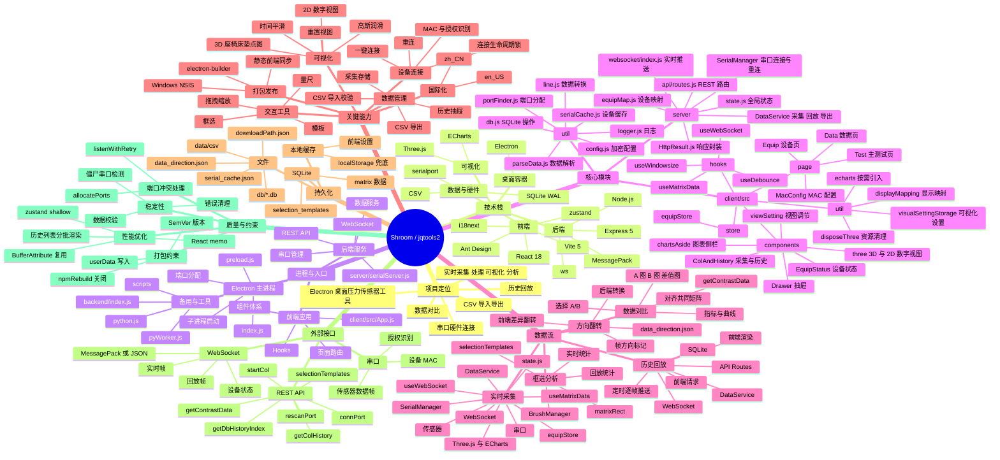

# 架构思维导图

> 基于 `ARCHITECTURE.md` 提炼。最后更新于：2026-05-25

```mermaid
mindmap
  root((Shroom / jqtools2))
    项目定位
      Electron 桌面压力传感器工具
      串口硬件连接
      实时采集 处理 可视化 分析
      历史回放
      CSV 导入导出
      数据对比
    技术栈
      桌面容器
        Electron
      前端
        React 18
        Vite 5
        Ant Design
        zustand
        i18next
      后端
        Node.js
        Express 5
        ws
        MessagePack
      可视化
        Three.js
        ECharts
      数据与硬件
        SQLite WAL
        serialport
        CSV
    进程与入口
      Electron 主进程
        index.js
        preload.js
        端口分配
        子进程启动
      后端服务
        server/serialServer.js
        REST API
        WebSocket
        串口管理
        数据服务
      前端应用
        client/src/App.js
        页面路由
        Hooks
        组件体系
      备用与工具
        backend/index.js
        scripts
        pyWorker.js
        python.js
    核心模块
      server
        state.js 全局状态
        SerialManager 串口连接与重连
        DataService 采集 回放 导出
        api/routes.js REST 路由
        websocket/index.js 实时推送
        equipMap.js 设备映射
        HttpResult.js 响应封装
      util
        db.js SQLite 操作
        portFinder.js 端口分配
        logger.js 日志
        config.js 加密配置
        serialCache.js 设备缓存
        parseData.js 数据解析
        line.js 数据转换
      client/src
        page
          Test 主测试页
          Data 数据页
          Equip 设备页
          MacConfig MAC 配置
        hooks
          useWebSocket
          useMatrixData
          useWindowsize
          useDebounce
        store
          equipStore
        components
          three 3D 与 2D 数字视图
          ColAndHistory 采集与历史
          chartsAside 图表侧栏
          viewSetting 视图调节
          EquipStatus 设备状态
          Drawer 抽屉
        util
          echarts 按需引入
          displayMapping 显示映射
          disposeThree 资源清理
          visualSettingStorage 可视化设置
    数据流
      实时采集
        传感器
        串口
        SerialManager
        state.js
        DataService
        WebSocket
        useWebSocket
        useMatrixData
        equipStore
        Three.js 与 ECharts
      历史回放
        前端请求
        API Routes
        SQLite
        DataService
        定时逐帧推送
        WebSocket
        前端渲染
      数据对比
        选择 A/B
        getContrastData
        对齐共同矩阵
        A 图 B 图 差值图
        指标与曲线
      框选分析
        BrushManager
        matrixRect
        selectionTemplates
        实时统计
        回放统计
      方向翻转
        data_direction.json
        后端转换
        帧方向标记
        前端差异翻转
    关键能力
      设备连接
        一键连接
        重连
        MAC 与授权识别
        连接生命周期锁
      可视化
        3D 座椅床垫点图
        2D 数字视图
        高斯润滑
        时间平滑
        重置视图
      交互工具
        框选
        模板
        量尺
        拖拽缩放
      数据管理
        采集存储
        CSV 导入校验
        CSV 导出
        历史抽屉
      国际化
        zh_CN
        en_US
      打包发布
        electron-builder
        Windows NSIS
        静态前端同步
    持久化
      SQLite
        matrix 数据
        selection_templates
      文件
        serial_cache.json
        data_direction.json
        downloadPath.json
        data/csv
        db/*.db
      本地缓存
        localStorage 兜底
        前端设置
    外部接口
      REST API
        connPort
        rescanPort
        startCol
        getColHistory
        getDbHistoryIndex
        getContrastData
        selectionTemplates
      WebSocket
        实时帧
        回放帧
        设备状态
        MessagePack 或 JSON
      串口
        传感器数据帧
        设备 MAC
        授权识别
    质量与约束
      端口冲突处理
        allocatePorts
        listenWithRetry
      性能优化
        React memo
        zustand shallow
        BufferAttribute 复用
        历史列表分批渲染
      稳定性
        僵尸串口检测
        错误清理
        数据校验
      打包约束
        SemVer 版本
        npmRebuild 关闭
        userData 写入
```
