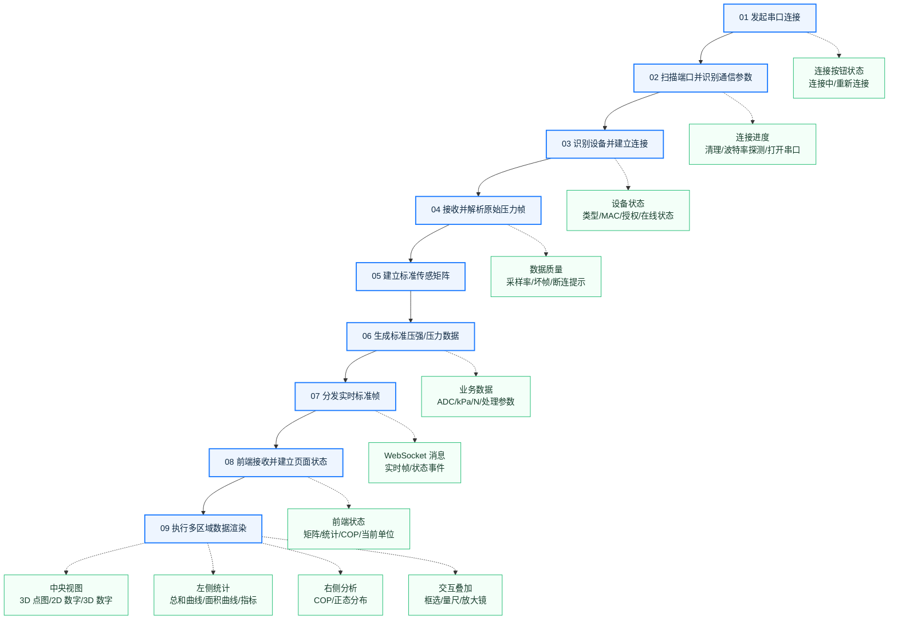
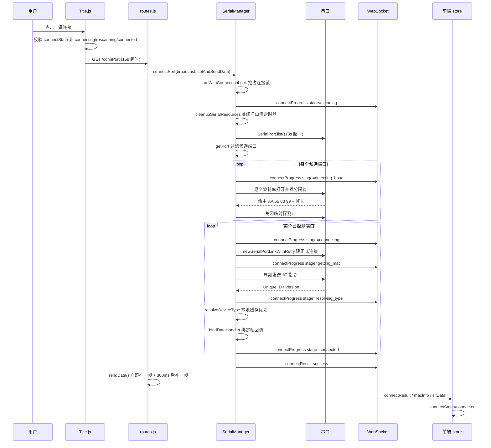
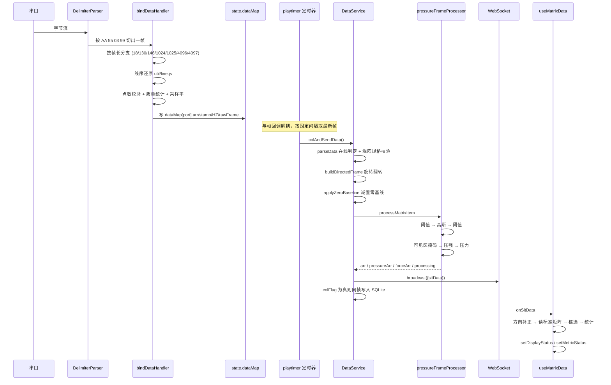
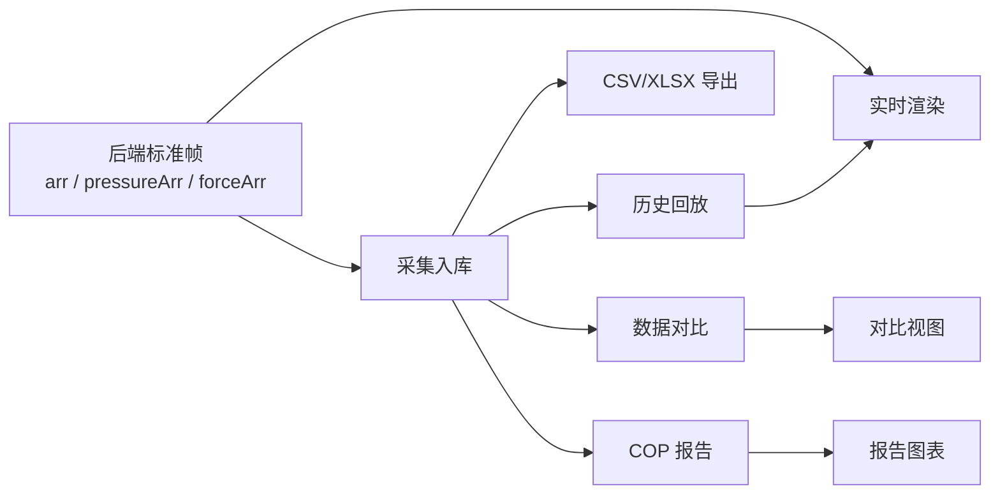

# 压力数据业务流程文档（实现级）

- 文档范围
	- 从用户发起串口连接开始
	- 到实时压力数据完成页面渲染结束
	- 补充同一标准帧进入采集、回放、对比、报告和导出的分支
- 文档结构
	- 主流程按编号顺序执行
	- 每一步固定展开：触发条件 / 输入 / 实现步骤 / 关键常量 / 输出 / 失败分支 / 代码位置
	- 「实现步骤」写到函数级，标注文件与行号
	- 使用流程图和层级节点，不使用思维导图
- 阅读方式
	- 只想知道有哪些步骤：看「总体流程」与每节标题
	- 想知道某步怎么实现：看该节的「实现步骤」和「代码位置」
	- 想核对字段：看附录 A「标准帧字段清单」
	- 想核对阈值：看附录 B「关键常量清单」

## 模块地图

- 进程结构
	- Electron 主进程
		- `index.js`
	- 后端服务子进程
		- `server/serialServer.js`
		- 启动时读取 `config.txt` 得到当前系统类型，写入 `state.file`
		- 初始化 SQLite（`util/db.js` → `initDb`），写入 `state.currentDb`
		- 加载方向配置 `db/data_direction.json`（`loadPersistedDataDirection`）
		- 起两个服务：Express API 与 WebSocket，端口冲突自动重试（`util/portFinder.js` → `listenWithRetry`）
	- 前端渲染进程
		- `client/src/page/test/Test.js` 为实时检测页入口
- 后端职责划分
	- `server/state.js`
		- 全局可变状态，串口、帧率、采集、回放、置零、连接锁都挂在同一个 `state` 对象上
	- `server/serial/SerialManager.js`
		- 端口扫描、波特率探测、建连、MAC 与设备类型识别、原始帧解析、数据质量统计
	- `server/services/DataService.js`
		- 在线判定、方向标准化、置零、调用帧处理器、实时广播、采集入库、历史回放推帧
	- `util/pressureFrameProcessor.js`
		- 唯一的压强/压力计算入口，产出 `arr`、`pressureArr`、`forceArr`、`processing`
	- `server/services/PressureConfig.js`
		- 读取 `db/pressure_config.json`，按 mtime 缓存，动态 `require` 压力公式文件
	- `server/websocket/index.js`
		- 广播，MessagePack 优先，不可用回退 JSON
	- `server/api/routes.js`
		- 全部 HTTP 接口
- 前端职责划分
	- `client/src/hooks/useWebSocket.js`
		- 连接、重连、解码、按消息类型分发
	- `client/src/hooks/useMatrixData.js`
		- 帧处理主逻辑：方向补正、读取标准矩阵、框选、统计、COP、正态分布
	- `client/src/store/equipStore.js`
		- Zustand 全局状态
	- `client/src/util/pressureDisplayMatrix.js`
		- 对标准矩阵做汇总统计与正态分布，不做单位换算
	- `client/src/util/pressureMetrics.js`
		- 单位元数据、点面积、浏览器侧公式镜像（当前实时链路不参与换算）

## 总体流程

## 一次连接的时序

## 一帧数据的时序

## 01 发起串口连接

- 触发条件
	- 用户点击「一键连接」按钮
	- 或页面加载后 300ms 的自动连接（`Title.js:90-101`）
		- 仅当 `connectState` 为 `idle`、`failed`、`deviceError` 时触发
		- 用 `window.__jqToolsAutoConnectStarted` 保证整个会话只自动连一次
- 输入
	- 当前 `connectState`
	- 当前系统类型（`GET /getSystem` 返回，来自 `config.txt`）
		- 汽车座椅 `car`
		- 汽车座椅 Y `carY`
		- Endi 座椅 `endi`
		- 床垫 `bed`
		- 手部点阵 `hand`
		- 脚垫 `foot`
		- 4096 点大矩阵 `bigHand`
- 实现步骤
	1. 前端状态机拦截（`client/src/components/title/Title.js:72-88`）
		- `connectState` 属于 `connecting`、`rescanning`、`connected` 时直接返回并提示重复操作
		- 通过校验后先把 `connectState` 置为 `connecting`，再发请求
	2. 发起请求
		- 一键连接：`GET /connPort`，axios 超时 `CONNECT_TIMEOUT_MS = 15000`
		- 重新连接：`GET /rescanPort`（`Title.js:105-120`）
		- 主动断开：`GET /stopPort`（`Title.js:124-150`）
	3. 后端接单（`server/api/routes.js:844`）
		- 调用 `connectPort(broadcast, colAndSendData)`
		- 第二个参数是实时发送回调，后续被串口回调注册成定时器任务
	4. 连接成功后的收尾（`routes.js:847-863`）
		- 复位历史态：`historyFlag=false`、`historyPlayFlag=false`、`historyDbArr=null`、`historySelectCache=null`
		- `clearPlayTimer()` 清回放定时器
		- 立即 `sendData()` 推一帧，300ms 后再补推一帧，避免首帧空白
	5. 前端消化结果（`Title.js:48-68` `applyConnectResult`）
		- `code === 0 且 success !== false` → `connectState='connected'`，清错误，`dataStatus='realtime'`，清历史图表与回放框
		- 否则走 `setConnectFailed`，`connectState='failed'` 并弹错误提示
	6. 断开的前端处理（`Title.js:134-150`）
		- 不等后端返回，立即清空 15 项 store 状态（设备状态、MAC、数据质量、矩阵、COP、历史、采集标记等）
- 关键常量
	- `CONNECT_TIMEOUT_MS = 15000`（前端 axios 超时）
	- 自动连接延迟 300ms
- 输出
	- 后端收到一次连接任务
	- 前端进入 `connecting` 状态
- 失败分支
	- axios `ECONNABORTED` → 提示连接超时
	- 后端返回 `code=1` → 展示 `message`，进入 `failed`
- 页面渲染
	- 连接按钮：未连接 / 连接处理中 / 已连接 / 重新连接
	- 顶部设备状态点、当前系统名称、连接失败提示
- 代码位置
	- `client/src/components/title/Title.js:36-150`
	- `server/api/routes.js:844-918`
	- `server/serial/SerialManager.js:1050`

## 02 扫描端口并识别通信参数

- 触发条件
	- `connectPort` 或 `rescanPort` 进入执行
- 输入
	- 计算机串口列表
	- 候选波特率 `BAUD_CANDIDATES`
	- 协议分隔符 `splitArr`
- 实现步骤
	1. 抢连接锁（`SerialManager.js:101` `runWithConnectionLock`）
		- 已有任务且未超过 `CONNECTION_LOCK_MAX_AGE = 25000` → 抛 `CONN_BUSY`
		- 超龄任务打日志后强制释放
		- 整个连接任务包一层 `withTimeout(CONNECT_TIMEOUT = 20000)`，超时抛 `CONNECT_TIMEOUT`
		- 失败时把错误写进 `state.lastConnectionError`，并在 `finally` 里释放锁
	2. 连接前清理（`SerialManager.js:328` `cleanupSerialResources`）
		- 对 `state.parserArr` 中每个端口执行 `closePortItem`
			- `parser.removeAllListeners()`、`port.removeAllListeners()`
			- `port.isOpen` 则 `port.close()`
			- `finally` 中删除 `parserArr / dataMap / lastDataTime / macInfo` 对应键，并从 `portHistory` 移除
		- 清空 `parserArr`、`dataMap`、`macInfo`、`linkIngPort`、`portHistory`、`lastDataTime`
		- `clearRuntimeTimers()`：清 `playtimer`，`MaxHZ=undefined`、`HZ=30`、`sendDataLength=0`、`oldTimeObj={}`
		- 广播 `connectProgress { stage: 'cleaning' }`
	3. 枚举串口（`SerialManager.js:1077`）
		- `SerialPort.list()` 包 `withTimeout(SCAN_TIMEOUT = 3000)`
		- 空列表 → 抛 `NO_PORT`
	4. 过滤候选端口（`util/serialport.js:11` `getPort`）
		- win32 分支按 `manufacturer === 'wch.cn'` 过滤
		- darwin 分支按 `path` 含 `usb` 过滤
		- 其余平台不过滤
		- 过滤后为空 → 抛 `NO_CH340`
		- 实际行为见「12 当前实现边界」
	5. 逐端口探测波特率（`SerialManager.js:350` `detectBaudRate`）
		- 广播 `connectProgress { path, stage: 'detecting_baud' }`
		- 按 `BAUD_CANDIDATES` 顺序调用 `tryBaudRate`
		- 命中即返回该波特率；遇到端口占用类错误立刻中断并抛 `PORT_BUSY`
	6. 单个波特率的探测细节（`SerialManager.js:384` `tryBaudRate`）
		- `autoOpen: false` 新建串口后手动 `open`
		- 维护一个长度等于分隔符长度的滑动窗口，逐字节比对 `AA 55 03 99`
		- 第一次命中分隔符后开始计数，直到第二次命中
			- 帧长 = 两次分隔符之间的字节数减去分隔符长度
			- 帧长命中 `VALID_FRAME_LENGTHS` → 判定成功
			- 帧长不在表内但分隔符出现两次 → 同样判定成功（兼容变长帧）
		- 兜底：计数超过 8200 字节仍未见第二个分隔符 → 按单次命中判定成功
		- 超时 `BAUD_DETECT_TIMEOUT = 2000`：若期间已命中过分隔符仍判定成功，否则失败
		- 无论成功失败都关闭临时探测口
	7. 探测节奏
		- 每个端口探测完等待 `POST_DETECT_DELAY = 500`
		- 全部端口探测完再等待 `POST_ALL_DETECT_DELAY = 1000`
		- 目的是等系统释放串口句柄，避免紧接着正式连接时报占用
	8. 波特率映射设备大类（`util/config.js:21` `BAUD_DEVICE_MAP`）
		- `921600 → hand`
		- `1000000 → sit`
		- `3000000 → foot`
- 关键常量
	- `BAUD_CANDIDATES = [921600, 1000000, 3000000]`
	- `splitArr = [0xAA, 0x55, 0x03, 0x99]`
	- `VALID_FRAME_LENGTHS = [18, 130, 146, 1024, 1025, 4096, 4097]`
	- `BAUD_DETECT_TIMEOUT = 2000`、`SCAN_TIMEOUT = 3000`
	- `POST_DETECT_DELAY = 500`、`POST_ALL_DETECT_DELAY = 1000`
- 输出
	- `detectedPorts`：`[{ portInfo, detectedBaud }]`
	- `failedPorts`：探测阶段失败的端口及原因
- 失败分支与错误码（`CONNECTION_ERROR_META`，`SerialManager.js:58`）
	- `CONN_BUSY` 正在连接中
	- `NO_PORT` 未检测到设备
	- `NO_CH340` 未检测到候选设备
	- `BAUD_FAIL` 波特率识别失败
	- `PORT_BUSY` 串口被占用
	- `OPEN_FAIL` 串口打开失败
	- 每个错误对象带 `code / stage / userMessage / message`，由 `serializeConnectionError` 序列化给前端
- 页面渲染
	- 连接进度：`cleaning` / `detecting_baud` / `connecting`
	- 失败提示按错误码展示中文文案
- 代码位置
	- `server/serial/SerialManager.js:101-136`（连接锁）
	- `server/serial/SerialManager.js:296-339`（清理）
	- `server/serial/SerialManager.js:350-516`（波特率探测）
	- `util/serialport.js:11-24`
	- `util/config.js:15-53`

## 03 识别设备并建立连接

- 触发条件
	- 波特率探测产出至少一个 `detectedPorts` 条目
- 输入
	- 已确认串口路径与波特率
	- 由波特率推导的设备大类 `deviceClass`
- 实现步骤
	1. 建立稳定连接（`SerialManager.js:526` `newSerialPortLinkWithRetry`）
		- 最多 `STABLE_CONN_RETRIES = 3` 次
		- 每次 `openStableConnection` 超时 `STABLE_CONN_TIMEOUT = 2000`
		- 失败后间隔 `STABLE_CONN_RETRY_DELAY = 500` 再试
		- 成功后创建 `DelimiterParser({ delimiter })` 并 `port.pipe(parser)`
	2. 注册运行态（`SerialManager.js:1141-1152`）
		- `state.parserArr[portPath] = { port, parser, baudRate }`
		- `state.dataMap[portPath] = { deviceClass, baudRate, type: null, premission: false }`
		- `state.lastDataTime[portPath] = Date.now()`
		- `trackPortAndCleanup(portPath)` 更新端口历史
	3. 坐垫与脚垫类（`deviceClass` 为 `sit` 或 `foot`）
		- 广播 `connectProgress { stage: 'getting_mac' }`
		- `sendMacCommand`（`SerialManager.js:589`）
			- 监听裸 `port` 的 `data`（AT 响应是纯文本，不走分隔解析器）
			- 每 `MAC_SEND_INTERVAL = 300` 毫秒写一次 `AT_MAC_COMMAND`
				- 指令内容 `AT+NAME=ESP32\r\n`，配置里以 hex 形式写死
			- 文本缓冲区超过 10000 字符只保留末尾 10000
			- 缓冲区出现 `Unique ID` 后停止重发，再收 500ms 后统一提取
			- 正则 `/Unique ID:\s*([0-9A-Fa-f]+)/` 与 `/Versions?:\s*([^\s]+)/`
			- 本流程传入的超时是 `MAC_CONNECT_TIMEOUT = 3000`
			- 超时返回 `{ uniqueId: null, version: null }`
		- 无 `uniqueId` → 记 `MAC_FAIL`，`closePortItem` 关掉该口，继续处理下一个端口
		- 广播 `connectProgress { stage: 'resolving_type', uniqueId }`
		- `resolveDeviceType`（`SerialManager.js:714`），超时 `TYPE_RESOLVE_TIMEOUT = 2000`
			- 先查本地缓存 `serial_cache.json`（`resolveDeviceTypeLocal`）
				- 命中直接返回 `{ type, premission: true }`
			- 未命中且 `AUTH_MODE === 'online'` → `resolveDeviceTypeOnline`
				- 并发请求设备详情与服务器时间
					- `GET {backendAddress}/device-manage/device/getDetail/{uniqueId}`
					- `GET {timeServerAddress}/rcv/login/getSystemTime`
				- `type = JSON.parse(data.typeInfo)[0]`
				- `premission = nowTime < expireTime`
				- 拿到 type 后 `setTypeToCache` 回写本地缓存
				- 任一请求异常 → 返回 `{ type: null, premission: false }`
			- 本地模式未命中 → 直接返回 `{ type: null, premission: false }`
		- 无 type → 记 `TYPE_UNKNOWN` 并关口
		- 无授权 → 记 `AUTH_FAIL` 并关口
		- 通过后写 `dataItem.type / premission`，`bindDataHandler` 绑定帧回调，广播 `deviceUpdate`
	4. 手部类（`deviceClass === 'hand'`，`SerialManager.js:1191-1200`）
		- 先置 `type='hand'`、`premission=true`
		- 立即 `bindDataHandler`，保证数据不丢
		- `sendMacCommand` 异步执行，拿到后补写 `state.macInfo`，失败静默
	5. 其它大类
		- 记 `TYPE_UNKNOWN` 并关口
	6. 汇总结果（`SerialManager.js:1227-1247`）
		- 没有任何端口连接成功 → `pickConnectionErrorCode(failedPorts)` 按优先级挑错误码抛出
			- 优先级 `PORT_BUSY > MAC_FAIL > TYPE_UNKNOWN > AUTH_FAIL > OPEN_FAIL > BAUD_FAIL`
		- 至少一个成功 → 广播 `connectResult { success, ports, failedPorts, macInfo, authMode }`
		- 有 MAC 时额外广播一条 `macInfo`
	7. 重新连接（`SerialManager.js:1284` `rescanPort`）
		- 同样走连接锁
		- 广播 `rescanProgress { stage: 'cleaning' }` → `cleanupSerialResources` → 固定等待 1000ms
		- 广播 `rescanProgress { stage: 'reconnecting', cleaned }`
		- 调 `connectPortUnlocked(..., { cleanupBeforeConnect: false })` 复用主流程
		- 结束广播 `rescanProgress { stage: 'done' | 'failed' }`
- 设备类型路由（`util/config.js:90` `typeConfig`，帧首字节类型码）
	- `1 → car-back`
	- `2 → car-sit`
	- `3 → bed`
	- `4 → endi-back`
	- `5 → endi-sit`
	- `6 → carY-back`
	- `7 → carY-sit`
	- 另有 `hand`、`foot`、`bigHand` 由大类或缓存决定
- 关键常量
	- `STABLE_CONN_RETRIES = 3`、`STABLE_CONN_TIMEOUT = 2000`、`STABLE_CONN_RETRY_DELAY = 500`
	- `MAC_SEND_INTERVAL = 300`、`MAC_CONNECT_TIMEOUT = 3000`、`TYPE_RESOLVE_TIMEOUT = 2000`
	- `AUTH_MODE` 默认 `online`，可用环境变量覆盖
- 输出
	- 可持续接收数据的串口对象与解析器
	- 与串口绑定的 `type` 和 `premission`
	- `state.macInfo[portPath] = { uniqueId, version }`
	- 已注册的帧回调
- 失败分支
	- 单端口失败不影响其它端口，形成「部分成功」结果
	- 前端展示已连接设备，同时保留失败端口的原因
- 页面渲染
	- 连接进度 `getting_mac` / `resolving_type` / `connected`
	- 设备类型、MAC、版本、授权状态、在线状态点
- 代码位置
	- `server/serial/SerialManager.js:526-578`（建连重试）
	- `server/serial/SerialManager.js:589-727`（MAC 与类型识别）
	- `server/serial/SerialManager.js:1065-1247`（主流程）
	- `server/serial/SerialManager.js:1284-1309`（重新连接）
	- `util/serialCache.js`、`server/state.js`

## 04 接收并解析原始压力帧

- 触发条件
	- `DelimiterParser` 按 `AA 55 03 99` 切出一帧后触发 `parser.on('data')`
- 输入
	- 一帧原始字节
	- `state.dataMap[portPath]` 当前设备上下文
- 实现步骤（`SerialManager.js:827` `bindDataHandler`）
	1. 前置处理
		- `Buffer.from(data)` 转 `Array.from` 得到 `pointArr`
		- 空帧 → `recordBadFrame('empty_frame')` 并返回
		- 更新 `state.lastDataTime[portPath] = receivedAt`（僵尸设备判定依据）
	2. 按内容与帧长分支
		- 帧内含 `Unique ID` 文本
			- 补写 `state.macInfo[portPath]`
			- 全部端口都拿到 MAC 时广播一次 `macInfo`
			- `deviceClass === 'foot'` 时再跑一次 `resolveDeviceType`，成功后改写 `dataItem.type` 并广播 `deviceUpdate`
		- 18 字节：陀螺仪
			- `dataItem.rotate = bytes4ToInt10(pointArr.slice(2))`
		- 130 字节：手套 256 点分包
			- 首字节为分包序号，映射 `order`（`1 → last`、`2 → next`）
			- 次字节为类型位，映射 `handTypeMap`（`1 → HL`、`2 → HR`）
			- 其余 128 字节存入 `dataItem[last|next]`
		- 146 字节：手套 + 四元数
			- 末 16 字节为姿态，中间为矩阵数据
		- 1024 字节：坐垫类矩阵
			- `premission` 为假直接丢弃
			- `processMatrixData` 按类型做线序还原
			- `validateMatrixPointCount` 点数校验
			- `recordGoodFrame` + `updateHZAndStartTimer`
			- 系统为 `foot` 时额外维护长度 60 的滑窗 `arrList`
		- 1025 字节：带类型码的 1024
			- 首字节查 `typeConfig`，不在表内则 `premission=false` 并丢弃
			- 其余走 `processTypedMatrixData`
		- 4096 字节：脚垫与大矩阵
			- 按 `type` 分别用 `endiSit` / `endiBack` / `carYSitLine` / `carYBackLine`，未匹配则原样使用
			- 采样 20 帧后确定 `MaxHZ`，并以 `1000 / HZ` 起实时定时器
		- 4097 字节：带类型码的 4096
		- 其它长度 → `recordBadFrame('frame_length_mismatch')`
	3. 线序还原（`util/line.js`）
		- `hand`、`jqbed`、`endiSit`、`endiBack`、`endiSit1024`、`endiBack1024`、`carYSitLine`、`carYBackLine`
		- 作用是把硬件扫描顺序的一维数组重排成行列连续的一维点阵
	4. 靠背倍率（`SerialManager.js:733` `applyBackMultiplier`）
		- 仅对 `*-back` 生效
		- 乘以 `db/pressure_config.json` 的 `backValueMultiplier`（当前为 1），保留 4 位小数
	5. 点数校验（`SerialManager.js:262` `validateMatrixPointCount`）
		- 期望值取自 `MATRIX_POINT_COUNTS`
			- `car-back / car-sit / bed / carY-back / carY-sit / hand` 均为 1024
			- `endi-back` 3200
			- `endi-sit` 2116
		- 不符则记 `matrix_size_mismatch` 且 `blocking: true`，同时置 `dataItem.status = 'matrix_error'`
	6. 采样率与定时器（`SerialManager.js:766` `updateHZAndStartTimer`）
		- 与上一帧间隔小于 `MIN_HZ_INTERVAL = 50` 毫秒的帧直接丢弃，起到限流作用
		- `sampleRateHz = max(1, round(1000 / intervalMs))`，写入 `frameIntervalMs / sampleRateHz / HZ`
		- 异常判定：间隔 ≥ `HZ_ZERO_THRESHOLD_MS = 2000`，或与上一次采样率相差超过 `HZ_JUMP_FACTOR = 3` 倍
			- 置 `quality.hzAbnormal = true` 并记 `sample_rate_abnormal`
		- 首次测得速率时把 `state.MaxHZ / state.HZ` 固定下来，并以 `DATA_SEND_INTERVAL = 80` 毫秒起 `playtimer`
		- 注意：1024 分支的定时器间隔是固定 80ms，4096 分支是 `1000 / HZ`
	7. 数据质量统计（`SerialManager.js:155-260`）
		- `ensureDataQuality` 惰性初始化质量对象
		- `resetQualityWindow` 每 `BAD_FRAME_WINDOW_MS = 1000` 结算一次窗口坏帧率
		- `recordGoodFrame`
			- 累加 `totalFrames`，清零 `consecutiveBadFrames`
			- `state.frameSeq += 1`，写 `rawFrame` 与 `rawPointArray` 元数据
		- `recordBadFrame`
			- 累加坏帧计数并记录 `lastError`
		- `updateQualityStatus`
			- 连续坏帧 ≥ `CONSECUTIVE_BAD_FRAME_THRESHOLD = 10` → `device_error`
			- 窗口坏帧率 > `BAD_FRAME_RATE_THRESHOLD = 0.1` 或 `hzAbnormal` → `degraded`
			- 否则 `ok`
		- `broadcastDataQualityIfNeeded`
			- 状态为 `ok` 不广播
			- 广播节流 `DATA_QUALITY_NOTIFY_INTERVAL = 3000`
- 关键常量
	- `MIN_HZ_INTERVAL = 50`、`DATA_SEND_INTERVAL = 80`
	- `BAD_FRAME_WINDOW_MS = 1000`、`BAD_FRAME_RATE_THRESHOLD = 0.1`
	- `CONSECUTIVE_BAD_FRAME_THRESHOLD = 10`、`DATA_QUALITY_NOTIFY_INTERVAL = 3000`
	- `HZ_ZERO_THRESHOLD_MS = 2000`、`HZ_JUMP_FACTOR = 3`
	- `ZOMBIE_THRESHOLD = 5000`、`ONLINE_THRESHOLD = 1000`
- 输出（写入 `state.dataMap[portPath]`）
	- `arr` 线序还原后的一维 ADC 点阵
	- `stamp` 采集时间
	- `HZ` / `sampleRateHz` / `frameIntervalMs`
	- `rawFrame { frame_id, received_at, port, baud_rate, frame_length, hardware_sample_rate_hz }`
	- `rawPointArray { point_count, received_at }`
	- `dataQuality` 质量统计对象
	- `type` / `premission` / `status`
- 数据质量状态
	- `online` 数据有效
	- `matrix_error` 点数或尺寸错误
	- `device_error` 连续异常超过阈值
	- `offline` 超时未收到新帧
- 页面渲染
	- 当前采样率与在线状态
	- 数据质量告警、设备断开提示、重新连接入口
	- 无效帧不进入业务统计，也不进入采集入库
- 代码位置
	- `server/serial/SerialManager.js:155-274`（质量统计）
	- `server/serial/SerialManager.js:733-817`（线序、倍率、采样率）
	- `server/serial/SerialManager.js:827-1034`（帧回调）
	- `util/line.js`、`util/parseData.js`

## 05 建立标准传感矩阵

- 触发条件
	- 定时器回调 `colAndSendData` 触发 `sendData()`
- 输入
	- `state.dataMap` 的深拷贝（`structuredClone`）
	- `state.dataDirection` 方向配置
- 实现步骤
	1. 在线判定与规格校验（`DataService.js:384` `parseData`）
		- 端口未打开 → `{ status: 'offline' }`
		- `data.type` 为空的端口直接跳过，避免产生无效 key
		- `Date.now() - data.stamp >= ONLINE_THRESHOLD(1000)` → `offline`
		- `isValidMatrix` 校验 `width * height === arr.length`
			- 不通过 → `status = 'matrix_error'`，`dataQuality.status = 'device_error'`，并携带期望尺寸与实际长度，直接返回不再写业务字段
		- 通过则复制 `arr / rotate / stamp / HZ / sampleRateHz / frameIntervalMs / rawFrame / rawPointArray / matrixMeta / dataQuality / cop`
		- 输出对象的键是设备类型 `type`，不再是端口路径
	2. 矩阵规格来源（`DataService.js:34` `MATRIX_DIMENSIONS`）
		- `endi-back` `50 × 64`
		- `endi-sit` `46 × 46`
		- `carY-back` `32 × 32`
		- `carY-sit` `32 × 32`
		- `car-back` `32 × 32`
		- `car-sit` `32 × 32`
		- `bed` `32 × 32`
		- `hand` `32 × 32`
		- `foot` `32 × 32`
		- `bigHand` `64 × 64`
		- 表中没有的 key 用 `sqrt(length)` 推断正方形
	3. 方向标准化（`DataService.js:278` `buildDirectedFrame`）
		- 按 key 取方向：`getDirectionForKey(state, key)`，优先 `byKey[key]`，回退全局
		- `applyCollectionDirection` 执行顺序固定
			1. 旋转：`rotateDegree / 90` 次 `rotateClockwise`，每次交换当前宽高
			2. `left` 为假 → `flipHorizontal`
			3. `up` 为假 → `flipVertical`
		- 写回 `nextItem.dataDirection`（本帧方向元数据）
		- 用 `getDirectedDimensions` 重算宽高（旋转 90/270 度时宽高互换），写入 `matrixMeta`
	4. 方向配置的持久化与迁移（`DataService.js:116-163`）
		- 存储路径 `db/data_direction.json`
		- `loadPersistedDataDirection` 在服务启动时调用
		- 兼容迁移
			- 坐垫类若为「未翻转 + 旋转 90 或 270」→ 重置为 `{ left: true, up: true, rotateDegree: 270 }`
			- 靠背类若为「全默认」→ 重置为 `{ left: false, up: true, rotateDegree: 0 }`
		- `normalizeRotateDegree` 把任意角度归一到 0/90/180/270
		- 默认值
			- `*-back`：`{ left: false, up: true, rotateDegree: 0 }`
			- `*-sit`：`{ left: true, up: true, rotateDegree: 270 }`
	5. 特殊有效区
		- Endi 靠背 `50 × 64` 的实际传感面不是整块矩形
		- 掩码在第 06 步统一施加（`isVisibleMetricIndex`），本步只负责尺寸与方向
- 输出
	- 方向统一的标准 ADC 矩阵
	- `matrixMeta { matrix_key, width, height, point_count }`
	- `dataDirection { left, up, rotateDegree, rotate_degree, data_direction }`
- 页面渲染
	- 本步不直接绘图
	- 决定后续渲染的行列数量、传感面方向、有效区域、框选坐标范围、3D 点位映射
- 代码位置
	- `server/services/DataService.js:34-45`（规格表）
	- `server/services/DataService.js:47-168`（方向归一与持久化）
	- `server/services/DataService.js:214-308`（翻转旋转）
	- `server/services/DataService.js:384-450`（在线判定）
	- `db/data_direction.json`

## 06 生成标准压强与压力数据

- 触发条件
	- `buildProcessedFrame` 对方向化后的每个传感面逐个处理
- 输入
	- 方向统一的 ADC 矩阵
	- `state.zeroState` 置零状态
	- 当前生效的处理参数
- 实现步骤
	1. 选择处理参数（`DataService.js:310` `getActiveFrameProcessingConfig`）
		- 采集中（`state.colFlag` 为真且有快照）→ 使用 `state.collectionProcessingConfig`
		- 否则使用 `state.frameProcessingConfig`
		- `normalizeFrameProcessingConfig` 做范围钳制
			- `filter` 0 ~ 4095，默认 30
			- `gauss` 0 ~ 4，默认 2
			- `coherent` 1 ~ 10，默认 1
	2. 保留原始 ADC 并置零（`DataService.js:317-344`）
		- `rawAdcArr = [...item.arr]`（方向化之后、置零之前）
		- `applyZeroBaseline(key, arr, zeroState)`
			- `zeroState.enabled` 为假直接返回副本
			- 基线按 `key` 或短 key（`endi-sit` → `sit`）查找
			- 基线长度与当前矩阵不一致则不生效
			- 逐点 `max(0, value - baseline[i])`
		- 附加 `zeroState` 元数据 `{ enabled, zero_enabled, zero_time, has_baseline }`
	3. 单帧 ADC 处理（`util/pressureFrameProcessor.js:101` `processAdcMatrix`）
		- 长度与 `width * height` 不符直接返回空数组
		- 步骤严格按此顺序
			1. 逐点取 `max(0, value)`，非数字归零
			2. `filter > 0` 时低于阈值的点归零
			3. 空间高斯 `gaussianBlur`
			4. 再次施加同一阈值，清理高斯扩散产生的低值
	4. 高斯实现细节（`pressureFrameProcessor.js:61` `gaussianBlur`）
		- `sigma = gauss × GAUSSIAN_SIGMA_FACTOR(0.5)`
		- `sigma <= 0.01` 或长度不符时原样返回
		- `radius = ceil(sigma × 2.57)`，一维核长度 `2 × radius + 1`
		- 可分离实现：先做水平方向卷积，再对中间结果做垂直方向卷积
		- 边界用 `clamp` 到最近的合法行列
		- 垂直方向输出时 `Math.round` 取整
		- 只处理当前帧，不读上一帧，不做时序平滑
	5. 可见区掩码（`pressureFrameProcessor.js:235` `isVisibleMetricIndex`）
		- 仅对 `endi-back` 且尺寸为 `50 × 64` 生效
		- 规则：`row >= 18` 恒可见；`row < 18` 时仅 `col` 在 `14 ~ 34` 之间可见
		- 不可见位置在参与压强计算前置 0，因此不影响总和、点数、面积、最大值
	6. 压强换算（`pressureFrameProcessor.js:178` `calcPressureFormulaStats`）
		- 公式模块由 `PressureConfig.loadPressureFormula()` 动态 `require`，按文件 mtime 缓存
		- 当前配置为 `pressureFormula_V2.7.38中英文logo.js`，只导出 `estimatePressure / estimateMaxPressure`
		- 因此走「标定均值缩放」分支
			1. 取 `value > 30` 的有效点集合
			2. `getCalibrationAverage` 求标定均值
				- 靠背 `topCount = 46`，坐垫 `topCount = 70`
				- 有效点数超过人体阈值（logo 版为 `> 300`）时用全体均值
				- 否则取最大的 `topCount` 个点求均值
			3. `estimatePressure(adcAvg, count, sensor)` 得到该帧的平均压强
			4. `pressureScale = 平均压强 / adcAvg`
			5. 逐点 `value > 30 ? value × pressureScale : 0`
		- 若换成导出 `master` 的公式文件（如 `pressureFormula_V2.8.1.js`），则走逐点分支
			- `scale = computeScale(adcMax) = 0.0063636 × adcMax + 0.5`
			- 逐点 `value <= MIN_ADC(30) ? 0 : scale × master(value, sensor)`
		- 传感面判定 `getPressureSensor`：key 含 `back` → `backrest`，含 `sit` 或 `seat` → `seat`
		- 输出单位 `kPa`
	7. 压力换算
		- `forceValues[i] = pressureValues[i] × pointAreaCm2 × 0.1`
		- 单点面积 `MATRIX_CONFIG[key].pointAreaCm2`
			- `endi-back` 1.3
			- `endi-sit` 1
			- `carY-back` 1.9
			- `carY-sit` 2.25
			- 其余 1
		- 输出单位 `N`
	8. 精度与元数据
		- `roundDisplayValue` 保留 `DISPLAY_DIGITS = 1` 位小数，非有限值或非正数归 0
		- `buildProcessingMetadata` 生成 `processing`
			- `version = 'backend-spatial-v1'`
			- `filter / gauss / coherent`
			- `gaussianSigma`
			- `temporal = false`
			- `outputDigits = 1`
			- `formulaFile / formulaProfile`
	9. 采集期参数锁定
		- `POST /startCol` 时把当前参数快照到 `collectionProcessingConfig` 并置 `processingConfigLocked = true`
		- 锁定期间 `POST /setFrameProcessingConfig` 直接返回 `code=1` 与 `locked: true`
		- `GET /endCol` 解锁并清空快照
- 关键常量
	- `PROCESSING_VERSION = 'backend-spatial-v1'`
	- `DISPLAY_DIGITS = 1`、`GAUSSIAN_SIGMA_FACTOR = 0.5`
	- 默认处理参数 `{ filter: 30, gauss: 2, coherent: 1 }`
	- `MIN_ADC = 30`
- 输出（每个传感面）
	- `rawAdcArr` 方向化后的原始 ADC
	- `arr` 阈值与高斯处理后的 ADC
	- `pressureArr` 逐点压强，`kPa`
	- `forceArr` 逐点压力，`N`
	- `processing` 处理元数据
	- `pressureUnit = 'kPa'`、`forceUnit = 'N'`
	- `zeroState` 置零元数据
- 处理参数语义
	- `filter` ADC 噪点阈值，前后各施加一次
	- `gauss` 单帧空间高斯强度，乘 0.5 得 sigma
	- `coherent` 仅为旧配置兼容字段，不参与任何计算
- 页面渲染
	- 压强模式逐点用 `pressureArr`，单位 `kPa`
	- 压力模式逐点用 `forceArr`，单位 `N`
	- 压力总和始终基于 `forceArr`，始终显示 `N`
	- 当前最大值与自动颜色按当前模式的标准矩阵计算
- 代码位置
	- `util/pressureFrameProcessor.js:1-316`
	- `server/services/PressureConfig.js:1-140`
	- `server/services/DataService.js:310-374`
	- `server/kpa/pressureFormula_V2.7.38中英文logo.js`
	- `server/api/routes.js:1137-1195`（参数读写与采集锁）

## 07 分发实时标准帧

- 触发条件
	- `state.playtimer` 定时器回调 `colAndSendData`
	- 定时器由第 04 步在测得首个采样率时启动
- 实现步骤
	1. 定时器守卫（`DataService.js:518` `colAndSendData`）
		- `state.historyFlag` 为真（处于历史模式）直接返回
		- `state.parserArr` 为空直接返回
		- 调 `sendData()` 取得本帧对象
		- `state.colFlag` 为真则把同一个对象交给 `storageData`
	2. 组帧与广播（`DataService.js:455` `sendData`）
		- `state.baudRate === 921600` 分支
			- `parseData` 不传 type，走蓝牙拼包逻辑
			- 过滤掉不在 `constantObj.type` 中的键
			- 广播 `{ data: obj }`
		- 其它分支
			- `parseData(..., 'highHZ')` 直接取 `data.arr`
			- `buildProcessedFrame(obj)` 完成第 05、06 步
			- 广播 `{ sitData: obj }`
		- 实际运行情况见「12 当前实现边界」
	3. 传输编码（`server/websocket/index.js:47` `broadcast`）
		- 启动时尝试 `require('@msgpack/msgpack')`
		- 可用则把对象编码为 MessagePack 二进制后发送
		- 不可用回退 JSON 字符串
		- 向所有 `readyState === OPEN` 的客户端逐个 `send`
	4. 定时器重建（`DataService.js:537` `ensureRealtimeTimer`）
		- 无端口时不建
		- 先清旧 `playtimer`
		- `intervalMs = max(16, 1000 / (HZ || MaxHZ || 30))`
	5. 采集入库（`DataService.js:481` `storageData`）
		- 逐 key 过滤
			- `status` 存在且不等于 `online` 的丢弃
			- `dataQuality.status === 'device_error'` 的丢弃
		- 删除 `status` 字段
		- 补写 `deviceMac`（来自 `state.macInfo[port].uniqueId`）、`deviceType`、`softwareVersion`、`pressureUnit`、`forceUnit`
		- `INSERT INTO matrix (data, timestamp, date, select) VALUES (?, ?, ?, ?)`
			- `data` 为整帧 JSON 字符串
			- `date` 存的是本次采集名 `state.colName`
			- `select` 入库时固定为空数组
		- 关键点：入库的就是广播出去的那一份对象，不重新过滤、不重新换算
- 状态类消息（同一 WebSocket 通道）
	- `connectProgress` 连接阶段进度
	- `connectResult` 连接最终结果
	- `deviceUpdate` 设备类型变更
	- `macInfo` MAC 汇总
	- `dataQuality` 数据质量告警
	- `rescanProgress` 重扫进度
	- `playEnd` / `index` / `timestamp` / `sitDataPlay` 回放相关
	- `contrastData` 对比数据
- 输出
	- 前端可消费的实时标准帧
	- 采集开启时同步落库的历史帧
- 代码位置
	- `server/services/DataService.js:455-550`
	- `server/websocket/index.js:23-79`
	- `util/db.js`

## 08 前端接收并建立页面状态

- 触发条件
	- WebSocket 收到消息
- 实现步骤
	1. 连接与解码（`client/src/hooks/useWebSocket.js:87-206`）
		- `ws.binaryType = 'arraybuffer'`
		- `parseMessage` 自动判别
			- `ArrayBuffer` → `msgpackDecode`
			- 字符串 → `JSON.parse`
			- `Blob` → 打警告并返回空对象
		- `onclose` 后固定 `WS_RECONNECT_DELAY = 3000` 毫秒重连
		- 组件卸载时 `shouldReconnect = false` 阻止重连
		- 内置调试开关：`wsDebugOn()`、`wsDebugFilter('sitData')`、`wsDebugLast()`、`wsDebugCount()`
	2. 消息分发
		- 逐个判断 `sitData`、`sitDataPlay`、`playEnd`、`contrastData`、`macInfo`、`index`、`timestamp`、`connectProgress`、`connectResult`、`deviceUpdate`、`rescanProgress`、`dataQuality`
		- 每类命中即调用对应 handler，互不阻塞
	3. 实时帧入口（`client/src/page/test/Test.js:145-164`）
		- `connectState === 'idle'` → 清空可视化数据后直接返回
		- 非对比态时把 `dataStatus` 切回 `realtime`，清回放框选、历史图表、历史索引
		- 调 `processSensorFrame(sitData, persistentDataRef.current, { source: 'realtime' })`
		- 回放帧入口是 `onSitDataPlay`，仅在 `dataStatus === 'replay'` 时处理，`source: 'playback'`
	4. 帧处理主流程（`client/src/hooks/useMatrixData.js:709` `processSensorFrame`）
		1. 空帧 → 把 `status`、`displayStatus` 重置为 4096 个 0，`metricStatus` 清空后返回
		2. 缓存本帧到 `lastSensorFrameRef`，记录来源
		3. 逐 key 提取
			- 短 key = `fullKey.split('-')[1]`，如 `endi-sit` → `sit`
			- `arr[shortKey]` 取后端处理后的 `arr`
			- `sourceAdcArr[shortKey]` 取 `rawAdcArr`（没有则回退 `arr`），供前端置零按钮取基线
			- `clampEndi`：key 含 `endi` 时把大于 255 的值截断到 255
		4. `buildFilteredMatrixFromRaw` 做一层浅拷贝，隔离引用
		5. `applyDisplayDirection` 方向补正
			- 读本帧自带的 `dataDirection`
			- 只有当帧方向是「全默认」时，才在前端再套一次当前方向
			- 否则说明后端已经转过，前端不再转，避免二次旋转
			- 把实际执行的方向记入 `activeFrameDirectionRef`
		6. `buildRenderedMetricData` 建立当前单位矩阵
			- 按 `systemPointConfig` 的 `width × height` 逐点读 `pressureArr` 与 `forceArr`
			- 非有限值或小于等于 0 的点写 0
			- 同样按帧方向决定是否补转
			- 写入 `renderedMetricDataRef` 并 `setMetricStatus({ pressure, force })`
		7. 逐 key 计算框选与统计
			- `computeSelectArr` 得到 `{ default, boxes }`
			- `computeStats` 写入趋势、指标、COP、正态分布
		8. 更新设备状态
			- `equipStatus` 逐 key 记录 `status`
			- `dataQuality` 合并进 store；出现 `device_error` 时
				- 以 3000 毫秒节流弹一次 `message.warning`
				- `connectState = 'deviceError'`，并写 `connectionError`
			- 全部 `offline` 且当前是 `connected` 时，起 5000 毫秒防抖定时器
				- 到期仍全 offline → `connectState = 'idle'`
				- 期间任一设备恢复则取消定时器
			- 回放帧（`source === 'playback'`）不参与设备状态与告警更新
		9. `setDisplayStatus(resArr)` 触发渲染
	5. 框选提取（`useMatrixData.js:231` `computeSelectArr`）
		- 实时框选：从 `selectArr` 中筛出属于当前矩阵的框
			- 有 `matrixKey` 按 `matrixKeysMatch` 匹配
			- 无 `matrixKey` 退化为按 `displayType` 判断
			- `colSelectMatrix` 把屏幕坐标换算成网格坐标 `{ xStart, xEnd, yStart, yEnd }`
			- `extractSelectData` 按行列裁剪，越界返回 `null`
			- 最多保留每个框的独立数据、颜色索引、名称
		- 回放框选：仅当 `playbackHasSelection` 为真时生效
			- 支持 `select.regions` 数组
			- 2D 视图下调 `matrixGenBox` 重绘历史框，其它视图 `removeHistoryBox`
		- 无框选：`default` 为整块矩阵，`boxes` 为空
	6. 统计计算（`useMatrixData.js:397` `computeStats`）
		- 分别对压强矩阵与压力矩阵调 `summarizePressureDisplayMatrix`
			- `activeCount` 大于 0 的点数
			- `total` 有效点求和
			- `max` 有效点最大值
			- `average = total / activeCount`
			- 另外派生 `pressureTotal` 与 `forceTotal` 用于跨模式换算
		- 趋势数组 `setTrendValue`
			- 滑动窗口固定 20 点，超出后 `shift` + `push`
			- `options.replaceLast` 为真时只替换最后一点，用于设置项变更时的原地刷新
			- 维护 `pressArr`、`pressureArr`、`forceArr`、`areaArr`、`pressureAreaArr`、`forceAreaArr`
		- COP
			- `calcCentroidRatio(values, width, height)` 求相对重心
			- 框选时先在框内求局部重心，再用 `projectBoxCenterToMatrix` 投影回整块矩阵坐标
		- 正态分布（`client/src/util/pressureDisplayMatrix.js:108`）
			- 只统计大于 0 的点
			- 均值、总体方差、标准差
			- 偏度用样本偏度公式，峰度用超额峰度公式，样本量不足时置 0
			- `domainMax = ceil(max(观测最大值, μ + 4σ, 0.1))`
			- 在 `[0, domainMax]` 上均匀取 `256` 个点计算概率密度
			- 标准差为 0 时退化为单点脉冲
		- 多框统计
			- `boxStats` 数组按框数动态扩缩
			- 每个框独立维护自己的趋势窗口、指标、COP、正态分布
	7. 前端明确不做的事
		- 不做 ADC 阈值过滤
		- 不做压强公式换算
		- 不做压力换算
		- 不做空间高斯
		- 不做跨帧时序平滑
		- `getSettingValue()`（`equipStore.js:118`）对旧渲染路径强制返回 `filter: 0, gauss: 0.01, coherent: 1`，即让旧代码里的本地处理变成空操作
- 数据来源切换
	- `sitData` 实时数据
	- `sitDataPlay` 历史回放数据
	- `contrastData` 对比数据
	- 三类数据不会同时作为主渲染源，由 `dataStatus` 仲裁
- 页面状态（`client/src/store/equipStore.js`）
	- `displayStatus` 当前 ADC 展示矩阵
	- `metricStatus` 当前 `pressure` / `force` 标准矩阵
	- `equipStatus` 设备在线状态
	- `dataQuality` 数据质量
	- `pressureMetricMode` 当前压强或压力模式，持久化到 localStorage
	- `display` 当前主视图类型
	- `displayType` 当前整体、靠背或坐垫
	- `connectState` 连接状态机
	- `dataStatus` 数据来源
	- `chartRef` 趋势与统计（以 ref 形式跨帧累积，不进 store）
- 代码位置
	- `client/src/hooks/useWebSocket.js:32-218`
	- `client/src/hooks/useMatrixData.js:145-994`
	- `client/src/util/pressureDisplayMatrix.js:75-166`
	- `client/src/store/equipStore.js:23-128`
	- `client/src/page/test/Test.js:144-218`

## 09 执行多区域数据渲染

- 渲染入口
	- `client/src/page/test/Test.js:444-479`
	- 按 `display` 选择中央视图：`contrast` / `num` / `point3D` / 其它落到 `num3D`
	- 侧栏与工具层共享同一帧标准矩阵，通过 `disPlayDataRef` 与 `renderedMetricDataRef` 两个 ref 传递

### 09.1 顶部状态渲染

- 系统信息
	- 当前系统名称、连接按钮、设备在线状态点
- 设备信息
	- 当前传感面、MAC、连接错误
- 采集状态
	- 开始采集调 `POST /startCol`，携带当前处理参数与方向
	- 停止采集调 `GET /endCol`
	- 历史数据入口
- 实现位置
	- `client/src/components/title/Title.js`
	- `client/src/components/col/Col.js`
	- `client/src/components/ColAndHistory/ColAndHistory.js`

### 09.2 中央 3D 点图渲染

- 启用条件
	- `display === 'point3D'`
- 视图范围
	- 整体同时显示靠背与坐垫
	- 靠背只显示靠背
	- 坐垫只显示坐垫
- 数据来源
	- 压强模式取 `metricStatus.pressure`
	- 压力模式取 `metricStatus.force`
	- 通过 `metricData={renderedMetricDataRef}` 直接读 ref，避免每帧触发 React 重渲染
- 组件路由（`Test.js:394-417`）
	- Endi 座椅、汽车座椅 Y → `ThreeAndCarPointV2`
	- 汽车座椅 → `ThreeAndCarPoint`
	- 床垫 → `ThreeAndModel`
	- 手部、脚垫、大矩阵 → `CanvasMemo`
	- 每个系统传入自己的 `backConfig` / `sitConfig`，含点阵行列数与插值参数
- 允许的视觉处理
	- 模型坐标映射、点位几何插值、高度比例、颜色映射
- 不允许的业务处理
	- 不重新过滤、不重新高斯、不重新换算压强压力、不做时间平滑
- 交互
	- 缩放、视角复位、整体与靠背与坐垫切换、45 度视角、禁用右键控制
- 实现位置
	- `client/src/components/three/ThreeAndCarPointV2.js`
	- `client/src/components/three/ThreeAndCarPoint.js`
	- `client/src/components/three/ThreeAndModel.js`
	- `client/src/components/three/CanvasMemo.js`

### 09.3 中央 2D 数字矩阵渲染

- 启用条件
	- `display === 'num'`
- 尺寸推导（`client/src/components/three/NumThres.js:20-33`）
	- `isMoreMatrix(systemType)` 为假 → 固定 `32 × 32`
	- 为真 → 按 `displayType` 含 `back` 决定取 `{system}-back` 或 `{system}-sit` 的 `systemPointConfig`
	- 找不到配置时回退：靠背 `50 × 64`，坐垫 `46 × 46`
	- `isSquareBack = width === height`
- 组件路由
	- 正方形矩阵 → `NumThreeColorV3`
	- 非正方形矩阵 → `NumThreeColorV4`
	- 组件 key 带上 `{system}-back|sit`，切换传感面时强制重建
- 数据来源
	- 压强模式 `pressureArr`，单位 `kPa`
	- 压力模式 `forceArr`，单位 `N`
- 渲染内容
	- 每个网格一个标准点值，保留一位小数
	- 每个网格按当前值着色
	- 非正方形矩阵按真实宽高居中
	- Endi 靠背隐藏无效填充区
- 交互
	- 50% 到 200% 缩放，缩放中心跟随鼠标
	- 左键拖动画布，重置到 100%
	- 放大镜、框选、量尺
- 实现位置
	- `client/src/components/three/NumThres.js`
	- `client/src/components/three/NumThreeColorV3.js`
	- `client/src/components/three/NumThreeColorV4.js`

### 09.4 中央 3D 数字渲染

- 启用条件
	- `display` 既不是 `contrast`、`num`，也不是 `point3D`
- 数据来源
	- 当前 `pressureMetricMode` 对应的 `metricStatus`
- 渲染内容
	- 三维数字点阵、当前压强或压力值、一位小数、当前色阶
- 实现位置
	- `client/src/components/num/Num3D.js`

### 09.5 左侧压力与面积渲染

- 压力总和区域
	- 趋势图按当前模式取 `pressureArr` 或 `forceArr` 趋势
	- 平均值为当前模式有效点平均值
	- 最大值为当前模式单点最大值
	- 压力总和始终为真实压力总和，始终 `N`
- 面积区域
	- 点数趋势按当前模式的非零点计算
	- 当前点数单位「个」
	- 当前面积 = 点数 × 单点面积，单位 `cm²`
- 压强与压力切换
	- 切换曲线数据、平均值、最大值、点数与面积口径
	- 不改变压力总和的业务定义
- 多传感面
	- 靠背与坐垫各自一条趋势，颜色不同
- 框选模式
	- 每个框选区域独立一条趋势
	- 统计只使用框内标准矩阵
	- 曲线颜色与框选颜色一致
- 实现位置
	- `client/src/components/chartsAside/ChartsAside.js`
	- `client/src/components/aside/Aside.js`
	- `client/src/util/pressureMetrics.js`

### 09.6 右侧 COP 与分布渲染

- 压力重心点
	- 以当前标准矩阵作为权重
	- 输出相对 X、Y 坐标（0 到 1），在网格中标出位置
- 压力正态分布
	- X 轴为当前压强或压力值，单位随模式切换
	- Y 轴为概率密度
	- 指标：均值 μ、方差 Var、偏度 Skew、峰度 Kurt，均保留 3 位小数
- 框选模式
	- 每个框独立计算重心与分布，颜色与框选一致
- 实现位置
	- `client/src/components/chartsAside/ChartsAside.js`
	- `client/src/components/chart/Chart.js`
	- `client/src/util/pressureDisplayMatrix.js`

### 09.7 框选与工具叠加渲染

- 框选
	- 以传感网格为最小单位，边界吸附到网格
	- 限制在有效矩阵区域内
	- 最多四个区域，支持拖动、按住左键配合方向键微调
	- 支持区域名称与颜色
	- 框选变更通过 `brushInstance.subscribe` 推给页面（`Test.js:221-308`）
	- 回放态下框选变更会调 `POST /getDbHistorySelect` 重新拉取整段曲线
- 框选模板
	- 保存区域坐标，应用模板
	- 修改后可覆盖旧模板或另存为新模板
	- 未保存修改时退出有提醒
	- 接口 `GET /selectionTemplates`、`POST /selectionTemplates/saveAll`
- 放大镜
	- 显示鼠标附近网格，放大显示数字与颜色
	- 不修改业务矩阵
- 量尺
	- 选择两个矩阵点位，按点距换算实际距离
	- 不修改业务矩阵
- 置零
	- 前端取当前 `rawAdcArr` 作为基线（`changeWsLocalData`）
	- 通过 `POST /setZeroBaseline` 提交给后端
	- 后端在第 06 步统一对后续帧减去基线
- 方向调整
	- 坐垫与靠背独立调整（`changeDataDirection`）
	- 本地写 localStorage，同时 `POST /setDataDirection` 持久化到后端
- 可视化调节
	- 颜色范围、自动颜色、3D 高度为纯前端参数
	- `filter`、`gauss` 通过 `POST /setFrameProcessingConfig` 下发后端，采集中被拒绝
- 实现位置
	- `client/src/components/selectBox/newSelecttBox.js`
	- `client/src/components/title/SecondTitle.js`
	- `client/src/components/ruler/newRuler.js`
	- `client/src/components/three/NumThreeColorV3.js`
	- `client/src/components/three/NumThreeColorV4.js`

## 10 同一标准帧的后续业务分支

- 实时渲染
	- 使用 `sitData`，进入第 08、09 步
- 采集入库
	- `POST /startCol`（`routes.js:1159`）
		1. 清 `state.selectArr` 与 `historySelectCache`
		2. `saveDataDirection` 持久化当前方向
		3. `ensureCurrentDb()` 确保数据库可用
		4. 校验 `state.dataMap` 中是否存在与当前系统匹配的传感器类型，不匹配直接返回提示
		5. 快照处理参数并置 `processingConfigLocked = true`
		6. `colFlag = true`，`colName = fileName || Date.now()`
	- 入库内容见第 07 步 `storageData`，保存的是与广播完全相同的标准帧
	- `GET /endCol` 解除锁定
- 历史回放
	- `POST /getDbHistory`（`routes.js:1230`）
		- 读取整段数据到 `state.historyDbArr`
		- `colMaxHZ = 1000 / (第二帧时间戳 - 第一帧时间戳)`，只有一帧时取 1
		- `colplayHZ = colMaxHZ`，`historyFlag = true`，`playIndex = 0`
	- `startPlayback`（`DataService.js:755`）
		- 无数据直接返回 false
		- 播放位置越界时归零
		- 广播 `{ playEnd: true }` 表示开始
		- 先跑一次 `runPlaybackTick`，再按 `getPlaybackIntervalMs()` 起 `colTimer`
	- 单帧取数 `getPlaybackSnapshot`（`DataService.js:632`）
		- `parsePlaybackData` 兼容对象与字符串两种存储形态
		- `removePlaybackSelect` 去掉旧的 `select` 字段
		- `ensureProcessedFrame` → `ensureProcessedMatrixItem`
			- `hasCanonicalMetricArrays` 判断：`processing.version` 匹配且 `pressureArr`、`forceArr` 长度与 `arr` 一致
			- 已带标准矩阵的新数据直接复用，不重复处理
			- 旧数据以 `rawAdcArr`（没有则 `arr`）为输入补算一次
		- `validatePlaybackFrameData` 校验空帧、缺矩阵、尺寸不符、非数字
		- 坏帧自动跳过并计数
			- 连续坏帧达到 10 帧 → 停止播放，返回 `playError.type = 'too_many_bad_frames'`
		- 注入 `historySelectCache` 中的框选信息供前端画框
		- 返回 `{ sitDataPlay, index, timestamp, playbackQuality }`
	- 倍速 `changePlaySpeed`（`DataService.js:784`）
		- 允许 `0.5 / 1 / 2 / 4`，非法值回退 1
		- `colplayHZ = colMaxHZ × speed`，重建定时器
	- 回放结束 `finishPlayback` 广播 `{ playEnd: false, realtimeAvailable }`
	- 前端复用实时渲染组件，`source: 'playback'`，不修改历史原始记录
- 框选回放曲线（`POST /getDbHistorySelect`，`routes.js:1317`）
	- 空 `selectJson` → 清缓存并返回六个空对象
	- 未加载历史 → 返回 `code=1`
	- 遍历全部帧，对每帧调 `ensureProcessedMatrixItem` 后按框裁剪
	- 降采样：目标 `PLAYBACK_CHART_TARGET_POINTS = 500`，`bucketSize = ceil(总帧数 / 500)`，桶内取均值
		- 目的是避免长时录制在框选回放时卡死
	- 返回 `pressArr`、`areaArr`、`pressureArr`、`forceArr`、`pressureAreaArr`、`forceAreaArr`
- CSV / XLSX 导出
	- 直接读取 `pressureArr` / `forceArr`
	- 压力总和固定输出 `N`
	- 秒数从 `0.000` 开始，保留三位小数
	- 相关实现在 `util/db.js` 的导出段（`buildExportHeadersForKeys`、`getExportMetricStats` 等）
	- 接口 `POST /download`、`POST /downloadFields`、`POST /exportContrastData`
- 数据对比
	- `POST /getContrastData`、`POST /getContrastIndex`
	- 读取两个历史记录的标准矩阵，渲染并列矩阵、差异指标、选区指标
	- 组件 `client/src/components/contrast/NumThresContrast.js`
- COP 报告（`POST /copReportData`，`routes.js:1258`）
	- 支持数据库记录与导入的 CSV 两种来源
	- 以首帧推断可用的 `keys`，并校验 `width × height === arr.length`
	- 逐帧 `normalizeReportFrame`
	- 计算 `durationMs` 与 `sampleRate = (帧数 - 1) × 1000 / durationMs`
	- 返回报告所需的全部帧与元信息
	- 报告内容：平均压力热力图、COP 轨迹、框选区域热力图、压力总和趋势、COP 左右与前后偏移趋势、统计指标
- 旧历史兼容
	- 缺少标准矩阵时由后端补算一次
	- 带 `processing.version = 'backend-spatial-v1'` 的新数据不重复处理
- 代码位置
	- `server/services/DataService.js:481-802`
	- `server/api/routes.js:1159-1441`（采集、历史、报告、框选曲线）
	- `server/api/routes.js:1442-1845`（对比与导出）
	- `util/db.js`

## 11 最终数据一致性

- 唯一标准数据源
	- 后端 `pressureArr`
	- 后端 `forceArr`
- 必须一致的页面
	- 2D 数字矩阵、3D 点图、3D 数字
	- 左侧趋势、平均值与最大值、点数与面积、压力总和
	- 框选统计、正态分布、COP
	- 历史回放、数据对比、COP 报告、CSV/XLSX 导出
- 一致性规则
	- 前端不重复计算压强
	- 前端不重复计算压力
	- 前端不重复执行高斯
	- 前端不执行帧间平滑
	- 实时广播与采集入库使用同一帧对象
	- 当前模式下的统计基于实际显示矩阵
	- 压力总和始终表示真实压力 `N`
- 机制保障
	- `processing.version` 作为处理版本水印，`hasCanonicalMetricArrays` 据此判断是否需要补算
	- `roundDisplayValue` 在后端统一取一位小数，前端 `normalizePressureDisplayValue` 用同样的精度规则，因此不会出现两侧四舍五入不一致
	- `getSettingValue()` 对旧渲染路径返回中性参数（`filter: 0`、`gauss: 0.01`），让残留的前端处理代码变成空操作
	- 采集期锁定处理参数，保证一次采集内的全部帧口径一致

## 12 当前实现边界

- WebSocket 旧字段
	- `state.baudRate === 921600` 分支仍会发送 `data`（`DataService.js:457-469`）
	- 前端 `useWebSocket` 只分发 `sitData`，没有 `data` 的 handler
	- 因此该旧分支不属于当前完整实时渲染链
	- 补充：`state.baudRate` 初始值为 `1000000`，且连接流程不会改写它，实际运行时走的一直是 `sitData` 分支
- 大矩阵 2D 展示
	- `bigHand` 后端标准矩阵与 3D 展示均为 `64 × 64`
	- `NumThres` 对非多矩阵系统固定使用 `32 × 32`（`NumThres.js:21`）
	- 若要求大矩阵 2D 与后端、3D 完全一致，需要为 `bigHand` 增加 `64 × 64` 的 2D 尺寸分支
- 候选端口过滤失效
	- `util/serialport.js:13-17` 用的是 `os.platform`（函数引用）而不是 `os.platform()`
	- 与字符串比较恒为假，因此实际走的是 `else` 分支，返回全部串口
	- 后果是 `NO_CH340` 这条错误路径当前不会触发，非目标串口也会进入波特率探测，靠探测阶段淘汰
- `bigHand` 与 `foot` 的点数校验缺口
	- `MATRIX_POINT_COUNTS`（`SerialManager.js:144`）没有 `foot` 与 `bigHand` 条目
	- `validateMatrixPointCount` 对这两类直接返回 true，尺寸异常要到 `DataService.parseData` 的 `isValidMatrix` 才拦住
- `coherent` 字段
	- 仍在配置、快照、接口与 `processing` 元数据中传递
	- 但 `processAdcMatrix` 完全不读它，不参与任何计算
- 两处实时定时器间隔不一致
	- 1024 分支用固定 `DATA_SEND_INTERVAL = 80` 毫秒
	- 4096 分支用 `1000 / state.HZ`
	- `ensureRealtimeTimer` 又用 `max(16, 1000 / HZ)`
	- 三者共用同一个 `state.playtimer`，谁最后设置谁生效
- 浏览器侧公式镜像
	- `client/src/util/pressureMetrics.js` 保留了完整的分段公式与 `master`
	- 当前实时链路不调用它做换算，只用其中的单位元数据、点面积与 `summarize` 相关函数
	- 其 `getPressurePointAreaCm2` 与后端 `MATRIX_CONFIG.pointAreaCm2` 是两套取值来源，改动时需要同步

## 附录 A 标准帧字段清单

单个传感面对象（`sitData['endi-sit']` 等）的字段：

| 字段 | 来源 | 说明 |
| --- | --- | --- |
| `status` | `DataService.parseData` | `online` / `offline` / `matrix_error` / `device_error` |
| `rawAdcArr` | `buildProcessedFrame` | 方向化后、置零前的原始 ADC |
| `arr` | `processAdcMatrix` | 置零 + 阈值 + 高斯 + 阈值后的 ADC |
| `pressureArr` | `buildCanonicalMetricArrays` | 逐点压强，`kPa`，一位小数 |
| `forceArr` | `buildCanonicalMetricArrays` | 逐点压力，`N`，一位小数 |
| `processing` | `buildProcessingMetadata` | 处理版本与参数水印 |
| `pressureUnit` / `forceUnit` | `buildProcessedFrame` | 固定 `kPa` / `N` |
| `zeroState` | `buildZeroMeta` | 置零开关、时间、是否有基线 |
| `dataDirection` | `buildDirectedFrame` | 本帧实际执行的方向 |
| `matrixMeta` | `buildDirectedFrame` | `matrix_key` / `width` / `height` / `point_count` |
| `stamp` | 帧回调 | 采集时间戳 |
| `HZ` / `sampleRateHz` / `frameIntervalMs` | `updateHZAndStartTimer` | 采样率相关 |
| `rawFrame` | `recordGoodFrame` | 帧序号、端口、波特率、帧长 |
| `rawPointArray` | `recordGoodFrame` | 点数与接收时间 |
| `dataQuality` | `cloneQuality` | 质量统计快照 |
| `rotate` | 帧回调 | 陀螺仪或四元数 |
| `cop` | 帧回调 | 设备直出的重心数据（若有） |
| `deviceMac` / `deviceType` / `softwareVersion` | `storageData` | 仅入库时补写 |
| `select` | `getPlaybackSnapshot` | 仅回放时注入 |

## 附录 B 关键常量清单

| 常量 | 值 | 位置 | 用途 |
| --- | --- | --- | --- |
| `BAUD_CANDIDATES` | `[921600, 1000000, 3000000]` | `util/config.js` | 波特率候选 |
| `splitArr` | `AA 55 03 99` | `util/config.js` | 帧分隔符 |
| `VALID_FRAME_LENGTHS` | `18,130,146,1024,1025,4096,4097` | `SerialManager.js` | 帧长白名单 |
| `BAUD_DETECT_TIMEOUT` | 2000 | `util/config.js` | 单个波特率探测超时 |
| `SCAN_TIMEOUT` | 3000 | `SerialManager.js` | 串口枚举超时 |
| `POST_DETECT_DELAY` | 500 | `SerialManager.js` | 单端口探测后等待 |
| `POST_ALL_DETECT_DELAY` | 1000 | `SerialManager.js` | 全部探测后等待 |
| `STABLE_CONN_TIMEOUT` | 2000 | `SerialManager.js` | 单次建连超时 |
| `STABLE_CONN_RETRIES` | 3 | `SerialManager.js` | 建连重试次数 |
| `STABLE_CONN_RETRY_DELAY` | 500 | `SerialManager.js` | 建连重试间隔 |
| `CONNECT_TIMEOUT` | 20000 | `SerialManager.js` | 整个连接任务超时 |
| `CONNECTION_LOCK_MAX_AGE` | 25000 | `SerialManager.js` | 连接锁最大存活 |
| `MAC_SEND_INTERVAL` | 300 | `util/config.js` | AT 指令重发间隔 |
| `MAC_CONNECT_TIMEOUT` | 3000 | `SerialManager.js` | 连接流程 MAC 等待 |
| `TYPE_RESOLVE_TIMEOUT` | 2000 | `SerialManager.js` | 类型解析超时 |
| `MIN_HZ_INTERVAL` | 50 | `SerialManager.js` | 最小帧间隔，低于则丢帧 |
| `DATA_SEND_INTERVAL` | 80 | `SerialManager.js` | 1024 分支发送间隔 |
| `ONLINE_THRESHOLD` | 1000 | `SerialManager.js` / `DataService.js` | 在线判定阈值 |
| `ZOMBIE_THRESHOLD` | 5000 | `SerialManager.js` | 僵尸端口判定 |
| `BAD_FRAME_WINDOW_MS` | 1000 | `SerialManager.js` | 坏帧率统计窗口 |
| `BAD_FRAME_RATE_THRESHOLD` | 0.1 | `SerialManager.js` | 降级阈值 |
| `CONSECUTIVE_BAD_FRAME_THRESHOLD` | 10 | `SerialManager.js` | 设备异常阈值 |
| `DATA_QUALITY_NOTIFY_INTERVAL` | 3000 | `SerialManager.js` | 质量告警节流 |
| `HZ_ZERO_THRESHOLD_MS` | 2000 | `SerialManager.js` | 采样率异常判定 |
| `HZ_JUMP_FACTOR` | 3 | `SerialManager.js` | 采样率跳变倍数 |
| `PROCESSING_VERSION` | `backend-spatial-v1` | `pressureFrameProcessor.js` | 处理版本水印 |
| `DISPLAY_DIGITS` | 1 | `pressureFrameProcessor.js` | 输出小数位 |
| `GAUSSIAN_SIGMA_FACTOR` | 0.5 | `pressureFrameProcessor.js` | `sigma = gauss × 0.5` |
| 默认处理参数 | `filter 30 / gauss 2 / coherent 1` | `state.js` | 帧处理默认值 |
| `MIN_ADC` | 30 | 公式模块 | 压强计算最小 ADC |
| `WS_RECONNECT_DELAY` | 3000 | `useWebSocket.js` | 断线重连间隔 |
| `CONNECT_TIMEOUT_MS` | 15000 | `Title.js` | 前端连接请求超时 |
| 趋势窗口长度 | 20 | `useMatrixData.js` | 实时趋势点数 |
| 离线防抖 | 5000 | `useMatrixData.js` | 全设备离线后转 idle |
| `PLAYBACK_CHART_TARGET_POINTS` | 500 | `routes.js` | 框选回放曲线降采样目标 |
| 回放连续坏帧上限 | 10 | `DataService.js` | 超过则中止回放 |

## 附录 C 接口清单（按流程分组）

- 系统与配置
	- `GET /getSystem` 当前系统类型、可选类型、最优与最大参数
	- `POST /setSystemConfig`、`POST /selectSystem`、`POST /changeSystemType`
	- `GET /getPressureConfig`、`POST /setPressureConfig`
- 连接
	- `GET /getPort` 候选串口列表
	- `GET /connPort` 一键连接
	- `GET /rescanPort` 重新连接
	- `GET /stopPort` 断开全部
	- `GET /sendMac`、`GET /sendMacConnected`、`GET /readMacOnly`
- 帧处理与方向
	- `GET /getDataDirection`、`POST /setDataDirection`
	- `POST /setZeroBaseline`
	- `GET /getFrameProcessingConfig`、`POST /setFrameProcessingConfig`
- 采集
	- `POST /startCol`、`GET /endCol`
- 历史与回放
	- `GET /getColHistory` 历史列表
	- `POST /getDbHistory` 载入一段历史
	- `POST /getDbHistoryPlay`、`POST /getDbHistoryStop`、`POST /cancalDbPlay`
	- `POST /changeDbplaySpeed`、`POST /getDbHistoryIndex`
	- `POST /getDbHistorySelect` 框选曲线
	- `POST /copReportData` COP 报告数据
- 对比与导出
	- `POST /getContrastData`、`POST /getContrastIndex`
	- `POST /download`、`POST /downloadFields`、`POST /exportContrastData`
	- `GET /getDownloadPath`、`POST /setDownloadPath`
	- `POST /openFile`、`POST /openFolder`
- 记录管理
	- `POST /delete`、`POST /changeDbName`、`POST /changeDbDataName`
	- `POST /upsertRemark`、`POST /getRemark`
- 框选模板
	- `GET /selectionTemplates`、`POST /selectionTemplates/saveAll`
- 设备缓存与授权
	- `GET /cache/devices`、`GET /cache/device-types`
	- `POST /cache/devices`、`POST /cache/devices/bulk`、`DELETE /cache/devices`、`POST /cache/clear`
	- `GET /auth/mode`、`POST /auth/mode`、`POST /bindKey`
- CSV 导入
	- `POST /uploadCsv`、`POST /getCsvData`
