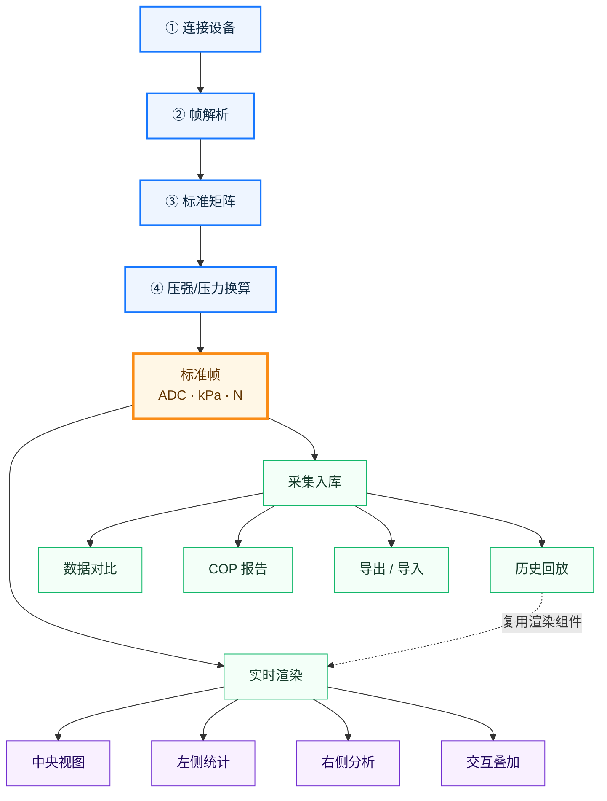
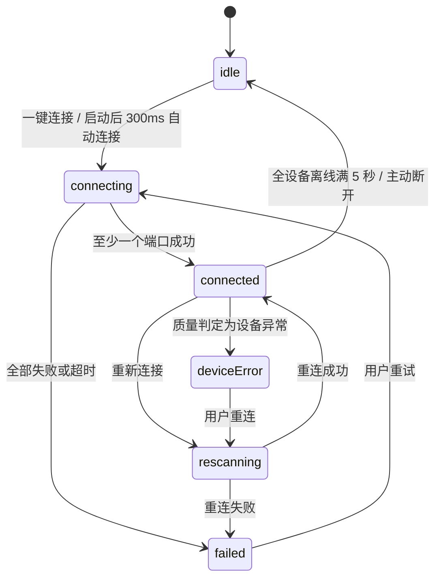

# 压力感知系统 · 实现说明

标注模块与函数名，不标行号。常量集中在附录，正文不重复。

---

## 一、总览

传感器数据沿主干加工成一份**标准帧**，之后所有功能消费同一份帧对象——广播与入库是同一个引用，不存在两份。



渲染失败时看这个结构（与上图等价）：

```
后端主干（严格顺序）
  ① 连接设备 → ② 帧解析 → ③ 标准矩阵 → ④ 压强/压力换算
                                              ↓
                              【标准帧】ADC · kPa · N
                                              ↓
扇出（互相独立）
  ├─ 实时渲染 ←──────────────┐
  └─ 采集入库                │
       ├─ 历史回放 ──────────┘ 复用渲染组件
       ├─ 数据对比
       ├─ COP 报告
       └─ 导出 / 导入

实时渲染内部（四区并行绘制）
  中央视图 · 左侧统计 · 右侧分析 · 交互叠加
```

| 段 | 模块 | 关键函数 |
| --- | --- | --- |
| ① 连接设备 | `server/serial/SerialManager.js` | `connectPort` `detectBaudRate` `sendMacCommand` `resolveDeviceType` |
| ② 帧解析 | `SerialManager.js` + `util/line.js` | `bindDataHandler` + 各线序函数 |
| ③ 标准矩阵 | `server/services/DataService.js` | `parseData` `buildDirectedFrame` |
| ④ 压强/压力换算 | `util/pressureFrameProcessor.js` | `processMatrixItem` `calcPressureFormulaStats` |
| 分发 | `DataService.js` + `server/websocket/index.js` | `sendData` `broadcast` |
| 前端处理 | `client/src/hooks/useMatrixData.js` | `processSensorFrame` |

---

## 二、后端主干

### ① 连接设备

四阶段，全程被连接锁包住（`runWithConnectionLock`）：已有任务且未超 25 秒 → 抛 `CONN_BUSY`；整个任务包 20 秒超时。

**阶段 0 · 清理**（`cleanupSerialResources`）

移除 parser 与 port 的所有监听器 → 关闭已打开的口 → 删除 `parserArr`/`dataMap`/`lastDataTime`/`macInfo` 对应键 → 清 `portHistory` → 清定时器并把 `MaxHZ` 置空、`HZ` 复位 30。

**阶段 1 · 波特率探测**（`detectBaudRate` → `tryBaudRate`）

按 `BAUD_CANDIDATES` 顺序逐个试。单次探测：

```
autoOpen:false 建口 → 手动 open
逐字节维护长度 4 的滑动窗口，比对 AA 55 03 99
第一次命中 → 开始计数
第二次命中 → 帧长 = 两次之间字节数 − 4
    帧长在 VALID_FRAME_LENGTHS 内   → 成功
    帧长不在表内但分隔符出现两次     → 也算成功（兼容变长帧）
计数 > 8200 字节仍无第二次命中      → 按单次命中算成功（兜底）
2 秒超时                            → 期间见过分隔符也算成功，否则失败
无论成功失败都关闭临时探测口
```

节奏：每个端口探测完等 500ms，全部探测完再等 1000ms——等系统释放句柄，否则紧接着正式建连会报占用。

遇端口占用类错误立即中断整个候选循环，抛 `PORT_BUSY`。

**阶段 2 · 建立稳定连接**（`newSerialPortLinkWithRetry`）

最多 3 次，每次 2 秒超时，失败间隔 500ms。成功后 `new DelimiterParser({delimiter})` 并 `port.pipe(parser)`。

注册运行态：`parserArr[path] = {port, parser, baudRate}`、`dataMap[path] = {deviceClass, baudRate, type:null, premission:false}`、`lastDataTime[path] = now`。

**阶段 3 · 身份识别**

波特率反推设备大类：`921600 → hand`、`1000000 → sit`、`3000000 → foot`。

`sit` / `foot` 走完整识别：

```
sendMacCommand
  监听裸 port 的 data（AT 响应是纯文本，不走分隔解析器）
  每 300ms 写一次 AT 指令 AT+NAME=ESP32\r\n（配置里以 hex 写死）
  文本缓冲超 10000 字符只留末尾 10000
  缓冲出现 'Unique ID' → 停止重发，再收 500ms 才统一提取
  正则 /Unique ID:\s*([0-9A-Fa-f]+)/ 与 /Versions?:\s*([^\s]+)/
  3 秒超时 → 返回 {uniqueId:null, version:null}

resolveDeviceType（2 秒超时）
  查本地缓存 serial_cache.json → 命中返回 {type, premission:true}
  未命中且 AUTH_MODE==='online'
      并发请求：设备详情 getDetail/{uniqueId} + 校时 getSystemTime
      type = JSON.parse(data.typeInfo)[0]
      premission = 服务器时间 < expireTime
      拿到 type 后 setTypeToCache 回写缓存
      任一请求异常 → {type:null, premission:false}
  本地模式未命中 → 直接 {type:null, premission:false}
```

任一步失败：记入 `failedPorts` → `closePortItem` 关掉该口 → **继续处理下一个端口**（部分成功）。

`hand` 类不等 MAC：直接 `type='hand'`、`premission=true`，立即绑回调保证不丢数据，`sendMacCommand` 异步执行后补写 `macInfo`，失败静默。

**结果汇总**

全部失败时按优先级挑一个错误码抛出：

```
PORT_BUSY > MAC_FAIL > TYPE_UNKNOWN > AUTH_FAIL > OPEN_FAIL > BAUD_FAIL
```

至少一个成功 → 广播 `connectResult {success, ports, failedPorts, macInfo, authMode}`。

路由层（`/connPort`）成功后复位历史态（`historyFlag`/`historyPlayFlag`/`historyDbArr`/`historySelectCache`）、清回放定时器，然后立即 `sendData()` 推一帧、300ms 后再补推一帧，避免首帧空白。

**重新连接**（`rescanPort`）走同一把锁：清理 → 固定等 1000ms → 调 `connectPortUnlocked(..., {cleanupBeforeConnect:false})` 复用主流程，全程广播 `rescanProgress`。

### ② 帧解析

`bindDataHandler` 注册在 parser 的 `data` 事件上。每帧先转 `Array.from(Buffer)`，空帧记 `empty_frame` 坏帧并返回，然后更新 `lastDataTime[path]`（僵尸端口判定依据），再按内容与帧长分派：

| 判定 | 含义 | 处理 |
| --- | --- | --- |
| 含 `Unique ID` 文本 | AT 响应漏进解析器 | 补写 `macInfo`；全端口都拿到时广播一次 `macInfo`；`foot` 类再跑一次 `resolveDeviceType` 并广播 `deviceUpdate` |
| 18 字节 | 陀螺仪 | `rotate = bytes4ToInt10(slice(2))` |
| 130 字节 | 手套 256 点分包 | byte0 = 分包序号（`1→last`/`2→next`），byte1 = 手别（`1→HL`/`2→HR`），其余 128 字节存入对应槽 |
| 146 字节 | 手套 + 四元数 | 末 16 字节为姿态，中间为矩阵数据 |
| 1024 字节 | 坐垫类矩阵 | 需 `premission`，否则丢弃；线序还原；点数校验；定时器间隔固定 80ms |
| 1025 字节 | 带类型码的 1024 | byte0 查 `typeConfig`，不在表内则 `premission=false` 并丢弃 |
| 4096 字节 | 脚垫 / 大矩阵 | 线序还原；累计 20 帧后定 `MaxHZ`，定时器间隔 `1000/HZ` |
| 4097 字节 | 带类型码的 4096 | 同 4096，byte0 先查 `typeConfig` |
| 其他长度 | — | 记 `frame_length_mismatch` 坏帧 |

**帧首字节类型码**（`typeConfig`）：`1 car-back`、`2 car-sit`、`3 bed`、`4 endi-back`、`5 endi-sit`、`6 carY-back`、`7 carY-sit`。

**线序函数按帧长与类型分派**

| 类型 | 1024 帧 | 4096 帧 |
| --- | --- | --- |
| hand | `hand` | — |
| bed | `jqbed` | — |
| car-back | `jqbed` + 靠背倍率 | — |
| car-sit | `jqbed` | — |
| endi-sit | `endiSit1024` | `endiSit` ⚠ |
| endi-back | `endiBack1024` + 倍率 | `endiBack` ⚠ |
| carY-sit | `carYSitLine` | `carYSitLine` |
| carY-back | `carYBackLine` + 倍率 | `carYBackLine` + 倍率 |
| 未匹配 | 原样 | 原样 |

⚠ 标记的两个函数当前输出全是 `undefined`，见第八章。

**点数校验**（`validateMatrixPointCount`）：期望值查 `MATRIX_POINT_COUNTS`，不符则记 `matrix_size_mismatch`（`blocking:true`）并置 `status='matrix_error'`。

### 线序还原怎么做的

硬件按自己的扫描顺序吐数，不是按行列顺序。三类做法。

**做法一 · 行块搬移**（`hand` / `jqbed` / `carYLine`，32×32）

```
1. 前 15 行上下翻转
     for i in 0..7:  第 i 行 ←→ 第 (14−i) 行  （整行 32 个点一起换）
2. 整段循环移位
     把前 15 行整体切下来，接到末尾
     → 原来第 15 行变成第 0 行
3. hand 额外：每行左右镜像
     for 每行:  第 j 列 ←→ 第 (31−j) 列

carYSitLine = carYLine + 行翻转 + 列翻转
carYBackLine = carYLine + 行翻转
        result[row][col] = base[H−1−row][col]        仅行翻转
        result[row][col] = base[H−1−row][W−1−col]    行列都翻
```

**做法二 · 坐标表重映射**（`arrToRealLine`，endi 系列）

用两张坐标序列表描述「目标矩阵的第 i 行/第 j 列，对应硬件扫描的第几行/第几列」。

```
输入：arrX（列坐标段）、arrY（行坐标段）、源矩阵宽度 matrixLength

1. 展开坐标段
     元素可以是单个数字，也可以是区间 [from, to]
     区间会展开成连续序列，且支持递减
       [0, 10]  → 0,1,2,...,10
       [63, 19] → 63,62,61,...,19      ← 倒序扫描就靠这个
     展开后得到 realX（列序列）、realY（行序列）

2. 按目标顺序挑值
     for i in realY 的下标:
       for j in realX 的下标:
         新数组.push( 源[ realY[i] × matrixLength + realX[j] ] )
```

本质是一张"目标位置 → 源位置"的查表，每种传感面一组坐标段。例如 `endiSit1024`：

```
arrX = [[22, 0]]              → 列序列 22,21,...,0        共 23 列
arrY = [[0, 10], [22, 11]]    → 行序列 0..10 再 22..11     共 23 行
从 32 宽的源里挑出 23 × 23 = 529 个真实传感点
```

**做法三 · 插值放大**（`lineInterp`，endi 专用）

endi 的硬件传感点比显示矩阵稀疏，坐标表挑出低分辨率矩阵后要放大：

```
lineInterp(小矩阵, 宽, 高, 横向倍数, 纵向倍数)

1. 建一个 (宽×横向倍数) × (高×纵向倍数) 的空矩阵
2. 横向填充
     每个原始点放到大矩阵的对应位置
     它与右邻点之间的空格，按 k/横向倍数 做线性插值
       填充值 = 本点 + (右邻点 − 本点) × k / 倍数
3. 纵向填充
     对横向填完的每一列，本行与下一行之间的空格同样线性插值
       填充值 = 本行 + (下行 − 本行) × k / 倍数
4. 整体 parseInt 取整
```

endi 的完整链条是三步叠加：

```
endiSit1024   坐标表挑出 23×23 → lineInterp 2×2 放大到 46×46 → 整体行列翻转 → 2116 点
endiBack1024  源 32 宽读出 25×32 低分辨矩阵 → 2 倍放大 → 50×64 → 3200 点
```

**采样率与限流**（`updateHZAndStartTimer`）：

```
相邻帧间隔 < 50ms          → 直接丢弃该帧（限流）
sampleRateHz = max(1, round(1000 / 间隔))
间隔 ≥ 2000ms
  或与上次采样率相差 > 3 倍 → hzAbnormal = true，记 sample_rate_abnormal
首次测得速率                → 固定 MaxHZ/HZ 并启动 playtimer
```

**质量统计**（`ensureDataQuality` / `recordGoodFrame` / `recordBadFrame`）：

```
好帧 → totalFrames++，consecutiveBadFrames 清零
       frameSeq++，写 rawFrame 与 rawPointArray 溯源元数据
坏帧 → badFrameCount++、consecutiveBadFrames++，记 lastError
窗口 → 每 1 秒结算一次坏帧率并重置窗口计数
状态 → 连续坏帧 ≥ 10                        → device_error
       窗口坏帧率 > 10% 或 hzAbnormal        → degraded
       否则                                   → ok
广播 → 状态为 ok 不广播；非 ok 按 3 秒节流广播 dataQuality
```

**关键设计**：帧回调只更新 `dataMap` 里的"最新帧"，不直接推送。推送由独立定时器按固定间隔取走，两者解耦——设备帧率再高也不会打满前端。

### ③ 标准矩阵

**在线判定与规格校验**（`parseData`）

```
port 未打开                        → {status:'offline'}
data.type 为空                     → 跳过该端口（避免产生无效 key）
now − stamp ≥ 1000ms               → {status:'offline'}
宽 × 高 ≠ 点数                     → status='matrix_error'
                                     dataQuality.status='device_error'
                                     附期望尺寸与实际长度，直接返回不写业务字段
通过 → 拷贝 arr/rotate/stamp/HZ/sampleRateHz/frameIntervalMs
              /rawFrame/rawPointArray/matrixMeta/dataQuality/cop
```

输出对象的键是**设备类型**（`endi-sit` 等），不再是端口路径。

**朝向归一**（`buildDirectedFrame` → `applyCollectionDirection`）

按 key 取朝向配置（优先 `byKey[key]`，回退全局），三步顺序固定：

```
1. 旋转   顺时针 (rotateDegree / 90) 次，每次交换当前宽高
2. 左右   left 为 false 时水平翻转
3. 上下   up   为 false 时垂直翻转
```

默认值：`*-back` = `{left:false, up:true, 0°}`，`*-sit` = `{left:true, up:true, 270°}`。

旋转 90°/270° 时用 `getDirectedDimensions` 重算宽高（互换），写回 `matrixMeta`；同时把本帧实际执行的朝向写入 `dataDirection` 供前端判断是否需要补转。

**持久化与迁移**：配置存 `db/data_direction.json`，服务启动时 `loadPersistedDataDirection` 加载。带兼容迁移——坐垫类若为「未翻转 + 旋转 90/270」重置为 `{left:true, up:true, 270°}`；靠背类若为全默认重置为 `{left:false, up:true, 0°}`。任意角度经 `normalizeRotateDegree` 归一到 0/90/180/270。

### ④ 换算入口

`buildProcessedFrame` 对每个传感面：

```
rawAdcArr = [...item.arr]                       朝向归一后、置零前
zeroedArr = applyZeroBaseline(key, rawAdcArr)   减置零基线
processMatrixItem(key, {arr: zeroedArr, rawAdcArr}, config)
    → 见第三章
附加 zeroState 元数据 {enabled, zero_time, has_baseline}
     pressureUnit='kPa'、forceUnit='N'
```

处理参数来源（`getActiveFrameProcessingConfig`）：采集中且有快照 → 用 `collectionProcessingConfig`，否则用 `frameProcessingConfig`。经 `normalizeFrameProcessingConfig` 钳制范围（`filter` 0~4095、`gauss` 0~4、`coherent` 1~10）。

### 分发与入库

**`sendData`**：`parseData(..., 'highHZ')` → `buildProcessedFrame` → `broadcast({sitData: obj})`。

**`broadcast`**：启动时尝试 `require('@msgpack/msgpack')`，可用则编码为二进制发送，不可用回退 JSON 字符串。没有 OPEN 状态客户端时直接跳过编码。

**`colAndSendData`**（定时器回调）：`historyFlag` 为真或无端口直接返回 → `sendData()` → `colFlag` 为真则把**同一个对象**交给 `storageData`。

**`storageData`**：

```
逐 key 过滤   status 存在且 ≠ 'online' → 丢弃
              dataQuality.status === 'device_error' → 丢弃
删除 status 字段
补写 deviceMac（取自 macInfo[port].uniqueId）、deviceType、softwareVersion
     pressureUnit、forceUnit
INSERT INTO matrix (data, timestamp, date, `select`)
     data   = 整帧 JSON 字符串
     date   = 本次采集名 colName
     select = 固定空数组
```

---

## 三、数据处理方法

### 3.1 单帧处理链

顺序不可交换。


渲染失败时：

```
原始字节 → 1 线序还原 → 2 朝向归一 → 3 置零 → 4 阈值
        → 5 空间高斯 → 6 再次阈值 → 7 有效区掩码
        → 8 压强标定 → 9 压力换算 → kPa / N
```

前两步在第二章已述（`util/line.js` 线序表、`applyCollectionDirection` 三步朝向）。线序必须最先做——否则后面所有空间运算（高斯、框选、重心）都建立在错误的邻接关系上。

### 3.2 预压力置零

```
处理后 = max(0, 当前值 − 基线值)
```

基线怎么存怎么找：

```
存
  前端点击置零 → 取当前帧的 rawAdcArr（未经阈值高斯的净原始值）
  POST /setZeroBaseline { key, baseline[] }
  后端存进 zeroState.baselines[key]，记 zero_time

找
  先按完整 key 查      zeroState.baselines['endi-sit']
  未命中则按短 key 查   zeroState.baselines['sit']
      短 key = key.split('-').pop()
  两者都没有 → 本传感面不置零

用
  长度校验：基线长度 ≠ 当前矩阵点数 → 整个置零跳过
  逐点：max(0, 当前值 − 基线[i])
```

短 key 兜底是为了兼容不同系统间的基线复用（`car-sit` 与 `endi-sit` 都能吃到 `sit` 的基线）。长度校验是防线——切换系统后矩阵尺寸变了，旧基线会被自动忽略而不是错位相减。

位置在阈值与高斯**之前**，所以后续所有统计都基于净压力。

### 3.3 ADC 阈值（施加两次）

```
低于 filter 的点 → 0        默认 filter = 30
```

第一次滤传感器底噪。高斯会把有值区域的能量往外扩散一圈，在空白处造出一批很小的假值，所以模糊后**再滤一次**清掉扩散值。只滤一次会在压力区周围看到一圈虚影。

### 3.4 空间高斯

```
σ      = gauss × 0.5              默认 gauss = 2 → σ = 1.0
半径   = ceil(σ × 2.57)
核长度 = 2 × 半径 + 1
核值   = exp(−(i−r)² / (2σ²))，除以核和归一化
```

怎么算的：

```
第一遍 · 横向（结果写进中间数组）
  遍历每一行、每一列：
    累加器 = 0
    for 偏移 = −半径 .. +半径:
        取样列 = clamp(0, 宽−1, 当前列 + 偏移)     ← 边界处理就是这句
        累加器 += 源[当前行][取样列] × 核[偏移+半径]
    中间[当前行][当前列] = 累加器 / 核和

第二遍 · 纵向（读中间数组，写最终结果）
  同样结构，但取样的是「行」：
        取样行 = clamp(0, 高−1, 当前行 + 偏移)
        累加器 += 中间[取样行][当前列] × 核[偏移+半径]
    结果[当前行][当前列] = round(累加器 / 核和)
```

| 项 | 做法 | 原因 |
| --- | --- | --- |
| 卷积 | **可分离**：两遍一维，不做二维核 | 二维核每点要 (2r+1)² 次乘加，拆成两遍只要 2×(2r+1) 次 |
| 边界 | 取样索引 clamp 到最近的合法行列（复制边缘值） | 补零会让边缘数值被压低一圈 |
| 取整 | 只在第二遍输出时 round | 中间结果保留小数，避免两次取整累积误差 |
| 跳过 | σ ≤ 0.01 或长度与宽高不符时原样返回 | gauss 调 0 等于关闭 |

**只处理当前帧，不读上一帧，无任何跨帧时间平滑。** 配置里的 `coherent` 历史上是时序平滑参数，现已完全不参与计算，仅为兼容旧配置保留。

### 3.5 有效区掩码

Endi 靠背实际传感面不是整块矩形（上方两侧无传感器），矩阵那部分是填充位。

```
50 × 64 的 endi-back：
  行 ≥ 18   → 全部有效
  行 < 18   → 仅列 14 ~ 34 有效
  其余位置在参与压强计算前置 0
```

置 0 在压强计算之前，所以填充区不污染总和、均值、最大值、点数、面积。

### 3.6 压强标定（ADC → kPa）

压强不是逐点独立查表算的，而是**先算整帧标定均值，再按比例摊到每点**。

当前公式文件 `pressureFormula_V2.7.38中英文logo.js` 只导出 `estimatePressure`/`estimateMaxPressure`（均值→压强的分段拟合），因此走**标定均值缩放**分支：

```
1. 有效点集合     value > 30
2. 标定均值 adcAvg
     有效点数 > 人体阈值(300)  →  全体有效点均值
     否则                      →  降序排序后取前 topCount 个求均值
                                  靠背 topCount=46，坐垫 topCount=70
                                  有效点不足 topCount 时就用全部
3. 整帧平均压强   P_avg = estimatePressure(adcAvg, 有效点数, 传感面)
                          见下方分段查表
4. 缩放系数       k = P_avg / adcAvg
5. 逐点           压强 = value > 30 ? value × k : 0
```

**estimatePressure 内部先分两条路**

有效点数同时决定用哪种标定模型，不只是决定怎么取均值：

```
有效点数 > 300（真人段）
    P = α · adcAvg²           α = 0.0006334425（靠背坐垫同值）
    单一二次式，完全不查段表

否则（砝码段）
    走 calcFiveSegment 查分段表
```

真人段用单一二次式，是因为人体接触是连续面压，砝码是离散点压，两者响应曲线形状不同，无法用同一张表描述。

**砝码段的分段查表**（`calcFiveSegment`）

段表按 ADC 区间排列，每段一组二次系数，靠背与坐垫各一张（各 9 段）：

```
段表 = [ {lo, hi, a, b, c}, ... ]     按 lo 升序
坐垫覆盖 92.78 ~ 192.20，靠背覆盖 125.61 ~ 214.466

1. adc ≤ 首段 lo   → P = leftSlope × adc
                      过原点的直线，保证 adc→0 时 P→0
                      坐垫 leftSlope = 0.0264748，靠背 = 0.0195092

2. adc > 末段 hi   → P = P_hi + rightSlope × (adc − 末段 hi)
                      从量程顶端线性外推
                      P_hi ≈ 25 kPa（两者都是标定顶点）
                      坐垫 rightSlope = 1.428571，靠背 = 1.345533

3. 区间内         → 顺序扫描，命中第一个 adc ≤ hi 的段
                      P = a·adc² + b·adc + c

4. 全部结果 max(0, …) 再 toFixed(2)
```

两端的斜率是**标定时预先算好写死的常量**，不是从段系数现场求导。段表只覆盖标定过的量程，超出范围既不能截断（会出现压不上去的平台）也不能外推二次式（末段 a 最大到 0.044，往外推会翘飞）。

注意末段 `a = 0`，实际是条直线——标定到顶端时响应已经线性了。

**最大压强**（`estimateMaxPressure`）不独立标定，按比例推算：

```
P_max = P_avg × (adcMax / adcAvg)
```

**为什么分两条路取均值**：接触面积大时（真人坐上去）全体均值能代表受力水平；面积小时（放个物件、只压到局部）全体均值会被大量近零点拉低，所以只取最高的几十个点标定。

传感面判定：key 含 `back` → 靠背标定系数，含 `sit`/`seat` → 坐垫标定系数。

> 换成导出逐点函数 `master` 的公式文件（如 `V2.8.1`）时走**逐点分段**分支：
> `压强 = scale × master(value, 传感面)`，`scale = 0.0063636 × 帧内ADC最大值 + 0.5`，`value ≤ 30` 记 0。
> 两条分支产出字段完全一致，下游无感。公式文件按 mtime 缓存，可热切换。

### 3.7 压力换算（kPa → N）

```
压力(N) = 压强(kPa) × 单点面积(cm²) × 0.1
```

`0.1` 为单位换算系数（1 kPa·cm² = 0.1 N）。

| 传感面 | 单点面积 cm² |
| --- | --- |
| endi-back | 1.3 |
| endi-sit | 1 |
| carY-back | 1.9 |
| carY-sit | 2.25 |
| car / bed / hand / foot / bigHand | 1 |

前后端共用这张表，改动必须同步（后端 `pressureFrameProcessor.js`，前端 `pressureMetrics.js`）。

### 3.8 精度约定

```
逐点物理量     统一保留 1 位小数（roundDisplayValue）
非有限值/负值  归 0
```

前后端用同一套取整规则，两侧不会出现四舍五入不一致。

副作用：逐点先取整再求和有累积误差。CSV 重新导入时最明显——压强精确复原，但由压强派生的压力列因每点二次取整，总和系统性偏低约 0.4%。

### 3.9 处理水印

`buildProcessingMetadata` 给每帧盖章：

```
version        'backend-spatial-v1'
filter/gauss/coherent
gaussianSigma
temporal       false（明确声明无时序处理）
outputDigits   1
formulaFile / formulaProfile
```

回放与导入时靠 `hasCanonicalMetricArrays` 判断是否已算过：`processing.version` 匹配 **且** `pressureArr`、`forceArr` 长度都等于 `arr` 长度。满足则直接复用，不重复处理。

### 3.10 压强模式与压力模式

切换只改**看什么**，不重新计算：

| | 压强模式 | 压力模式 |
| --- | --- | --- |
| 逐点取值 | `pressureArr` | `forceArr` |
| 单位 | kPa | N |
| 平均值 / 最大值 | 按压强 | 按压力 |
| 点数 / 面积 | 按该模式非零点 | 同 |
| **压力总和** | **始终 N** | **始终 N** |

最后一行是特意的：压力总和代表"压下来的总力"，是物理事实，不随显示口径变化。模式选择持久化在 localStorage。

### 3.11 统计口径

只统计**大于 0** 的点（零点视为未接触）：

```
点数     = 大于 0 的点个数
面积     = 点数 × 单点面积
总和     = 有效点求和
平均值   = 总和 / 点数        ← 分母是有效点数，不是全矩阵点数
最大值   = 有效点最大值
```

平均值分母用有效点数，否则接触面积一小就被摊薄到没意义。

`summarizePressureDisplayMatrix` 同时输出跨模式派生量（`pressureTotal`/`forceTotal`），供切换模式时换算显示。

### 3.12 压力重心 COP

```
COP = Σ(坐标 × 权重) / Σ(权重)       权重 = 当前模式的逐点值
输出相对坐标 0~1
```

框选时先在框内算局部重心，再投影回整块矩阵坐标系：

```
全局X = (框起点X + 局部X × (框宽 − 1)) / (矩阵宽 − 1)
全局Y = (框起点Y + 局部Y × (框高 − 1)) / (矩阵高 − 1)
结果 clamp 到 0~1
```

这样多个框的重心能画在同一张网格图上互相比较。

### 3.13 压力正态分布

```
μ     有效点均值
Var   总体方差
σ     标准差
Skew  样本偏度   n < 3 或 σ≈0 时置 0
      (n/((n−1)(n−2))) · Σ((x−μ)/σ)³
Kurt  超额峰度   n < 4 或 σ≈0 时置 0
      n(n+1)·Σ((x−μ)/σ)⁴ / ((n−1)(n−2)(n−3)) − 3(n−1)²/((n−2)(n−3))

绘图域  domainMax = ceil( max(观测最大值, μ + 4σ, 0.1) )
采样    [0, domainMax] 上均匀取 256 点算概率密度
退化    σ ≈ 0 时画单点脉冲（所有点取值相同）
```

解读：Skew 偏正说明少数点承受偏高压力；Kurt 偏大说明压力集中在窄区间。

### 3.14 长录制降采样

框选回放要画整段曲线，几万帧直接画会卡死：

```
目标点数 500
桶大小   = ceil(总帧数 / 500)
每桶取平均值输出一个点
```

只降采样**曲线**，矩阵数据本身不降。

---

## 四、前端处理链

### 4.1 接收与分发

`useWebSocket`：`binaryType='arraybuffer'`，`parseMessage` 自动判别——`ArrayBuffer` 走 msgpack 解码，字符串走 `JSON.parse`，`Blob` 打警告返回空对象。断线后固定 3 秒重连；组件卸载置 `shouldReconnect=false` 阻止重连。

按 key 分发：`sitData`、`sitDataPlay`、`playEnd`、`contrastData`、`macInfo`、`index`、`timestamp`、`connectProgress`、`connectResult`、`deviceUpdate`、`rescanProgress`、`dataQuality`，每类命中即调对应 handler，互不阻塞。

内置调试开关：`wsDebugOn()`、`wsDebugFilter('sitData')`、`wsDebugLast()`、`wsDebugCount()`。

数据来源由 `dataStatus` 仲裁（`realtime`/`replay`/`contrast`），三类数据不会同时作为主渲染源。实时帧进来时若 `connectState==='idle'` 直接清空并返回。

### 4.2 processSensorFrame 九步

```
1. 空帧
     status/displayStatus 重置为 4096 个 0，metricStatus 清空，返回

2. 缓存
     本帧存入 lastSensorFrameRef，记录来源（realtime/playback）
     供设置项变更时原地重算

3. 逐 key 提取
     短 key = fullKey.split('-')[1]        endi-sit → sit
     arr[shortKey]        取后端处理后的 arr
     sourceAdcArr[shortKey] 取 rawAdcArr（缺则回退 arr）→ 供置零取基线
     clampEndi：key 含 endi 时把 > 255 的值截断到 255

4. buildFilteredMatrixFromRaw
     浅拷贝一层，隔离引用，避免后续原地修改污染缓存帧

5. applyDisplayDirection（方向补正）
     读本帧自带的 dataDirection
     仅当帧朝向为「全默认」时，前端才再套一次当前朝向配置
     否则说明后端已转过 → 前端不动，避免二次旋转
     实际执行的朝向记入 activeFrameDirectionRef，供翻转按钮取基准

6. buildRenderedMetricData（建立当前单位矩阵）
     按 systemPointConfig 的 width × height 逐点读 pressureArr 与 forceArr
     非有限值或 ≤ 0 的点写 0
     同样按帧朝向决定是否补转
     写入 renderedMetricDataRef 并 setMetricStatus({pressure, force})

7. 逐 key 计算
     computeSelectArr → {default, boxes}
     computeStats     → 趋势、指标、COP、正态分布

8. 设备状态
     equipStatus 逐 key 记 status
     dataQuality 合并进 store
       出现 device_error → 3 秒节流弹一次 message.warning
                          connectState='deviceError'，写 connectionError
     全部 offline 且当前 connected → 起 5 秒防抖定时器
       到期仍全 offline → connectState='idle'
       期间任一设备恢复 → 取消定时器
     回放帧（source==='playback'）不参与设备状态与告警更新

9. setDisplayStatus(resArr) 触发渲染
```

**前端明确不做**：ADC 阈值、压强换算、压力换算、空间高斯、跨帧平滑。`getSettingValue()` 对残留的旧渲染路径强制返回 `{filter:0, gauss:0.01, coherent:1}`，让那些本地处理变成空操作。

### 4.3 框选提取

**实时框选**（`computeSelectArr`）

```
从 selectArr 筛出属于当前矩阵的框
    带 matrixKey → matrixKeysMatch 匹配（支持全名与短名互认）
    无 matrixKey → 退化为按 displayType 判断
colSelectMatrix  屏幕坐标 → 网格坐标 {xStart, xEnd, yStart, yEnd}
extractSelectData 按行列裁剪；坐标非法或越界返回 null 丢弃该框
每框保留 data / colorIndex / bgc / name / matrix
default 取第一个框的数据（兼容旧逻辑），boxes 保留全部
```

**屏幕坐标怎么换成网格坐标**（`calMatrixArea`）

画布是正方形，但矩阵可能不是（如靠背 50×64），所以按**长边**定格子大小，短边居中留白：

```
每格像素 = 画布边长 / max(矩阵宽, 矩阵高)
居中偏移 = |矩阵高 − 矩阵宽| / 2          单位是「格」

宽 < 高时（如 50×64，左右留白）：
    xStart = clamp(0, 宽, floor((框左 − 画布左) / 每格像素) − 偏移)
    xEnd   = clamp(0, 宽, ceil ((框右 − 画布左) / 每格像素) − 偏移)
    yStart = clamp(0, 高, floor((框上 − 画布上) / 每格像素))
    yEnd   = clamp(0, 高, ceil ((框下 − 画布上) / 每格像素))

高 < 宽时反过来，偏移加在 y 上
```

起点用 `floor`、终点用 `ceil`——框选边界自动吸附到整格，不会切half格。`clamp` 保证拖出画布也不越界。

若框对象自带 `matrixRect`（模板应用、回放注入的场景），直接校验合法性后使用，不走屏幕坐标换算。

**回放框选**：仅当 `playbackHasSelection` 为真时生效（避免退出框选后旧帧缓存重绘历史框）。支持 `select.regions` 数组；2D 视图下调 `matrixGenBox` 重绘历史框，其他视图调 `removeHistoryBox`。

**无框选**：`default` 为整块矩阵，`boxes` 为空。

### 4.4 统计与趋势

```
computeStats
  对 pressure 与 force 各调一次 summarizePressureDisplayMatrix
  趋势数组 setTrendValue
      滑动窗口固定 20 点，超出则 shift + push
      options.replaceLast 为真时只替换最后一点
          → 用于设置项变更后的原地刷新，不产生新数据点
      维护 pressArr / pressureArr / forceArr
           areaArr / pressureAreaArr / forceAreaArr
  COP：calcCentroidRatio，框选时叠加 projectBoxCenterToMatrix 投影
  分布：buildPressureDisplayNormalDistribution，两种模式各算一份
  多框：boxStats 数组按框数动态扩缩（框变少则截断）
        每框独立维护自己的趋势窗口、指标、COP、分布
```

统计与趋势挂在 ref 上跨帧累积，不进 store——避免每帧触发 React 重渲染。

### 4.5 视图路由

中央视图按 `display` 选择：`contrast` / `num` / `point3D` / 其他落 `num3D`。

**3D 点图组件映射**

| 系统 | 组件 |
| --- | --- |
| endi、carY | `ThreeAndCarPointV2` |
| car | `ThreeAndCarPoint` |
| bed | `ThreeAndModel` |
| hand、foot、bigHand | `CanvasMemo` |

每个系统传入自己的 `backConfig`/`sitConfig`（点阵行列数、插值参数、点位位姿）。矩阵数据通过 `metricData={renderedMetricDataRef}` 以 ref 传入，不走 props 触发重渲染。

**2D 数字矩阵尺寸推导**（`NumThres`）

```
isMoreMatrix(systemType) 为假 → 固定 32 × 32
为真 → 按 displayType 含 'back' 取 {system}-back 或 {system}-sit 的 systemPointConfig
       找不到配置时回退：靠背 50 × 64，坐垫 46 × 46
isSquareBack = (width === height)
    真 → NumThreeColorV3（正方形）
    假 → NumThreeColorV4（非正方形，按真实宽高居中）
组件 key 带 {system}-back|sit，切换传感面时强制重建
```

3D 点图只允许视觉处理（坐标映射、几何插值、高度比例、颜色映射），不允许重新过滤/高斯/换算/时间平滑。

### 4.6 颜色映射

调色板 `rainbowTextColorsxy` 是一串预置 RGB，**首项红（高压）→ 末项白（无压）**。取色是查表不是算 HSL：

```
1. 无效值处理
     值 ≤ 0 或非有限 → 直接取调色板最后一项（背景色）

2. 归一化
     ratio = (值 − 下限) / (上限 − 下限)
     clamp 到 0~1
     上限 = 可视化设置里的 color（色阶上限）
     下限 = 0

3. 可选伽马校正
     ratio = ratio ^ GAMMA
     用途：低压区拉开对比度，避免整片都是同一个颜色

4. 反向取索引
     index = round( (1 − ratio) × (调色板长度 − 1) )
     注意是 1 − ratio：值越大 index 越小 → 越靠近开头的红色

5. 返回 palette[index] 的 RGB
```

**自动颜色**（`autoColor`）：开启时上限不用固定值，而是取当前帧标准矩阵的最大值，所以色阶会随压力大小自动伸缩；关闭时用用户设定的固定上限，便于跨帧、跨记录横向对比。

`getDisplayColorValue` 会先把值 clamp 到上限，超过上限的点统一显示为最深色。`shouldHideDisplayPoint` 负责把低于 `filter` 的点直接不画。

### 4.7 3D 高度映射

点的 y 坐标 = 标准值 × 高度比例（可视化设置里的 `height`，默认 80）。高度与颜色用的是**同一个值**，所以柱子越高颜色越红，两个通道表达同一信息。

3D 点图的点位不是矩阵点一一对应：`lineInterp` 已经把矩阵插值放大过，点云比实际传感点密，视觉上更连续。插值只影响显示，不影响任何统计。

---

## 五、扇出分支

### 采集入库

`/startCol`：清 `selectArr` 与 `historySelectCache` → 持久化当前朝向 → 确保数据库可用 → 校验 `dataMap` 里存在与当前系统匹配的传感器类型（不匹配直接返回提示）→ 快照处理参数并置 `processingConfigLocked=true` → `colFlag=true`、`colName = fileName || Date.now()`。

锁定期间 `/setFrameProcessingConfig` 直接返回 `code=1` 与 `locked:true`。`/endCol` 解锁并清空快照。

入库逻辑见第二章 `storageData`。

### 历史回放

```
/getDbHistory
    读整段到 historyDbArr
    colMaxHZ = 1000 / (第二帧时间戳 − 第一帧时间戳)，仅一帧时取 1
    colplayHZ = colMaxHZ，historyFlag=true，playIndex=0

startPlayback
    无数据返回 false；播放位置越界归零
    广播 {playEnd:true} 表示开始
    先跑一次 runPlaybackTick，再按 getPlaybackIntervalMs() 起 colTimer

getPlaybackSnapshot（单帧取数）
    parsePlaybackData      兼容对象与字符串两种存储形态
    removePlaybackSelect   去掉旧的 select 字段
    ensureProcessedFrame   带水印的直接复用
                           缺标准矩阵的老数据以 rawAdcArr（缺则 arr）补算一次
    validatePlaybackFrameData 校验空帧 / 缺矩阵 / 尺寸不符 / 非数字
    坏帧自动跳到下一帧并计数
        连续 10 帧坏 → 停止播放，返回 playError.type='too_many_bad_frames'
    注入 historySelectCache 里的框选信息供前端画框
    返回 {sitDataPlay, index, timestamp, playbackQuality}

changePlaySpeed  允许 0.5/1/2/4，非法值回退 1，重建定时器
finishPlayback   广播 {playEnd:false, realtimeAvailable}
```

前端复用实时渲染全部组件，`source:'playback'`，不修改历史原始记录。

### 框选回放曲线

`/getDbHistorySelect`：空 `selectJson` 清缓存并返回六个空对象；未加载历史返回 `code=1`。否则遍历全部帧，每帧 `ensureProcessedMatrixItem` 后按框裁剪，按 3.14 降采样到 500 点，返回 `pressArr`/`areaArr`/`pressureArr`/`forceArr`/`pressureAreaArr`/`forceAreaArr`。

### 数据对比

`/getContrastData`、`/getContrastIndex`：读两条历史记录的标准矩阵，渲染并列矩阵、差异指标、选区指标。组件 `NumThresContrast`。

### COP 报告

`/copReportData`：支持数据库记录与导入 CSV 两种来源。以首帧推断可用 `keys` 并校验 `宽 × 高 == 点数` → 逐帧 `normalizeReportFrame` → 算 `durationMs` 与 `sampleRate = (帧数 − 1) × 1000 / durationMs` → 返回全部帧与元信息。

报告内容：平均压力热力图、COP 轨迹图、框选区域热力图、压力总和趋势、COP 左右偏移趋势、COP 前后偏移趋势、统计指标。

### 导出

`buildExportHeadersForKeys` 按当前模式生成表头，数据列带单位后缀：

```
压强模式  {传感面}压强数据(kPa)   最大压强(kPa) 平均压强(kPa) 受力面积(cm²)
压力模式  {传感面}压力数据(N)     最大压力(N)   平均压力(N)   受力面积(cm²)
固定列    时间戳、秒数(s)
框选列    {传感面}框选{N}...      每个矩阵最多 4 个
```

秒数从 `0.000` 起，保留三位小数；压力总和固定输出 N。

### 导入

```
表头判定  剥掉单位后缀 (kPa)/(N)/(cm²) 后再判断是否为数据列
前缀提取  剥单位 → 去「数据」→ 去计量词「压强/压力」→ 得传感面标签
模式识别  表头含 压强+kpa → pressure；含 压力+(N) → force
数值落位  按模式填入 pressureArr 或 forceArr
          另一侧用单点面积换算派生
          arr 置零数组（导入的是物理量，不是 ADC）
水印      processing.importedMetric = true，避免被当 ADC 二次换算
矩阵白名单 1024 / 2116 / 3200 / 4096
```

---

## 六、横切机制

### 连接状态机



渲染失败时：

```
idle ──点击连接/启动自动连接──→ connecting
connecting ──至少一口成功──→ connected
connecting ──全失败或超时──→ failed
connected  ──点重新连接──→ rescanning ──→ connected / failed
connected  ──质量判定异常──→ deviceError ──用户重连──→ rescanning
connected  ──全设备离线满5秒 / 主动断开──→ idle
failed     ──用户重试──→ connecting
```

- `connecting`/`rescanning`/`connected` 状态下拦截重复点击
- 启动后 300ms 自动连一次，仅当状态为 `idle`/`failed`/`deviceError`；用全局标记保证整个会话只自动连一次
- 主动断开不等后端返回，前端立即清空全部状态

### 配置与持久化

| 配置 | 位置 | 说明 |
| --- | --- | --- |
| 当前系统类型 | `config.txt`（加密） | 启动时读入，决定加载哪套传感面 |
| 传感面朝向 | `db/data_direction.json` | 坐垫/靠背独立，带 legacy 迁移 |
| 压力公式与靠背倍率 | `db/pressure_config.json` | 按 mtime 缓存，可热切换公式 |
| 设备类型与授权 | `serial_cache.json` | 本地优先，未命中才联网并回写 |
| 帧处理参数 | 后端内存 + 前端 localStorage | 采集期锁定 |
| 压强/压力模式 | 前端 localStorage | — |
| 可视化设置（颜色/高度/缩放） | 前端 localStorage | 纯显示，不影响数据 |

### 服务启动

`serialServer.js` 作为子进程：读 `config.txt` 定系统类型 → `initDb` 初始化 SQLite → `loadPersistedDataDirection` → 起 WebSocket 与 Express 两个服务，端口冲突时 `listenWithRetry` 自动递增 → 把实际端口回报主进程。

---

## 七、一致性保证

**唯一数据源**：后端 `pressureArr` / `forceArr`。

必须显示同一个数的地方：2D 数字矩阵、3D 点图、3D 数字、左侧趋势与指标、点数与面积、压力总和、框选统计、正态分布、COP、历史回放、数据对比、COP 报告、导出文件。

三条机制：

1. **单一换算入口**——只有 `pressureFrameProcessor` 做物理量换算，前端一行不算
2. **处理水印**——`processing.version` + 数组长度一致性判断"已算过"，回放与导入不重复处理
3. **同帧复用**——广播与入库是同一个对象引用

---

## 八、实现边界

已知的不一致与遗留，改动时需注意。

| 项 | 现状 | 影响 |
| --- | --- | --- |
| `endiSit` / `endiBack` 缺参数 | 两者内部调 `arrToRealLine(arr, arrX, arrY)`，但该函数第 4 个参数 `matrixLength` 是取源值的必需项（`arr[y × matrixLength + x]`）。不传 → `undefined` → 索引算出 `NaN` → **输出数组每一项都是 `undefined`** | 4096 帧的 endi 走这条路径。实测 `endiSit` 返回 529 个 `undefined`、`endiBack` 返回 800 个。这些值进 `processAdcMatrix` 后被 `Number.isFinite` 判定为非法归 0，所以表现为整片无数据而不是报错。1024 帧走的 `endiSit1024`/`endiBack1024` 传了参数，正常 |
| 921600 旧分支 | `sendData` 里 `state.baudRate === 921600` 会发 `data` 字段而非 `sitData`。但 `state.baudRate` 初始为 1000000 且连接流程从不改写它 | 该分支实际不可达；前端也没有 `data` 的 handler |
| bigHand 的 2D 尺寸 | 后端标准矩阵与 3D 均为 64×64，但 `NumThres` 对非多矩阵系统固定 32×32 | 大矩阵 2D 视图与后端/3D 不一致，需补 `bigHand` 的 64×64 分支 |
| 点数校验缺口 | `MATRIX_POINT_COUNTS` 无 `foot`、`bigHand` 条目 | 这两类在串口层直接放行，尺寸异常要到 `parseData` 的 `isValidMatrix` 才拦住，坏帧统计里不计数 |
| `coherent` | 仍在配置、快照、接口、水印里传递，但 `processAdcMatrix` 完全不读 | 死字段，易误以为有时序平滑 |
| 定时器互相覆盖 | 三处都在设 `state.playtimer`：1024 分支固定 80ms、4096 分支 `1000/HZ`、`ensureRealtimeTimer` 用 `max(16, 1000/HZ)` | 同时接坐垫与脚垫时，谁最后设置谁决定全局推送频率；设备断开也不会重建 |
| 前端公式镜像 | `pressureMetrics.js` 保留完整分段公式与 `master`，但实时链路不调用它换算 | 只用其中的单位元数据、单点面积、summarize 系列；两处面积表需手工同步 |
| 派生列取整 | 导入时由压强派生压力（或反向）会二次取整到 1 位小数 | 总和系统性偏低约 0.4% |

---

## 附录 A · 标准帧字段

| 字段 | 含义 |
| --- | --- |
| `rawAdcArr` | 朝向归一后、置零前的原始 ADC |
| `arr` | 置零 + 阈值 + 高斯 + 阈值后的 ADC |
| `pressureArr` | 逐点压强，kPa，1 位小数 |
| `forceArr` | 逐点压力，N，1 位小数 |
| `processing` | 水印：版本、参数、高斯 σ、`temporal:false`、公式文件 |
| `matrixMeta` | `matrix_key` / `width` / `height` / `point_count` |
| `dataDirection` | 本帧实际执行的朝向（前端据此判断是否补转） |
| `zeroState` | `enabled` / `zero_time` / `has_baseline` |
| `status` | `online` / `offline` / `matrix_error` / `device_error` |
| `dataQuality` | 总帧数、坏帧数、连续坏帧、坏帧率、`hzAbnormal`、`lastError` |
| `stamp` / `HZ` / `sampleRateHz` / `frameIntervalMs` | 时间与采样率 |
| `rawFrame` | 溯源：`frame_id` / `received_at` / `port` / `baud_rate` / `frame_length` |
| `rawPointArray` | 溯源：`point_count` / `received_at` |
| `rotate` | 陀螺仪或四元数 |
| `cop` | 设备直出的重心（若有） |
| `deviceMac` / `deviceType` / `softwareVersion` | 仅入库时补写 |
| `select` | 仅回放时注入 |

## 附录 B · 关键参数

**协议与连接**

| 参数 | 值 |
| --- | --- |
| 帧分隔符 | `AA 55 03 99` |
| 候选波特率 | 921600 hand / 1000000 sit / 3000000 foot |
| 合法帧长 | 18 / 130 / 146 / 1024 / 1025 / 4096 / 4097 |
| 波特率探测超时 | 2 秒（单个候选） |
| 探测间隔 | 单口后 500ms，全部后 1000ms |
| 建连重试 | 3 次 × 2 秒超时，间隔 500ms |
| 串口枚举超时 | 3 秒 |
| 连接任务总超时 | 20 秒（前端请求 15 秒） |
| 连接锁最大存活 | 25 秒 |
| MAC 指令 | 每 300ms 重发，等待 3 秒，命中后再收 500ms |
| 类型解析超时 | 2 秒 |
| 僵尸端口阈值 | 5 秒无数据 |

**矩阵规格**

| 传感面 | 宽 × 高 | 点数 |
| --- | --- | --- |
| endi-back | 50 × 64 | 3200 |
| endi-sit | 46 × 46 | 2116 |
| bigHand | 64 × 64 | 4096 |
| carY / car / bed / hand / foot | 32 × 32 | 1024 |

**数据处理**

| 参数 | 默认 | 作用 |
| --- | --- | --- |
| `filter` | 30 | ADC 阈值，前后各施加一次；范围 0~4095 |
| `gauss` | 2 | 空间高斯，σ = gauss × 0.5；范围 0~4 |
| `coherent` | 1 | 已废弃，不参与计算；范围 1~10 |
| 最小 ADC | 30 | 低于此值压强记 0 |
| 人体阈值 | 300 | 有效点数超过则用全体均值标定 |
| topCount | 靠背 46 / 坐垫 70 | 未达人体阈值时取最高的几个点标定 |
| 输出小数位 | 1 | 逐点物理量精度 |
| 水印版本 | `backend-spatial-v1` | 判断是否需补算 |

**阈值与限流**

| 参数 | 值 | 作用 |
| --- | --- | --- |
| 最小帧间隔 | 50ms | 低于则丢帧限流 |
| 在线判定 | 1 秒 | 超时视为离线 |
| 离线转 idle 防抖 | 5 秒 | 避免瞬时抖动清屏 |
| 连续坏帧阈值 | 10 帧 | 判定设备异常 |
| 窗口坏帧率阈值 | 10%（1 秒窗口） | 判定数据不稳定 |
| 采样率异常 | 间隔 ≥ 2 秒或突变 > 3 倍 | 标记 hzAbnormal |
| 告警节流 | 3 秒 | 前后端各一处 |
| WebSocket 重连 | 3 秒 | 固定间隔 |
| 实时趋势窗口 | 20 点 | 界面曲线长度 |
| 回放曲线目标点数 | 500 | 长录制降采样 |
| 回放坏帧上限 | 连续 10 帧 | 超过则中止回放 |
| 回放倍速 | 0.5 / 1 / 2 / 4 | 非法值回退 1 |
| 框选区域上限 | 4 个 | 每个矩阵 |
| 正态分布采样点 | 256 | 概率密度曲线 |
| endi 值上限 | 255 | 前端 clampEndi 截断 |

## 附录 C · 接口速查

| 分组 | 接口 |
| --- | --- |
| 连接 | `/connPort` `/rescanPort` `/stopPort` `/getPort` `/sendMac` `/readMacOnly` |
| 系统配置 | `/getSystem` `/changeSystemType` `/setSystemConfig` `/getPressureConfig` `/setPressureConfig` |
| 帧处理与朝向 | `/getFrameProcessingConfig` `/setFrameProcessingConfig` `/setZeroBaseline` `/getDataDirection` `/setDataDirection` |
| 采集 | `/startCol` `/endCol` |
| 历史回放 | `/getColHistory` `/getDbHistory` `/getDbHistoryPlay` `/getDbHistoryStop` `/cancalDbPlay` `/changeDbplaySpeed` `/getDbHistoryIndex` `/getDbHistorySelect` |
| 对比与报告 | `/getContrastData` `/getContrastIndex` `/copReportData` |
| 导出导入 | `/download` `/downloadFields` `/exportContrastData` `/getDownloadPath` `/setDownloadPath` `/uploadCsv` `/getCsvData` |
| 记录管理 | `/delete` `/changeDbName` `/changeDbDataName` `/upsertRemark` `/getRemark` |
| 框选模板 | `/selectionTemplates` `/selectionTemplates/saveAll` |
| 设备授权 | `/cache/devices` `/cache/device-types` `/cache/clear` `/auth/mode` `/bindKey` |
