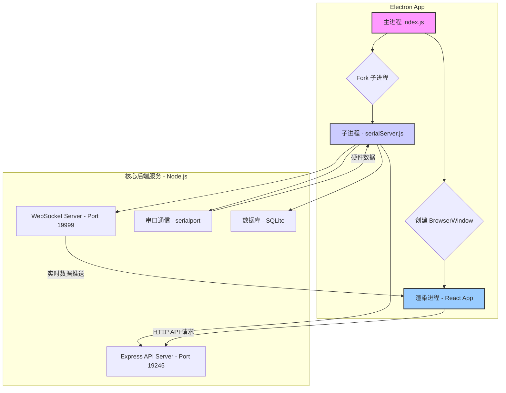
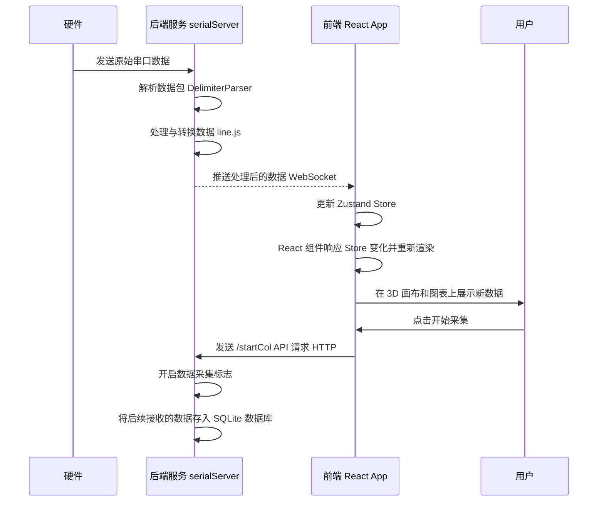

# Shroom (jqtools2) 项目架构分析

## 1. 项目概述

本项目是一个基于 Electron 的桌面应用程序，名为 `jqtools2`。其核心功能是连接硬件传感器（通过串口），实时采集、处理、可视化和分析压力数据。应用包含一个 React 构建的前端界面用于数据展示和交互，以及一个 Node.js 后端服务处理硬件通信、数据存储和 API 请求。

## 2. 总体架构

该项目采用经典的前后端分离的 Electron 应用架构模式，但其特殊之处在于后端服务被拆分为两个主要部分：

1.  **Electron 主进程 (`index.js`)**: 作为应用的入口和协调者，负责创建UI窗口、管理应用生命周期，并 **fork** 一个独立的子进程来运行核心后端服务。
2.  **核心后端服务 (`server/serialServer.js`)**: 运行在独立的 Node.js 子进程中，避免了繁重的I/O操作（如串口通信和数据处理）阻塞主进程和UI渲染，保证了应用的响应性。此服务通过 Express.js 提供 HTTP API，并通过 WebSocket 提供实时数据流。
3.  **前端渲染进程 (`client/` 目录)**: 一个标准的 React 应用，负责所有的用户界面展示和交互。它通过 HTTP 和 WebSocket 与核心后端服务通信。

下面是该架构的高层示意图：

## 3. 后端架构 (主进程 & 核心服务)

后端是整个应用的数据中枢，负责与硬件交互、数据持久化和业务逻辑处理。

### 3.1. 技术栈

- **运行环境**: Node.js
- **应用框架**: Electron
- **HTTP 服务**: Express.js
- **实时通信**: `ws` (WebSocket)
- **硬件交互**: `serialport`
- **数据库**: `sqlite3`
- **加密**: `crypto-js` (用于配置文件加密)

### 3.2. 核心模块

#### 3.2.1. Electron 主进程 (`index.js`)

- **窗口管理**: 使用 `BrowserWindow` 创建应用的主窗口，并加载前端 React 应用的构建产物 (`build/index.html`)。
- **进程管理**: 通过 `child_process.fork()` 启动 `server/serialServer.js`。这种方式创建了一个独立的 V8 实例，实现了主进程与后端服务的隔离，是处理密集型任务的推荐做法。
- **静态文件服务**: 内置一个简单的 `http` 服务器，用于在生产环境中为渲染进程提供 `index.html` 及相关的静态资源（JS, CSS, 图片等）。
- **预加载脚本 (`preload.js`)**: 作为渲染进程和主进程之间的桥梁，但在此项目中仅暴露了一个 `getPath` 函数，未充分利用其 IPC 通信能力。

#### 3.2.2. 核心后端服务 (`server/serialServer.js`)

这是应用的“大脑”，在一个独立的子进程中运行，承担了所有核心业务逻辑。

- **API 服务**: 启动一个 Express 服务器监听 `19245` 端口，提供 RESTful API 用于：
    - 设备和系统管理 (`/getPort`, `/connPort`, `/selectSystem`)
    - 数据采集控制 (`/startCol`, `/endCol`)
    - 历史数据操作 (`/getColHistory`, `/getDbHistory`, `/downlaod`, `/delete`)
    - 数据回放控制 (`/getDbHistoryPlay`, `/changeDbplaySpeed`, `/getDbHistoryStop`)
    - 备注与别名管理 (`/upsertRemark`, `/getRemark`)
    - API 接口定义在 `swagger.yaml` 文件中，提供了清晰的文档。

- **WebSocket 服务**: 启动一个 WebSocket 服务器监听 `19999` 端口，用于向所有连接的前端客户端实时推送传感器数据。数据以 JSON 字符串格式发送。

- **串口通信**: 
    - 使用 `serialport` 库自动发现和连接串口设备（特别是 `wch.cn` 制造商的设备）。
    - 使用 `DelimiterParser` 按特定的字节序列 (`[0xaa, 0x55, 0x03, 0x99]`) 分割和解析来自硬件的数据流。
    - 能够处理不同类型和长度的数据包（如陀螺仪数据、256/1024/4096矩阵数据），并根据设备类型进行相应的数据转换和整形（见 `util/line.js`）。

- **数据库交互 (`util/db.js`)**:
    - 使用 `sqlite3` 作为本地数据库。
    - 根据不同的传感器系统（如 `bed`, `endi`）动态初始化或加载对应的 `.db` 文件。
    - 封装了完整的数据库操作逻辑，包括：
        - 表创建与初始化 (`initDb`, `ensureRemarksTable`)。
        - 历史数据增删改查。
        - 将数据库记录导出为 CSV 文件 (`dbLoadCsv`)。

- **数据处理与加密**:
    - `util/parseData.js`: 包含将字节数组转换为浮点数等底层数据解析函数。
    - `util/line.js`: 核心数据转换逻辑，根据不同传感器型号（如 `jqbed`, `endiSit`）对原始矩阵数据进行行列变换、插值和校准。
    - `util/aes_ecb.js`: 使用 AES (ECB模式) 对配置文件 (`config.txt`) 进行加密和解密，保护配置信息的安全。

## 4. 前端架构 (渲染进程)

前端负责所有与用户相关的数据可视化和交互操作。

### 4.1. 技术栈

- **核心框架**: React
- **UI 组件库**: Ant Design (`antd`)
- **路由管理**: `react-router-dom`
- **状态管理**: `zustand`
- **数据请求**: `axios`
- **3D 可视化**: `three.js`
- **图表**: `echarts`
- **样式**: Sass (`.scss`)

### 4.2. 核心模块

#### 4.2.1. 应用入口与路由 (`App.js`)

- 使用 `HashRouter` 作为路由容器。
- 定义了三个主要页面路由：
    - `/`: 主测试和展示页面 (`Test.js`)
    - `/data`: 数据处理相关页面 (`Data.js`)
    - `/addMac`: 设备管理页面 (`Equip.js`)
- 初始化 `i18next` 用于国际化（中/英文切换）。

#### 4.2.2. 状态管理 (`store/equipStore.js`)

- 使用 `zustand` 创建一个全局的 store 来管理应用状态，这比传统的 Redux 或 Context API 更简洁高效。
- **核心状态包括**:
    - `status`: 实时传感器数据矩阵。
    - `history`: 历史数据回放状态。
    - `systemType`: 当前选择的系统类型。
    - `settingValue`: 可视化调节参数（如高斯模糊、颜色、高度等）。
    - `selectArr`: 框选工具选择的区域。
    - `dataStatus`: 当前数据模式（实时/历史回放）。
- 提供了 `set` 方法来更新状态，并导出 selector hooks (`useEquipStore`) 和 direct getters (`getStatus`) 供组件使用。

#### 4.2.3. 页面与组件

- **`page/test/Test.js` (主页面)**:
    - **WebSocket 连接**: 在 `useEffect` 中建立与后端 `ws://127.0.0.1:19999` 的 WebSocket 连接，并处理重连逻辑。
    - **数据接收与处理**: 在 `onmessage` 事件中接收实时数据，解析 JSON，并根据数据类型（实时/历史/对比）更新 `zustand` store。
    - **组件集成**: 作为容器集成了大部分核心功能组件，如 `Title` (标题栏), `CanvasShow` (3D画布), `Aside` (侧边栏), `ChartsAside` (图表侧边栏) 等。
    - **上下文 (`pageContext`)**: 创建了一个 React Context，用于在组件树深层传递一些控制函数和状态，如 `setDisplay`, `setOnRuler` 等。

- **核心组件**:
    - **`components/three/...`**: 包含了所有 `three.js` 相关的3D可视化组件。例如 `ThreeAndModel.js` 和 `ThreeAndCarPoint.js` 分别用于渲染不同类型的3D模型和压力点云图。这些组件接收来自 `zustand` store 的数据并将其渲染为3D场景。
    - **`components/chartsAside/ChartsAside.js`**: 使用 `echarts` 渲染压力和面积曲线图。它既可以展示实时数据，也可以展示从 `zustand` store 中获取的历史回放数据。
    - **`components/ColAndHistory/ColAndHistory.js`**: 负责数据采集控制和历史数据管理的用户界面。用户可以在这里开始/停止采集、查看历史记录、下载、删除和对比数据。
    - **`components/title/Title.js`**: 应用的顶部标题栏，包含系统类型选择、一键连接按钮和语言切换功能。

#### 4.2.4. 前后端通信

前端与后端的通信是双向的：

- **控制流 (HTTP)**: 前端通过 `axios` 向后端的 Express API (`http://localhost:19245`) 发送 POST/GET 请求，以执行如连接设备、开始采集、查询历史等控制类操作。
- **数据流 (WebSocket)**: 前端通过 WebSocket 接收由后端实时推送的传感器数据。这种推模式（Push）非常适合高频率的实时数据更新场景，效率远高于轮询（Polling）。

数据流转过程如下：

## 5. 总结与建议

该项目架构设计合理，充分利用了 Electron 和 Node.js 的生态系统。核心亮点在于：

- **进程隔离**: 将UI渲染和后端重度I/O任务分离到不同进程，保证了应用的流畅性。
- **技术选型得当**: React + Zustand + Three.js 的组合为前端提供了强大的数据可视化和状态管理能力；Express + WebSocket + SerialPort 的后端组合则稳定地处理了硬件通信和数据服务。
- **模块化清晰**: 前后端的代码结构都比较清晰，功能被拆分到不同的模块和组件中。

**可改进之处**:

1.  **Python 集成**: 项目中存在 `pyWorker.js` 和相关的 Python 脚本，但大部分调用代码被注释掉了。如果需要重新启用 Python 算法，建议完善 `pyWorker.js` 中的进程管理和错误处理逻辑，确保 Python 进程的稳定性和通信效率。
2.  **API 安全性**: 目前后端 API 直接暴露在本地，没有任何认证或授权机制。虽然是桌面应用，但如果未来有网络扩展需求，应考虑增加安全措施。
3.  **代码重复**: 在 `util/line.js` 和前端的 `util/util.js` 中可能存在一些重复的数据处理或计算逻辑，可以考虑重构和统一。
4.  **前端性能**: 实时高频的渲染可能会对性能造成压力。`scheduler.js` 提供了一个简单的渲染调度器，但可以进一步优化，例如通过 `useMemo` 和 `useCallback` 减少不必要的组件重渲染，以及对 Three.js 场景进行性能分析和优化。

总体而言，这是一个功能完整、架构稳健的专业级传感器数据分析工具。
